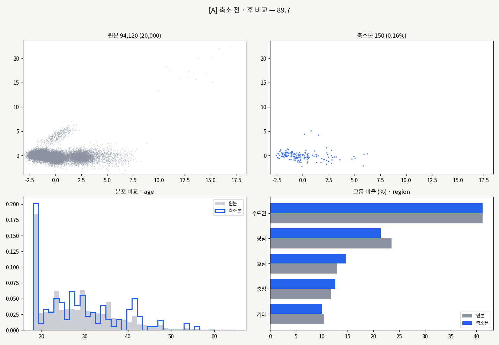
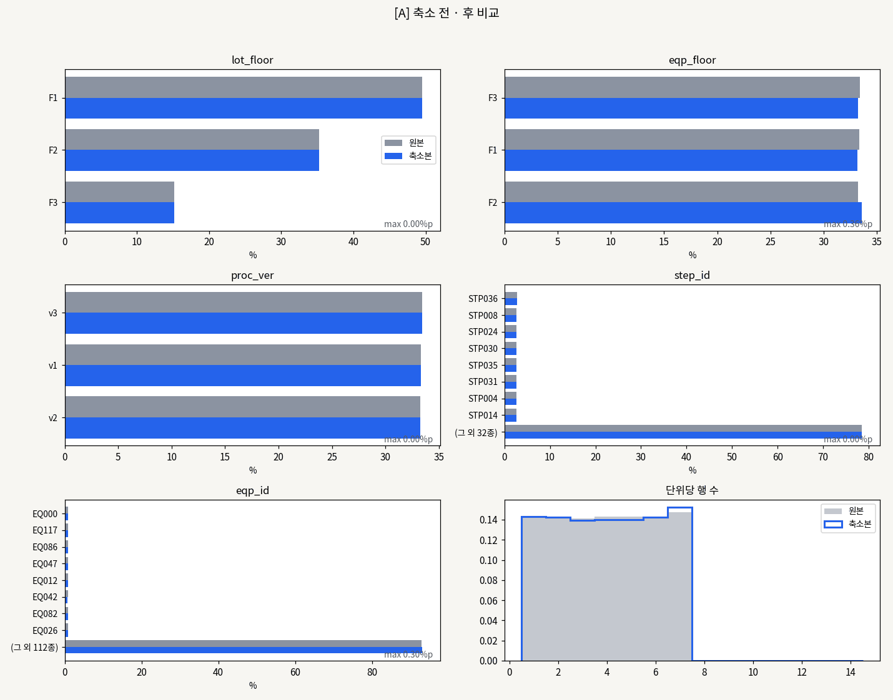

<div align="center">

# Reduce &amp; Compare

**대규모 표 데이터를 대표 샘플로 줄이고, 원본과 얼마나 닮았는지 숫자와 그래프로 확인합니다.**


</div>

---

수십만 행짜리 CSV는 그대로 열기도, 그래프로 그리기도 무겁습니다.
이 도구는 **행을 줄이되 원본의 분포·관계·구조가 얼마나 남았는지 점수로 보여줍니다.**
줄인 결과가 믿을 만한지 눈으로도 확인할 수 있게, 축소 전후를 나란히 그려 줍니다.

```bash
pip install pandas numpy scikit-learn scipy matplotlib
python scripts/run_reduce.py "데이터 폴더"
```

```
[A]  원본 94,120행 → 축소 3,030행 (0.84%)  ·  4.9초
  종합 유사도 89.7점   (분포 94.6 / 상관 83.1 / 구조 91.5)
  추천 방식: 군집 기반(실제 행)
  · 이상치 95건 제외 · 희소 군집 6개에 최소 30행 보장
```

<br>

## 결과 미리 보기

**축소 전후 비교** — 왼쪽이 원본, 오른쪽이 축소본입니다. 점 크기는 그 행이 대표하는 원본 행 수입니다.



**컬럼별 값 분포 비교** — 회색이 원본, 파랑이 축소본입니다. 막대 길이가 같으면 비율이 그대로 유지된 것입니다.



<br>

## 두 가지 실행 방식

| | `run_reduce.py` | `run_reduce_units.py` |
|---|---|---|
| **쓰는 경우** | 행끼리 독립적인 일반 표 데이터 | 한 묶음(lot·주문 등)이 여러 행을 갖는 데이터 |
| **축소 단위** | 행 | 지정한 단위 — 단위의 행은 통째로 남거나 통째로 빠짐 |
| **고르는 방법** | 랜덤·층화·군집(실제 행/평균 행) 4가지를 비교해 자동 선택 | 지정한 조합별 비율을 유지하며 단위 추출 |
| **유사도** | 분포 · 상관 · 구조 (각 1/3) | 컬럼 비율 · 조합 비율 · 단위 크기 (각 1/3) |
| **크기 결정** | 기준 점수(기본 85)를 넘는 가장 작은 크기 자동 탐색 | 비율 지정 또는 자동 탐색 |

```bash
# 일반 표 데이터
python scripts/run_reduce.py "폴더" --inspect            # 컬럼 판별 먼저 확인
python scripts/run_reduce.py "폴더" --target 90          # 기준 점수 올리기
python scripts/run_reduce.py "폴더" --exclude memo,code  # 기준 컬럼에서 빼기
python scripts/run_reduce.py "폴더" --columns a,b,c      # 기준 컬럼 직접 지정
python scripts/run_reduce.py "폴더" --max-missing 0.2    # 결측 20% 넘는 컬럼 자동 제외
python scripts/run_reduce.py "폴더" --out 결과폴더        # 저장 위치 바꾸기 (기본 results/)

# 묶인 행 데이터 (예: lot-공정 이력)
python scripts/run_reduce_units.py "폴더" \
    --unit lot_id,step_id,proc_id,proc_ver \
    --strata step_id,proc_id,proc_ver,lot_floor \
    --limit eqp_id=6 --ratio 0.2 --show-dist lot_floor,eqp_floor
```

> 📘 묶인 행 데이터 축소는 **[run_reduce_units.py 사용 설명서](docs/guide/run_reduce_units.md)** 에 개념(단위·층)부터
> `--limit` 적용 순서, 무작위 세트 여러 개 만들기(`--sets`), 화면·그래프 읽는 법까지 정리해 두었습니다.

<details>
<summary><code>run_reduce_units.py</code> 옵션 요약</summary>

- `--unit`: 이 조합이 같은 행은 통째로 남기거나 통째로 뺍니다
- `--strata`: 이 조합별 비율을 원본과 같게 유지합니다 (드문 조합도 최소 1개)
- `--combo`: 비율을 따로 확인할 컬럼 조합
- `--ratio` 생략 시 1%부터 올려가며 기준 점수(기본 85)를 넘는 최소 비율을 찾습니다
- `--show-dist`: 값별 원본·축소 비율을 표로 출력하고 그래프로 저장 (`distribution_<그룹>.csv`, `.png`)
- `--no-plot`: 그래프를 만들지 않음
- `--limit eqp_id=6`: 그 컬럼의 값 종류를 6개로 줄입니다 (많이 쓰인 순서, 남은 값끼리의 비율은 원본 그대로).
  `--limit-mode sample`을 주면 원본 비율을 확률로 삼아 무작위로 고릅니다.
  `--unit` 컬럼(예: `lot_id=100`)은 다른 컬럼을 거른 뒤 마지막에 골라 그 개수만큼 결과에 남깁니다
- `--sets 100`: 기준 점수를 넘는 서로 다른 무작위 축소 세트를 100개 만듭니다 (`sets_<그룹>/`)
- `--inspect`: 단위·층 구성만 먼저 확인

</details>

<br>

## 할 수 있는 것

| | |
|---|---|
| **파일을 알아서 읽습니다** | `.csv` `.tsv` `.txt` · 구분자(쉼표·탭·세미콜론·파이프)와 인코딩(UTF-8, CP949 등) 자동 감지 |
| **폴더를 알아서 묶습니다** | 컬럼 구조가 같은 파일은 병합, 다른 파일은 따로 처리 |
| **기준 컬럼을 알아서 고릅니다** | ID·날짜·자유 텍스트·결측 많은 컬럼은 제외. `--columns`로 직접 지정도 가능 |
| **희소 그룹을 지킵니다** | 비율대로 나누되 드문 그룹은 최소 수를 보장. 이상치는 대표에서 제외 |
| **값 종류를 줄입니다** | `--limit eqp_id=6` — 60종을 6종으로. 남은 값끼리의 비율은 원본 그대로 |
| **근거를 남깁니다** | 축소본 CSV, 지표 JSON, 분포 비교 CSV, 비교 그래프 PNG |

<br>

## 출력물

실행하면 `results/` 폴더에 저장됩니다.

| 파일 | 내용 |
|---|---|
| `reduced_<그룹>.csv` | 축소본. 첫 컬럼 `_weight`는 그 행이 대표하는 원본 행 수 |
| `report_<그룹>.json` | 지표 상세, 크기별 점수, 방식별 점수 |
| `compare_<그룹>.png` | 축소 전후 비교 그래프 (`run_reduce.py`) |
| `strata_<그룹>.csv` | 층(조합)별 원본·축소 단위 수, 행 수, 비율 차이 (`run_reduce_units.py`) |
| `sets_<그룹>/set_###.csv` · `sets_<그룹>.csv` | 무작위 세트와 세트별 점수 요약 (`run_reduce_units.py --sets`) |
| `distribution_<그룹>.csv` · `.png` | 컬럼별 값마다 원본 비율과 축소본 비율, 그래프 (`run_reduce_units.py --show-dist`) |

<br>

## 로컬 웹 앱 실행

웹 화면은 만드는 중입니다. 지금은 백엔드(FastAPI)와 프론트엔드(Vite + React) 뼈대, 폴더 업로드·구성 판별 API까지 있습니다.

처음 한 번 `backend`의 가상환경에 `requirements.txt`를 설치하고 `frontend`에서 `npm install`을 실행합니다.
그다음 저장소 어디에서든 다음 명령 하나로 백엔드와 프론트엔드를 함께 시작합니다.

```bash
python scripts/dev.py
```

브라우저에서 `http://127.0.0.1:5173`을 열고, 종료할 때는 실행한 터미널에서 `Ctrl+C`를 누릅니다.

<br>

## 진행 상황

작업은 `backlog.json`에 태스크 122개로 쪼개 두었고, 전용 CLI로만 다룹니다.

```bash
python backlog.py stats     # 에픽별 진행률
python backlog.py next      # 지금 시작할 수 있는 태스크
python backlog.py show T033 # 태스크 상세
```

| 영역 | 상태 |
|---|---|
| 요구사항 정리, 열린 질문 결정, 프로젝트 셋업 | 완료 |
| 데이터 입력 (파일 읽기·스키마 판별·전처리) | 완료 |
| 축소 알고리즘 (랜덤·층화·군집·그룹 단위) | 완료 |
| 유사도 지표 (분포·상관·구조·범주형) | 완료 |
| 축소 크기 자동 결정, 명령줄 실행 | 진행 중 |
| 백엔드 API (폴더 업로드·구성 판별 완료) | 진행 중 |
| 상관관계 분석, 반영 리포트 (계산 모듈) | 진행 중 |
| 웹 화면 (업로드·결과·그래프·디자인 설정) | 예정 |

백엔드 테스트 199건, lint·build 통과. 전체 진행률(현재 약 49%)은 `python backlog.py stats`로 확인합니다.
`scripts/backlog_dashboard.html`을 브라우저로 열고 `backlog.json`과 `docs/tasks` 폴더를 연결하면
간트 차트, 태스크 상세, 안내서·리뷰(그림 포함)를 한 화면에서 볼 수 있습니다.

<br>

## 폴더 구조

<details>
<summary>펼쳐 보기</summary>

```
reduce-compare/
├── CLAUDE.md               Claude Code 작업 규칙 (자동으로 읽힘)
├── AGENTS.md               Codex CLI 작업 규칙 진입점 (rules/agent-workflow.md를 따름)
├── problem.md              요구사항과 결정 사항
├── backlog.json            작업 목록 (CLI로만 수정)
├── backlog.py              백로그 CLI
├── rules/                  Codex CLI용 작업 흐름 (agent-workflow.md)
├── hooks/                  Codex CLI용 훅 스크립트와 config.json
├── backend/
│   ├── app/api/            API 라우터
│   ├── app/core/           읽기·전처리·축소·지표·상관 분석 모듈
│   └── tests/              테스트
├── frontend/src/           화면 (Vite + React)
├── scripts/
│   ├── dev.py              백엔드·프론트엔드 함께 실행
│   ├── run_reduce.py       일반 표 데이터 축소
│   ├── run_reduce_units.py 묶인 행 데이터 축소
│   ├── make_sample_data.py 시험용 데이터 생성
│   ├── plot_*.py           비교 그래프
│   └── backlog_dashboard.html  백로그 대시보드
├── sample_data/            시험용 CSV (내용은 git에 올리지 않음)
├── docs/
│   ├── images/             README 그림
│   ├── tasks/              태스크별 안내서(<ID>.md)와 리뷰(<ID>.review.md)
│   └── session-log.md      세션 종료 시 훅이 남기는 짧은 기록
├── .claude/                Claude Code 설정
│   ├── settings.json       훅 등록
│   ├── hooks/              훅 스크립트와 config.json (줄 수 한도, lint/build 명령)
│   ├── rules/              태스크 진행·서브에이전트 규칙
│   └── agents/             서브에이전트 (task-briefer, adversarial-reviewer)
├── .codex/                 Codex CLI 설정: hooks.json(hooks/ 등록)
└── .vscode/                VS Code 추천 확장·설정
```

`sample_data/`의 CSV와 모든 `*.csv`, `*.parquet`는 `.gitignore`로 제외돼 저장소에 올라가지 않습니다.
macOS Finder에서는 `.claude`, `.codex`, `.vscode`가 숨김 폴더라 안 보입니다 (`Cmd + Shift + .`로 표시).

</details>

<details>
<summary>작업 규칙 (훅으로 강제)</summary>

- `backlog.json`은 직접 수정하지 않고 CLI로만 다룹니다
- 태스크를 `in_progress`로 바꾸기 전에는 코드 파일을 수정할 수 없습니다
- 구현한 뒤 적대적 리뷰에서 PASS를 받아야 `done`이 됩니다
- 파일·함수 줄 수가 한도의 85%를 넘으면 경고, 100%를 넘으면 반려합니다
- 작업을 끝낼 때 lint·build가 통과해야 합니다
- `done` 처리하면 전체 작업을 커밋하고 push합니다
- `main`에서는 직접 작업하지 않고 `dev`에서 작업합니다

Claude Code 규칙은 `CLAUDE.md`와 `.claude/rules/`, 훅은 `.claude/hooks/`에 있습니다.
Codex CLI 규칙은 `AGENTS.md`와 `rules/agent-workflow.md`, 훅은 `hooks/`에 있습니다.
두 쪽의 설정(`config.json`)은 따로 있으므로, 줄 수 한도나 lint/build 명령을 바꿀 때는 둘 다 고칩니다.

</details>

<br>

## 시작하기

```bash
git clone https://github.com/bysandychoi/reduce-compare.git
cd reduce-compare
git switch dev
pip install pandas numpy scikit-learn scipy matplotlib

python scripts/make_sample_data.py --rows 100000 --out sample_data/demo  # 시험용 데이터
python scripts/run_reduce.py sample_data/demo                             # 축소 실행
```

에이전트로 작업을 이어가려면 같은 폴더에서 `claude`(또는 `codex`)를 실행합니다.
처음 한 번은 이 폴더의 설정(훅)을 신뢰할지 묻는데, 승인해야 훅이 동작합니다.
그다음 `python backlog.py next`로 태스크를 고르고 "T053부터 하자"처럼 정해 주면
Claude Code는 `CLAUDE.md`, Codex CLI는 `AGENTS.md` 규칙대로 진행합니다.

## 필요한 것

- Python 3.9 이상 (백로그 CLI와 훅은 표준 라이브러리만 사용)
- git
- 웹 앱과 lint·build 훅: `backend/requirements.txt`, `ruff`, Node.js
- 에이전트 작업: Claude Code 또는 Codex CLI (같은 백로그·안내서·리뷰 문서를 공유하므로 번갈아 써도 됩니다)

훅을 실행하는 파이썬 명령은 도구마다 다릅니다. `.claude/settings.json`은 `python3`, `.codex/hooks.json`은 `python`을 씁니다.
Windows처럼 `python3`가 없거나 Microsoft Store 스텁으로만 연결된 환경에서는 `.claude/settings.json`과
`.claude/hooks/config.json` 안의 `python3`를 모두 `python`으로 바꿔 주세요 (`backlog_cli`와 backend build 명령 포함).
반대로 `python`이 없는 환경에서는 `.codex/hooks.json`과 `hooks/config.json` 안의 `python`을 모두 `python3`로 맞춥니다.
