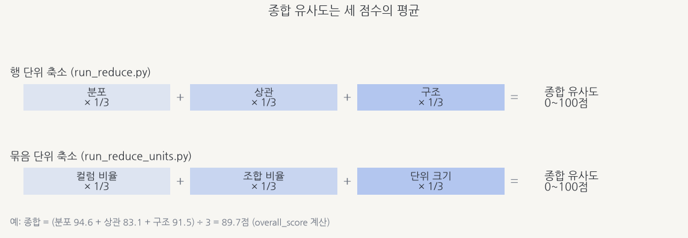
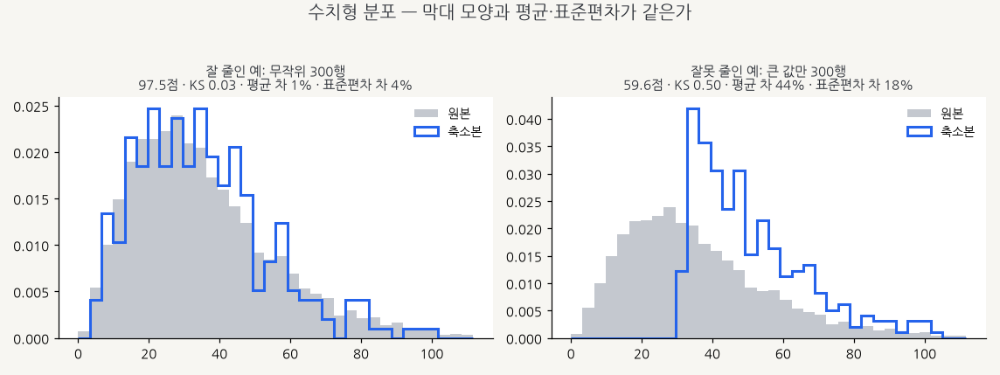
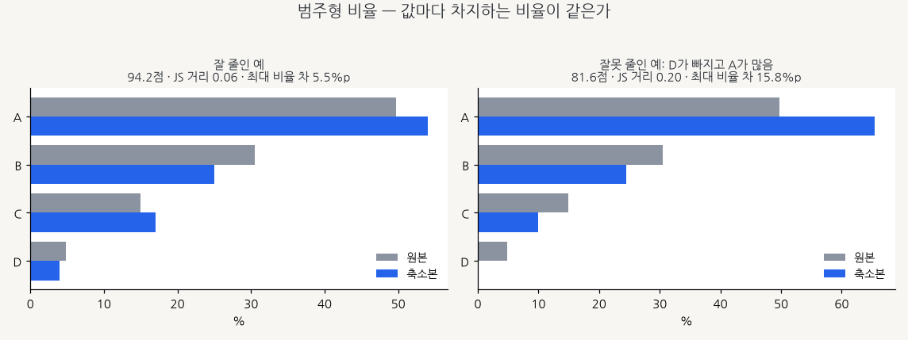
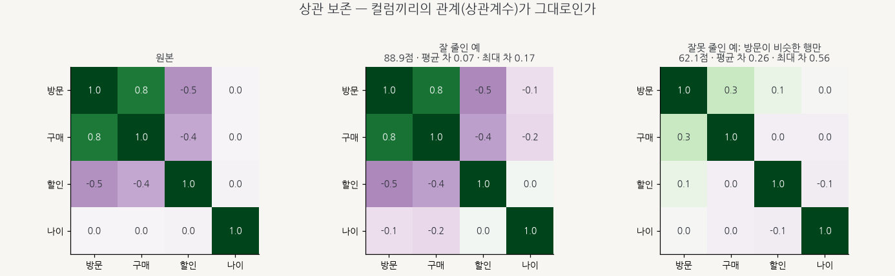
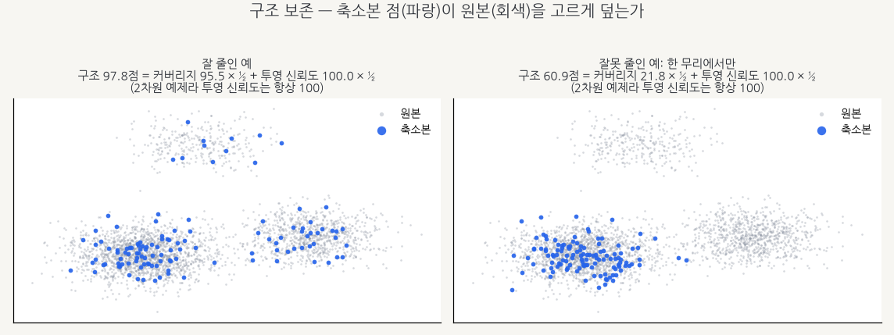
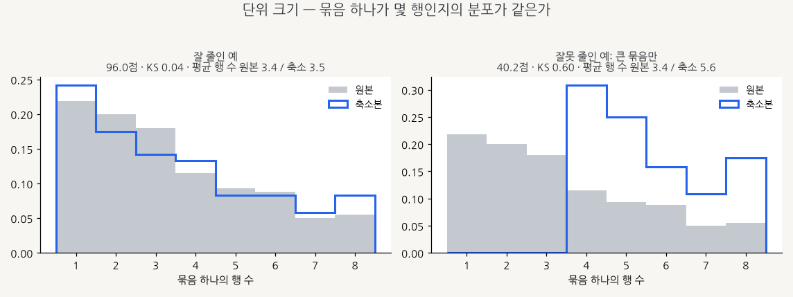

# 유사도 지표 이해하기

> 축소본이 원본과 "얼마나 닮았는지"를 0~100점으로 보여 주는 지표들을 그림과 함께 설명합니다.
> 점수가 높을수록 원본과 비슷합니다.

- [한눈에 보기](#한눈에-보기)
- [행 단위 축소의 점수](#행-단위-축소의-점수-run_reducepy) — 분포 · 상관 · 구조
- [묶음 단위 축소의 점수](#묶음-단위-축소의-점수-run_reduce_unitspy) — 컬럼 비율 · 조합 비율 · 단위 크기
- [점수를 읽을 때 주의할 점](#점수를-읽을-때-주의할-점)
- [그림 다시 만들기](#그림-다시-만들기)

그림마다 왼쪽은 **잘 줄인 예**, 오른쪽은 **잘못 줄인 예**입니다. 회색은 원본, 파랑은 축소본입니다.
(상관 그림만 원본 · 잘 줄인 예 · 잘못 줄인 예 세 칸이고, 색은 상관의 부호를 뜻합니다.)
그림에 적힌 점수는 실제 지표 함수로 계산한 값입니다 ([그림 다시 만들기](#그림-다시-만들기)).

---

## 한눈에 보기



종합 유사도는 세 점수의 평균입니다. 어떤 세 점수를 쓰는지는 축소 방식에 따라 다릅니다.

| 축소 방식 | 세 점수 (각 1/3) | 코드 |
|---|---|---|
| 행 단위 (`run_reduce.py`) | 분포 · 상관 · 구조 | `structure.overall_score` |
| 묶음 단위 (`run_reduce_units.py`) | 컬럼 비율 · 조합 비율 · 단위 크기 | `catmetrics.grouped_similarity` |

`run_reduce.py`는 크기를 키워 가며 종합 점수가 기준(기본 85점)을 처음 넘는 가장 작은 크기를 고릅니다.
끝까지 못 넘으면 가장 높은 점수의 크기를 씁니다.

분포·상관·비율·단위 크기 점수는 `100 × (1 − 차이)` 꼴입니다. 차이가 0이면 100점이고, 차이가 1 이상이면 0점입니다.
커버리지는 무작위로 뽑았을 때와의 거리 비율로, 구조 점수는 커버리지와 투영 신뢰도의 평균으로 계산합니다 ([구조](#3-구조--데이터-공간을-고르게-덮는가)).

---

## 행 단위 축소의 점수 (`run_reduce.py`)

### 1. 분포 — 컬럼마다 값의 퍼짐이 같은가

축소 기준 컬럼마다 점수를 매기고 평균을 냅니다. 수치형과 범주형은 계산 방법이 다릅니다.

#### 수치형 컬럼



| 보는 것 | 뜻 | 비중 |
|---|---|---|
| KS 통계량 | 두 누적분포가 가장 크게 벌어진 정도 (0~1). 막대 모양 전체가 같은지 봅니다 | 0.5 |
| 평균 차 | 원본 평균 대비 평균이 얼마나 달라졌는지 (비율) | 0.25 |
| 표준편차 차 | 원본 표준편차 대비 퍼짐이 얼마나 달라졌는지 (비율) | 0.25 |

```
점수 = 100 × (1 − (0.5 × KS + 0.25 × 평균 차 + 0.25 × 표준편차 차))
```

- 평균·표준편차는 축소본 각 행의 가중치(`_weight`, 그 행이 대표하는 원본 행 수)를 반영해 계산합니다.
- KS는 가중치 없이 축소본 행을 그대로 비교합니다.
- 오른쪽 예처럼 큰 값만 남기면 막대가 오른쪽으로 쏠립니다. KS 0.50(약 25점), 평균 차 44%(약 11점), 표준편차 차 18%(약 4.5점)가 깎여 59.6점이 됩니다.

#### 범주형 컬럼



| 보는 것 | 뜻 | 비중 |
|---|---|---|
| JS 거리 | 두 비율 분포가 얼마나 다른지 (0~1, Jensen-Shannon) | 0.7 |
| 최대 비율 차 | 값 중 비율 차이가 가장 큰 것 (예: 50% → 65%면 0.15) | 0.3 |

```
점수 = 100 × (1 − (0.7 × JS 거리 + 0.3 × 최대 비율 차))
```

축소본 비율은 가중치를 반영합니다.

- 오른쪽 예는 D가 빠지고 A가 50%에서 66%로 늘어난 경우입니다. 최대 비율 차 0.158은 A에서 나오고, 81.6점이 됩니다.
- 같은 원본에서 **D(원본 5%)만** 빼고 나머지 비율을 유지하면 87.5점입니다 (JS 거리 0.16, 최대 비율 차 0.05).

> 값 하나가 통째로 빠져도 80점대 후반이 나올 수 있습니다. 범주형 점수는 빠진 값에 비해 덜 떨어지는 편이니,
> 점수만 보지 말고 컬럼별 값 비율을 확인하세요.
> `run_reduce.py`는 비교 그림(`compare_<그룹>.png`)과 `report_<그룹>.json`의 컬럼별 점수를,
> `run_reduce_units.py`는 [값 분포 표](run_reduce_units.md#화면-결과-읽는-법)를 보면 됩니다.

### 2. 상관 — 컬럼끼리 함께 움직이는 관계가 남았는가



수치형 컬럼끼리의 상관계수 행렬(-1~1)을 원본과 축소본에서 각각 구해, 칸마다 차이를 봅니다.
초록은 함께 커지는 관계(양의 상관), 보라는 반대로 움직이는 관계(음의 상관)입니다.

| 보는 것 | 뜻 | 비중 |
|---|---|---|
| 평균 차 | 모든 컬럼 쌍의 상관계수 차이의 평균 | 0.6 |
| 최대 차 | 가장 크게 달라진 쌍의 차이 | 0.4 |

```
점수 = 100 × (1 − (0.6 × 평균 차 + 0.4 × 최대 차))
```

- 오른쪽 예는 '방문'이 비슷한 행만 남긴 경우입니다. 방문-구매 상관이 0.8에서 0.3으로 약해지고, 방문-할인은 -0.5에서 0.1로 부호까지 바뀝니다.
  최대 차 0.56은 방문-할인 쌍에서 나오며, 62.1점이 됩니다.
  이렇게 한 컬럼의 범위를 좁히면 그 컬럼과 다른 컬럼의 관계가 사라져 보입니다.
- 결과에는 참고값도 함께 남습니다: 행렬 전체 차이(Frobenius), 상관끼리의 상관(`corr_of_corr`). 점수에는 쓰지 않습니다.
- Spearman(순위 상관)으로도 계산할 수 있습니다 (`method="spearman"`).
- 수치형 컬럼이 2개 미만이면 비교할 쌍이 없어 100점이 됩니다.
- 상관을 정의할 수 없는 쌍(한쪽이 상수인 컬럼)은 점수 계산에서 0으로 채워집니다.
  쌍별 분석에서는 따로 `undefined`로 표시합니다 (T139).

### 3. 구조 — 데이터 공간을 고르게 덮는가



```
구조 점수 = 커버리지 점수 × ½ + 투영 신뢰도 × 100 × ½
```

**커버리지**는 원본 점마다 가장 가까운 축소본 점까지의 거리를 잽니다.
- 같은 개수를 무작위로 뽑았을 때의 거리와 비교합니다.
- 무작위만큼 가깝거나 더 가까우면 100점입니다. 멀수록 `무작위 거리 ÷ 실제 거리`만큼 낮아집니다.
- 오른쪽 예처럼 한 무리에서만 뽑으면 나머지 무리의 점들이 멀어져 커버리지가 21.8점이 됩니다.
- 원본이 2만 행보다 많으면 2만 행을 뽑아 계산합니다.

**투영 신뢰도**(trustworthiness, 0~1)는 원본을 2차원으로 펼쳤을 때 가까운 점들의 이웃 관계가 유지되는지 봅니다.
- 원본에서 최대 3,000행을 뽑아 계산합니다.

> **주의 — 투영 신뢰도는 축소본을 보지 않습니다.** 현재 구현은 원본만으로 계산하므로 어떤 축소본이든 같은 값이 나옵니다.
> 그래서 구조 점수에서 축소본에 따라 실제로 달라지는 것은 커버리지(절반)뿐입니다.
> 그림의 예제는 원래 2차원이라 투영 신뢰도가 항상 100입니다.
> 이 지표가 완료 기준의 뜻과 맞는지는 [T043](../tasks/T043.md)에 재확인 항목으로 남아 있습니다.

---

## 묶음 단위 축소의 점수 (`run_reduce_units.py`)

lot·주문처럼 여러 행이 한 묶음(단위)인 데이터에서는 값의 **비율**과 묶음의 **크기**를 봅니다.
개념과 사용법은 [run_reduce_units.py 사용 설명서](run_reduce_units.md)를 보세요.

### 컬럼 비율 · 조합 비율

[범주형 그림](#범주형-컬럼)과 같은 방식으로 값마다 비율을 비교합니다. 다만 비중이 다릅니다.

```
점수 = 100 × (1 − (0.6 × JS 거리 + 0.4 × 최대 비율 차))
```

| 점수 | 무엇의 비율 | 합치는 방법 |
|---|---|---|
| 컬럼 비율 | `--columns`의 컬럼 하나하나 (기본: 전체 컬럼). 수치형도 값 그대로 비교 | 컬럼별 점수의 평균 |
| 조합 비율 | `--combo`로 정한 컬럼 조합 (기본: `--strata` 조합) | 조합별 점수의 평균 |

- 함께 남는 **값 커버리지**는 원본 값 중 축소본에도 남은 값의 비율입니다. 점수에는 쓰지 않습니다.
- 값 종류가 아주 많은 컬럼(lot_id 등)은 축소하면 대부분의 값이 빠집니다. 그래서 이 컬럼의 점수는 낮게 나옵니다.
  점수에서 빼려면 `--columns`로 볼 컬럼만 지정하세요.

### 단위 크기 — 묶음 하나가 몇 행인지의 분포가 같은가



```
점수 = 100 × (1 − KS)        KS: 원본과 축소본의 '단위당 행 수' 분포를 비교한 KS 통계량
```

- 오른쪽 예처럼 큰 묶음만 남기면 축소본 분포가 4행 이상으로 쏠립니다. KS가 0.60이 되어 40.2점이 됩니다.
- `run_reduce_units.py` 결과 그래프의 **단위당 행 수** 패널이 바로 이 비교입니다.

---

## 점수를 읽을 때 주의할 점

**종합 점수만 보지 마세요.** 세 점수 중 하나가 낮으면 평균이 높아도 그 부분은 원본과 다릅니다. 화면에 함께 나오는 세 점수를 보세요.

| 낮은 점수 | 의심할 것 | 해볼 것 |
|---|---|---|
| 분포 / 컬럼 비율 | 특정 값·구간이 너무 많거나 적게 남음 | 크기(비율)를 키우기, `--target` 올리기, 컬럼별 점수·값 분포 확인 |
| 상관 | 한 컬럼의 범위가 좁아져 관계가 약해짐 | 크기 키우기, 방식 비교표에서 다른 방식 확인 |
| 구조 | 일부 무리(군집)만 남음 | 군집 기반 방식 쓰기, 크기 키우기 |
| 조합 비율 | 드문 조합이 빠짐 | `--strata`를 덜 잘게 나누기, `--min-units` 늘리기 |
| 단위 크기 | 큰 묶음 또는 작은 묶음만 남음 | lot 제한(`--limit lot_id=N`) 대신 `--ratio` 비율 축소 쓰기, lot 제한을 쓴다면 `--limit-mode sample`로 행 수가 많은 lot에 치우치지 않게 하기 |

**점수는 "비슷함"의 요약입니다.**
- 행 단위 축소의 점수는 축소 기준으로 고른 컬럼만 봅니다. 기준에서 뺀 컬럼(ID, 자유 텍스트 등)은 점수에 들어가지 않습니다.
- `run_reduce_units.py`에서 `--limit`로 행을 걸렀다면 "원본"은 거른 뒤의 데이터입니다.
- 점수를 계산하는 식의 비중(0.5, 0.7 등)은 해석하기 쉽게 정한 값입니다. 통계적 유의수준이 아닙니다.

---

## 그림 다시 만들기

그림은 [`scripts/make_metric_figures.py`](../../scripts/make_metric_figures.py)가 실제 지표 함수로 계산해서 그립니다.
예제 데이터는 seed가 고정돼 있어, 같은 글꼴로 실행하면 똑같은 그림이 나옵니다.

```bash
python scripts/make_metric_figures.py --font NanumGothic.ttf   # 결과: docs/images/metrics/*.png
```

- `--font`에는 한글 글리프가 있는 `.ttf`를 지정합니다. 저장소 그림은 나눔고딕으로 만들었고, 글꼴 파일은 저장소에 넣지 않았습니다.
- `--font`가 없으면 설치된 글꼴 중 한글이 실제로 그려지는 것을 찾습니다. 없으면 그림을 쓰기 전에 멈춥니다.
- 지표 코드가 바뀌면 이 스크립트를 다시 돌려 그림의 점수를 맞춥니다.

| 지표 | 코드 | 태스크 |
|---|---|---|
| 수치형 분포 | `metrics.numeric_metrics` | [T040](../tasks/T040.md) |
| 범주형 분포 | `metrics.categorical_metrics` | [T041](../tasks/T041.md) |
| 상관 | `metrics.correlation_metrics` | [T042](../tasks/T042.md), [T130](../tasks/T130.md) |
| 투영 신뢰도 | `structure.trustworthiness_score` | [T043](../tasks/T043.md) |
| 커버리지 | `structure.coverage_metrics` | [T044](../tasks/T044.md) |
| 종합 (행 단위) | `structure.overall_score` | [T045](../tasks/T045.md) |
| 컬럼·조합 비율, 단위 크기 | `catmetrics.grouped_similarity` | [T047](../tasks/T047.md) |
