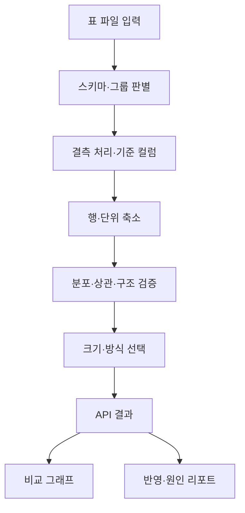

# Task 문서 보완 목록 — 2026-10-01

기준 dev `019ee848b2c3c3d2ffc98eafd3679692a2a81f2d`. 전체 125개 중 기존 20개는 보존했고, 빠진 105개를 작성했다.

완료 작업 45개는 사후 근거 기록, 미완료 작업 60개는 착수 준비 문서다. 기존 완료를 재심사하거나 PASS 리뷰를 소급 생성하지 않았다. 백로그와 제품 코드는 변경하지 않았다.

그림은 제품 처리 개념이며 구현 완료 여부를 나타내지 않는다. 투영·API·화면에는 미완료 태스크가 있다.

| Task | 상태 | 문서 성격 | 제목 |
|---|---|---|---|
| [T001](T001.md) | done | 사후 보완 | 결측치·이상치 처리 방식 결정 |
| [T002](T002.md) | done | 사후 보완 | 축소 기준 컬럼 지정 방식 결정 |
| [T003](T003.md) | done | 사후 보완 | 유사도 기준치 기본값과 변경 허용 여부 결정 |
| [T004](T004.md) | done | 사후 보완 | 군집 대표값 방식 결정 |
| [T005](T005.md) | done | 사후 보완 | 종합 점수 산식 결정 |
| [T006](T006.md) | done | 사후 보완 | 처리 시간 목표 및 부가기능 범위 결정 |
| [T007](T007.md) | done | 사후 보완 | 희소 군집 최소 대표 수·이상치 기준 결정 |
| [T010](T010.md) | done | 사후 보완 | 저장소 구조 생성 |
| [T015](T015.md) | done | 사후 보완 | 샘플 데이터 생성기 |
| [T020](T020.md) | done | 사후 보완 | 폴더 내 CSV 목록 수집 |
| [T021](T021.md) | done | 사후 보완 | CSV 인코딩 자동 감지 |
| [T022](T022.md) | done | 사후 보완 | 컬럼 스키마 추출 |
| [T023](T023.md) | done | 사후 보완 | 스키마 그룹핑 (병합/개별 판별) |
| [T024](T024.md) | done | 사후 보완 | 그룹별 데이터 병합 |
| [T025](T025.md) | done | 사후 보완 | 전처리: 결측치·이상치 처리 |
| [T026](T026.md) | done | 사후 보완 | 전처리: 축소 기준 컬럼 적용 |
| [T027](T027.md) | done | 사후 보완 | 특징 행렬 변환 |
| [T028](T028.md) | done | 사후 보완 | 축소 기준 컬럼 기본 선택값 생성 |
| [T029](T029.md) | done | 사후 보완 | 층화 기준 컬럼 자동 선택 |
| [T030](T030.md) | done | 사후 보완 | 축소기 공통 인터페이스 정의 |
| [T031](T031.md) | done | 사후 보완 | 랜덤 샘플링 구현 |
| [T032](T032.md) | done | 사후 보완 | 층화 샘플링 구현 |
| [T033](T033.md) | done | 사후 보완 | 군집 기반 대표 추출 구현 |
| [T034](T034.md) | done | 사후 보완 | 군집 크기 가중치 저장 |
| [T035](T035.md) | done | 사후 보완 | 축소기 단위 테스트 |
| [T036](T036.md) | done | 사후 보완 | 희소 군집 최소 대표 수 보장 |
| [T037](T037.md) | done | 사후 보완 | 이상치 판정과 대표 제외 |
| [T038](T038.md) | done | 사후 보완 | 군집 평균(가상 행) 대표 생성 |
| [T039](T039.md) | done | 사후 보완 | 그룹 단위 층화 축소 (행이 묶여 있는 데이터) |
| [T040](T040.md) | done | 사후 보완 | 수치형 분포 지표 |
| [T041](T041.md) | done | 사후 보완 | 범주형 분포 지표 |
| [T042](T042.md) | done | 사후 보완 | 상관관계 보존 지표 |
| [T043](T043.md) | done | 사후 보완 | 구조 보존 지표: trustworthiness |
| [T044](T044.md) | done | 사후 보완 | 구조 보존 지표: 커버리지 |
| [T045](T045.md) | done | 사후 보완 | 종합 점수 계산 |
| [T046](T046.md) | done | 사후 보완 | 지표 단위 테스트 |
| [T047](T047.md) | done | 사후 보완 | 범주형 전용 유사도 지표 (조합 비율·단위 크기) |
| [T050](T050.md) | done | 사후 보완 | 크기 후보 생성 |
| [T051](T051.md) | done | 사후 보완 | 기준치 만족 최소 크기 탐색 |
| [T052](T052.md) | done | 사후 보완 | 추천 축소 방식 자동 선택 |
| [T053](T053.md) | todo | 작업 준비 | 2D/3D 투영 계산 |
| [T054](T054.md) | todo | 작업 준비 | 전체 파이프라인 조립 |
| [T055](T055.md) | todo | 작업 준비 | 결과 객체 스키마 정의 |
| [T056](T056.md) | done | 사후 보완 | 명령 한 줄 실행 스크립트 (폴더 → 결과) |
| [T057](T057.md) | done | 사후 보완 | 구분자 텍스트 파일(.txt/.tsv) 지원 |
| [T058](T058.md) | done | 사후 보완 | 결측 많은 컬럼 자동 제외와 원인 안내 |
| [T059](T059.md) | done | 사후 보완 | 그룹 단위 축소 실행 스크립트 |
| [T062](T062.md) | todo | 작업 준비 | 축소 실행 API (백그라운드) |
| [T063](T063.md) | todo | 작업 준비 | 진행 상태 API |
| [T064](T064.md) | todo | 작업 준비 | 결과 조회 API |
| [T065](T065.md) | todo | 작업 준비 | 원본 대용량 시각화용 데이터 API |
| [T066](T066.md) | todo | 작업 준비 | API 오류 처리 |
| [T067](T067.md) | todo | 작업 준비 | 축소 기준 컬럼 조회/저장 API |
| [T068](T068.md) | todo | 작업 준비 | 그룹 단위 축소: 층화 컬럼 결측값 처리 |
| [T070](T070.md) | todo | 작업 준비 | 앱 레이아웃과 라우팅 |
| [T071](T071.md) | todo | 작업 준비 | API 클라이언트 모듈 |
| [T072](T072.md) | todo | 작업 준비 | 폴더 선택 UI |
| [T073](T073.md) | todo | 작업 준비 | 업로드 연결 |
| [T074](T074.md) | todo | 작업 준비 | 폴더 구성 판별 결과 UI |
| [T075](T075.md) | todo | 작업 준비 | 실행 및 진행 상태 UI |
| [T076](T076.md) | todo | 작업 준비 | 축소 기준 컬럼 선택 UI |
| [T077](T077.md) | todo | 작업 준비 | 컬럼 선택 검증과 안내 |
| [T080](T080.md) | todo | 작업 준비 | 그룹 선택 탭 |
| [T081](T081.md) | todo | 작업 준비 | 요약 카드 |
| [T082](T082.md) | todo | 작업 준비 | 세부 지표 표 |
| [T083](T083.md) | todo | 작업 준비 | 크기별 점수 곡선 차트 |
| [T084](T084.md) | todo | 작업 준비 | 방식별 점수 비교 |
| [T085](T085.md) | todo | 작업 준비 | 축소본 CSV 다운로드 |
| [T090](T090.md) | todo | 작업 준비 | 그래프 컨테이너와 종류 선택 |
| [T091](T091.md) | todo | 작업 준비 | 2D 산점도 비교 |
| [T092](T092.md) | todo | 작업 준비 | 3D 산점도 비교 |
| [T093](T093.md) | todo | 작업 준비 | 히스토그램 비교 |
| [T094](T094.md) | todo | 작업 준비 | 박스플롯 비교 |
| [T095](T095.md) | todo | 작업 준비 | 범주 비율 비교 |
| [T096](T096.md) | todo | 작업 준비 | 상관행렬 히트맵 비교 |
| [T098](T098.md) | todo | 작업 준비 | 상관 네트워크 그래프 렌더링 |
| [T100](T100.md) | todo | 작업 준비 | 디자인 설정 스키마 정의 |
| [T101](T101.md) | todo | 작업 준비 | 설정 패널 자동 생성 UI |
| [T102](T102.md) | todo | 작업 준비 | 색상/팔레트 설정 |
| [T103](T103.md) | todo | 작업 준비 | 점 크기·투명도 설정 |
| [T104](T104.md) | todo | 작업 준비 | 축 변수 매핑 설정 |
| [T105](T105.md) | todo | 작업 준비 | 네트워크 레이아웃 알고리즘 설정 |
| [T106](T106.md) | todo | 작업 준비 | 설정 초기화 |
| [T108](T108.md) | todo | 작업 준비 | 결과 그림 한글 글꼴 선택 보정 |
| [T110](T110.md) | todo | 작업 준비 | 처리 시간 측정 스크립트 |
| [T111](T111.md) | todo | 작업 준비 | 지표 계산 서브샘플링 적용 |
| [T112](T112.md) | todo | 작업 준비 | 크기 탐색 병렬화/조기 종료 |
| [T113](T113.md) | todo | 작업 준비 | 파이프라인 진행률 콜백 연결 |
| [T114](T114.md) | todo | 작업 준비 | 프론트 렌더링 성능 점검 |
| [T120](T120.md) | todo | 작업 준비 | 파이프라인 통합 테스트 |
| [T121](T121.md) | todo | 작업 준비 | API 테스트 |
| [T122](T122.md) | todo | 작업 준비 | 사용자 흐름 수동 점검 |
| [T123](T123.md) | todo | 작업 준비 | README 작성 |
| [T133](T133.md) | todo | 작업 준비 | 쌍 산점도 데이터 API |
| [T134](T134.md) | todo | 작업 준비 | 결과 화면 상단 상관 섹션 레이아웃 |
| [T135](T135.md) | todo | 작업 준비 | 상관 종류 전환·임계값 슬라이더 |
| [T136](T136.md) | todo | 작업 준비 | 차이 큰 쌍 순위 목록 UI |
| [T137](T137.md) | todo | 작업 준비 | 쌍 선택 → 산점도 비교·노드 강조 |
| [T138](T138.md) | todo | 작업 준비 | 사라진·새 관계 엣지 표시 |
| [T142](T142.md) | todo | 작업 준비 | 반영 리포트 API |
| [T143](T143.md) | todo | 작업 준비 | 그래프 구성 설명 섹션 UI |
| [T144](T144.md) | todo | 작업 준비 | 규모 비교 점 구름 UI |
| [T145](T145.md) | todo | 작업 준비 | 군집별 반영 표 UI |
| [T146](T146.md) | todo | 작업 준비 | 관계 변화·원인 표 UI |
| [T310](T310.md) | done | 사후 보완 | 컬럼 값 종류 줄이기 (상위 N개 유지) |

검증: CLI 조회 기준 모든 Task의 ID.md 존재, 기존 문서 무변경, 코드 근거 심볼·파일 및 상대 링크 확인. 기능 테스트는 문서 변경 범위상 재실행하지 않았다.
