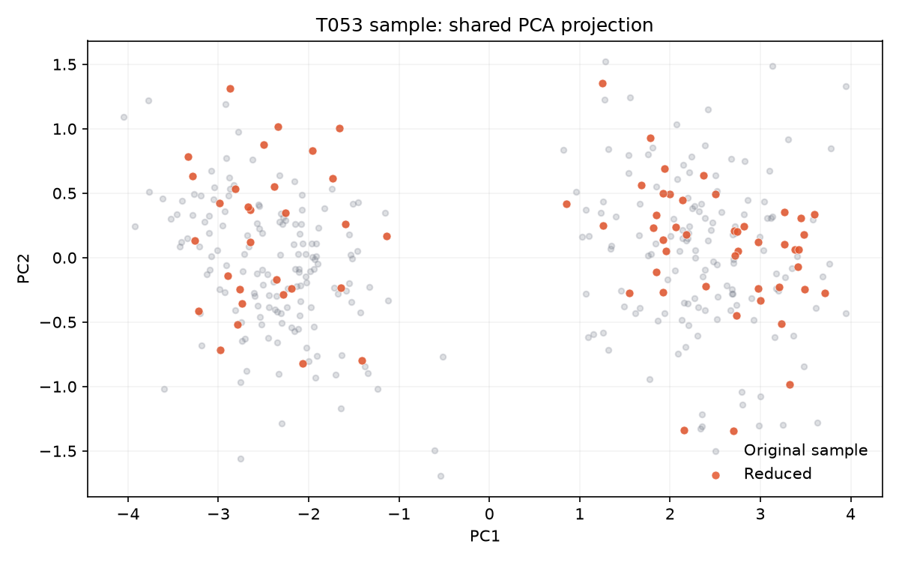

# T053 — 2D/3D 투영 계산

## 문서 성격과 현재 상태

구현 전 확인한 범위와 검증 계획을 기록한다. 최종 결과와 리뷰 판정은 별도 리뷰 문서에 남긴다.

- 기준: 2026-10-01 dev
- 백로그 상태: `in_progress` / 에픽: `E5` / 예상: 30분
- 후행 작업: [T054](T054.md), [T065](T065.md)

## 쉽게 이해하기

많은 컬럼을 2개나 3개 축으로 압축해 점으로 보여준다. 원본과 축소본에 같은 변환을 적용해야 위치를 비교할 수 있다.

## 의존 작업

- [T027](T027.md): `done` — 특징 행렬 변환

## 범위와 완료 기준

원본 서브샘플 + 축소본에 대해 PCA, UMAP 투영 좌표 계산 (같은 투영 공간)

1. 원본·축소본 좌표가 같은 축으로 비교 가능
2. PCA와 UMAP에서 2차원 또는 3차원 좌표를 선택 가능
3. 원본이 큰 경우 재현 가능한 서브샘플을 사용

## 구현 계획

1. `backend/app/core/projection.py`에 투영 결과 자료형과 공통 입력 검증을 둔다.
2. 원본 서브샘플에 모델을 한 번 학습하고 축소본에는 `transform`만 적용한다.
3. PCA/UMAP, 2D/3D, 시드 재현성과 잘못된 입력을 단위 테스트로 확인한다.
4. 실제 구현으로 만든 2D 비교 그림을 이 문서의 샘플로 남긴다.

## 관련 요구사항

[problem.md](../../problem.md)의 §4 자동 크기 결정, §5 지표, §6 시각화을 참고한다. 제목과 절 구성은 작업 시작 때 다시 확인한다.

## 현재 코드 근거와 관련 파일

- [backend/app/core/pipeline.py](../../backend/app/core/pipeline.py) — 현재 존재하는 참고 파일.
- [backend/app/core/prepare.py](../../backend/app/core/prepare.py) — 현재 존재하는 참고 파일.
- [backend/app/core/structure.py](../../backend/app/core/structure.py) — 현재 존재하는 참고 파일.

### 구현 시 검토할 위치

파일명과 구성은 확정 설계가 아니라 후보다. 기존 파일을 확장할지 새 파일로 나눌지는 착수 시 판단한다.

- `backend/app/core/projection.py` — 투영 계산 모듈(생성 예정)
- `backend/tests/test_projection.py` — 동일 공간·경계 입력 검증(생성 예정)

## 검증 근거와 다음 확인

- `pytest tests/test_projection.py`
- `ruff check app/core/projection.py tests/test_projection.py`
- 샘플 이미지 육안 확인

## 경계 사례와 위험

빈 입력, NaN/무한대, 원본·축소본 특징 수 불일치, 투영 축 수보다 작은 입력을 확인한다.

## 줄 수 제한

core 파일 300/함수50, API 파일200/함수40, backend 테스트400/함수60, TSX250/함수80, TS200/함수50, scripts200/함수50 (공백 제외). 정확한 적용 규칙은 [hooks/config.json](../../hooks/config.json) 참고.

## 샘플 이미지

`project_comparison`과 합성 데이터로 만든 사용 예시이며 실제 사용자 데이터 결과는 아니다.
회색은 원본, 주황색은 축소본이고 두 집합 모두 원본에 학습한 동일 PCA 축을 사용한다.
