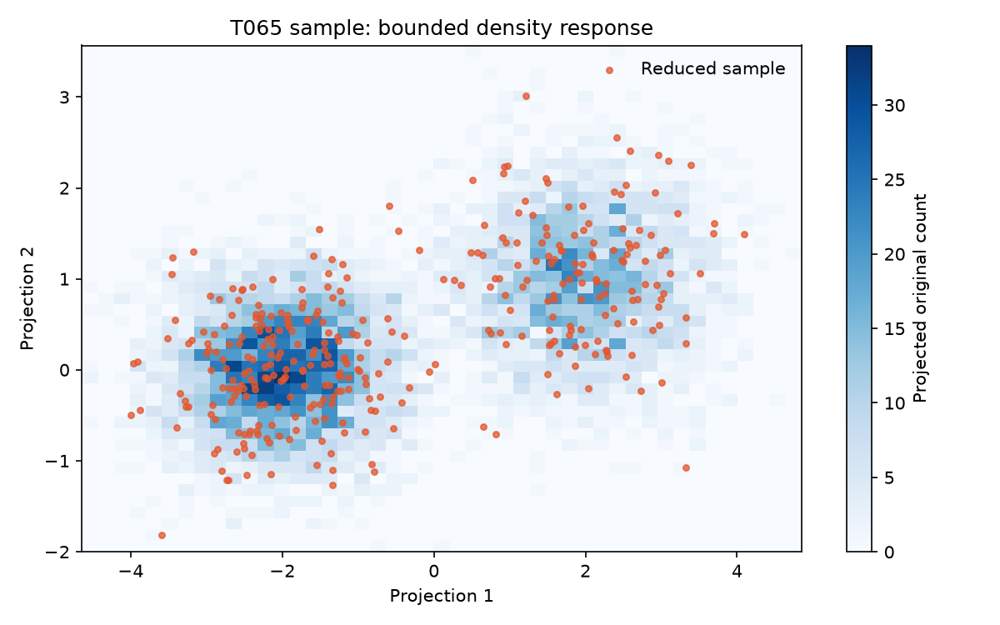

# T065 — 원본 대용량 시각화용 데이터 API

## 문서 성격과 현재 상태

구현 전 확인한 범위와 검증 계획을 기록한다. 최종 판정은 리뷰 문서에 남긴다.

- 기준: 2026-10-01 dev
- 백로그 상태: `in_progress` / 에픽: `E6` / 예상: 30분
- 후행 작업: [T091](T091.md)

## 쉽게 이해하기

원본 전체를 브라우저에 보내는 대신 일부 점이나 밀도로 표현해 응답 크기를 제한한다.

## 의존 작업

- [T053](T053.md): `done` — 2D/3D 투영 계산
- [T064](T064.md): `done` — 결과 조회 API

## 범위와 완료 기준

원본은 서브샘플 또는 2D 밀도(binning) 형태로 반환

1. 수십만 행 원본도 응답 크기 제한 내
2. `sample`은 원본·축소본 점 수 상한을 지키고 인덱스를 함께 반환
3. `density`는 원본 2D 격자와 제한된 축소본 점을 반환
4. 원본 전체 행 수와 실제 투영 표본 수를 구분해 표시

## 구현 계획

1. `backend/app/api/visualizations.py`에 표본/밀도 응답 모델과 엔드포인트를 둔다.
2. T064 결과 스키마를 재사용하고 그룹 이름, 모드, 점/격자 한도를 검증한다.
3. 10만 점 합성 결과에서도 응답 크기가 상한 내인지 테스트한다.
4. 실제 변환 함수로 샘플 이미지를 만들어 문서에 첨부한다.

## 관련 요구사항

[problem.md](../../problem.md)의 §3 입력 데이터, §7 사용자 흐름을 참고한다. 제목과 절 구성은 작업 시작 때 다시 확인한다.

## 현재 코드 근거와 관련 파일

- [backend/app/main.py](../../backend/app/main.py) — 현재 존재하는 참고 파일.
- [backend/app/api/jobs.py](../../backend/app/api/jobs.py) — 현재 존재하는 참고 파일.
- [backend/app/api/groups.py](../../backend/app/api/groups.py) — 현재 존재하는 참고 파일.

### 구현 시 검토할 위치

파일명과 구성은 확정 설계가 아니라 후보다. 기존 파일을 확장할지 새 파일로 나눌지는 착수 시 판단한다.

- `backend/app/api/results.py` — 현재 없음; 생성 후보

## 검증 근거와 다음 확인

- `pytest tests/test_visualizations.py`
- `ruff check app/api/visualizations.py tests/test_visualizations.py`
- 전체 API 회귀 및 품질 게이트

## 경계 사례와 위험

없는 job/group, 잘못된 입력, 재시작·동시 요청, 응답 크기와 오류 메시지를 확인한다.

## 줄 수 제한

core 파일 300/함수50, API 파일200/함수40, backend 테스트400/함수60, TSX250/함수80, TS200/함수50, scripts200/함수50 (공백 제외). 정확한 적용 규칙은 [hooks/config.json](../../hooks/config.json) 참고.

## 샘플 이미지

`build_visualization`과 합성 투영 좌표로 만든 API 표현 예시이며 실제 사용자 데이터 결과는 아니다.
파란 격자는 원본 투영 표본의 밀도, 주황 점은 응답 상한 내 축소본 표본이다.
