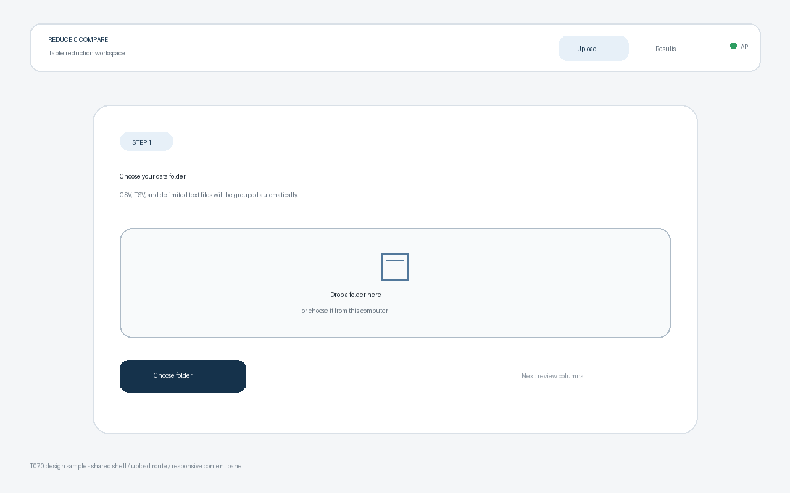

# T070 Task Analysis — 앱 레이아웃과 라우팅

## Task and dependency status

- Task: T070, 앱 레이아웃과 라우팅
- Status: `todo` at analysis time; move to `in_progress` before implementation.
- Estimate: 20 minutes
- Dependency: T012 (`done`), React/Vite frontend initialization.
- Downstream tasks: T072, T080, T143.
- Active branch: `dev`.

## Scope

- Replace the single placeholder screen with a shared application shell and two pages: upload (`/`) and results (`/results`).
- Provide visible navigation between both pages without a full browser reload.
- Keep the existing backend health status visible in the shared header.
- Make direct visits and browser Back/Forward navigation resolve to the correct page.
- Provide useful empty-state content so both routes remain understandable before later feature tasks add real data.
- Add responsive and accessible layout styling for desktop and narrow screens.

## Non-goals

- Implementing folder upload, API client abstractions, processing, polling, charts, metrics, or real result data.
- Adding React Router or another routing dependency for two static routes.
- Defining the final upload workflow or result-dashboard components owned by downstream tasks.
- Backend changes.

## Technical approach

- Use a small History API router in `App.tsx` because the application currently has only two routes and no router dependency.
- Normalize trailing slashes and render a not-found state for unsupported paths rather than silently showing the wrong page.
- Centralize route changes in an accessible link component that preserves modified-click and external browser behavior.
- Split shared shell/navigation and the two page placeholders into focused frontend components if needed to stay within line limits.
- Keep the health check in the application shell so route changes do not restart or hide connection state.

## Acceptance criteria

1. `/` renders a clearly identified upload page and `/results` renders a clearly identified results page.
2. Header navigation changes pages client-side and indicates the active page.
3. Browser Back/Forward navigation updates the rendered page.
4. Direct route loading works through Vite's SPA fallback, including a trailing slash on `/results/`.
5. Unknown routes show a useful not-found view with a route back to upload.
6. Backend health status remains visible and accessible on both pages.
7. Layout remains readable on desktop and narrow screens, and frontend lint/build pass.

## Relevant requirements

- `problem.md` §7: the application starts with folder selection/upload and later presents a result screen.
- `problem.md` §8: the UI is a local browser application backed by local processing.
- T070 backlog acceptance: upload and result pages exist and page navigation works.

## Existing and expected files

- `frontend/src/App.tsx`: currently owns the health check and placeholder screen; update to own route state and shared shell.
- `frontend/src/styles.css`: replace placeholder styling with the shared responsive layout and page states.
- New component files may be added under `frontend/src/` only where they improve separation and line-limit safety.
- `frontend/src/main.tsx`, `frontend/package.json`, and backend files require no change.
- `docs/tasks/T070.sample.png`: representative design sample for the two-page shell.

## Representative sample

The sample illustrates the intended upload route in the shared shell. It is a design reference, not production evidence.

## Test plan

- Run ESLint and the production TypeScript/Vite build.
- Start the Vite preview and verify `/`, `/results`, `/results/`, and an unknown route return the SPA document.
- Exercise navigation, active-state semantics, and Back/Forward behavior in a browser if an automated browser is available.
- Inspect the rendered desktop and narrow-screen layouts visually.
- Run `git diff --check` and line-limit checks.

## Edge cases and risks

- Modified clicks, middle clicks, downloads, and links targeting another browsing context must not be intercepted.
- A `popstate` listener must be removed on unmount, including React Strict Mode remounts.
- Query strings and hashes must not prevent pathname route matching.
- Trailing slash normalization must not turn unknown nested paths into valid pages.
- The results route has no task/result identifier yet; it must present an honest empty state rather than fabricated data.
- Vite dev/preview supports SPA fallback, but production hosting rewrites remain outside this local-only task.

## Line limits

From `hooks/config.json`:

- Frontend TSX files: at most 250 non-blank lines per file and 80 per function.
- Frontend TS files: at most 200 non-blank lines per file and 50 per function.

## Unknowns

- Final page content, task identifiers, API response types, and result URL shape belong to downstream tasks and remain unknown.
- No frontend unit-test framework or DOM test runner is currently configured; lint, build, preview routing, and browser checks provide proportional evidence for this scaffolding task.
