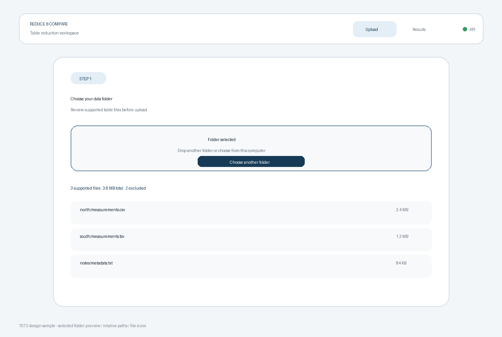

# T072 Task Analysis — 폴더 선택 UI

## Task and dependency status

- Task: T072, 폴더 선택 UI.
- Status: `todo` at analysis time; move to `in_progress` before implementation.
- Estimate: 30 minutes.
- Dependency: T070 (`done`), app shell and upload route.
- Downstream task: T073, upload connection.
- Active branch: `dev`.

## Scope

- Add an accessible folder chooser using a hidden file input with the browser directory-selection attributes.
- Accept a folder by drag and drop, including recursive traversal when Chromium exposes directory entries.
- Keep only supported tabular extensions: `.csv`, `.tsv`, and `.txt`, case-insensitively.
- Preview each accepted file's relative path and readable byte size before any upload occurs.
- Show the selected file count, combined size, unsupported-file count, empty selection guidance, and a clear-selection action.
- Preserve the T070 app shell, routing, health status, and result placeholder.

## Non-goals

- Sending files to `/jobs`, showing upload progress, receiving a `job_id`, or navigating after upload; these belong to T073.
- Parsing file contents, validating whether `.txt` is actually tabular, detecting encoding/delimiters, or grouping schemas.
- Reading or displaying full local absolute paths, file contents, or directory handles.
- Adding a frontend test framework or a new dependency.

## Technical approach

- Introduce a focused `FolderPicker` component and keep routing concerns in `App.tsx`.
- Represent selections as `{ file, path }` records so folder-relative paths survive both input and directory-drop flows.
- Read dropped `FileSystemEntry` directory trees asynchronously, exhausting directory-reader batches until empty.
- Fall back to `DataTransfer.files` where entry traversal is unavailable.
- Filter and sort the display model without mutating browser `FileList` objects.
- Format file sizes locally with bytes/KB/MB/GB units; do not inspect file contents.

## Acceptance criteria

1. The upload page exposes a keyboard-operable “choose folder” control backed by a directory input.
2. Folder drag and drop selects supported files recursively when the browser provides directory entries.
3. Selecting files shows relative paths and individual sizes for `.csv`, `.tsv`, and `.txt` files.
4. The summary shows supported file count, total size, and how many unsupported files were excluded.
5. Empty/unsupported-only selections show clear guidance and never imply upload success.
6. A clear action removes the current preview, and selecting the same folder again remains possible.
7. Existing routes remain functional, responsive layouts remain readable, and frontend lint/build pass.

## Relevant requirements

- `problem.md` §3: folder input supporting CSV, TSV, and delimiter text files.
- `problem.md` §7: folder selection/upload is the first interactive step.
- T072 backlog acceptance: folder selection displays CSV-family file names and sizes.
- Backend `/jobs` already accepts `.csv`, `.tsv`, and `.txt` relative filenames; transmission is deferred to T073.

## Existing and expected files

- `frontend/src/App.tsx`: replace the upload placeholder with `FolderPicker`.
- `frontend/src/styles.css`: add drop zone, selection summary, file list, and narrow-layout styles.
- New `frontend/src/FolderPicker.tsx`: selection, directory traversal, filtering, formatting, and preview UI.
- `frontend/src/main.tsx`, package files, and backend files require no change.
- `docs/tasks/T072.sample.png`: representative selected-folder preview.

## Representative sample

The sample shows the intended selected-folder state with supported-file counts and relative paths. It is a design reference, not production evidence.

## Test plan

- Run frontend ESLint and the production TypeScript/Vite build.
- Verify chooser attributes and keyboard activation in a live browser.
- Use browser automation to provide synthetic `File` objects for supported, unsupported, nested, mixed-case, empty, and repeated-selection states without uploading them.
- Verify drag-active styling and narrow-screen rendering visually.
- Recheck `/results` and unknown routes for T070 regressions.
- Run `git diff --check` and line-limit checks.

## Edge cases and risks

- Directory readers can return entries in multiple batches; traversal must continue until an empty batch.
- Drag events can repeatedly enter child elements; styling must be cleared reliably on leave/drop.
- `webkitRelativePath` may be empty in programmatic or fallback selections, so filename fallback is required.
- Unsupported-only and empty folders must clear stale prior selections rather than leaving misleading results.
- Duplicate relative paths can occur in malformed programmatic selections; the preview should remain stable and deterministic.
- Large folders can contain many files; only metadata is retained and the list uses a bounded scroll area.
- `webkitdirectory` and entry traversal are Chromium-oriented nonstandard APIs; fallback behavior is documented by the UI model and no upload occurs in this task.

## Line limits

From `hooks/config.json`:

- Frontend TSX files: at most 250 non-blank lines per file and 80 per function.
- Frontend TS files: at most 200 non-blank lines per file and 50 per function.

## Unknowns

- The final upload button placement, progress state, API error presentation, and post-upload route are owned by T073.
- Browser behavior for dragging directories outside Chromium varies; the fallback can preview exposed files but cannot guarantee recursive discovery without entry APIs.
