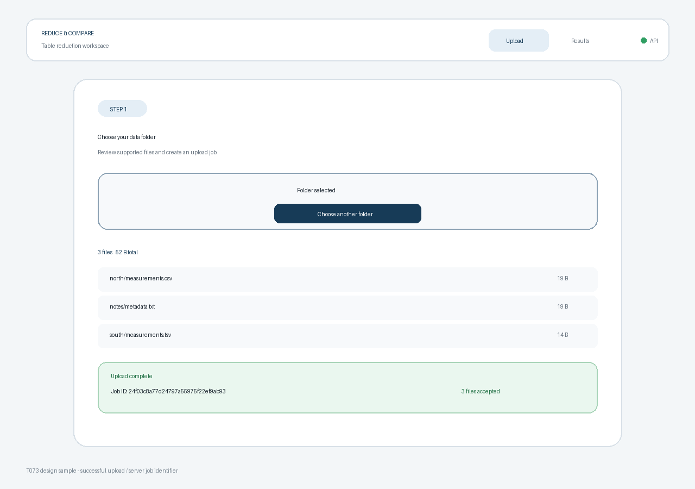

# T073 Task Analysis — 업로드 연결

## Task and dependency status

- Task: T073, 업로드 연결.
- Status: `todo` at analysis time; move to `in_progress` before implementation.
- Estimate: 25 minutes.
- Dependencies: T071 (`done`), typed API client; T072 (`done`), folder selection UI.
- Downstream task: T074, schema-group review UI.
- Active branch: `dev`.

## Scope

- Expose the accepted `UploadItem[]` selection from `FolderPicker` to its parent.
- Add an upload action that calls `createJob` with the selected relative paths.
- Show idle, uploading, success, and failure states with accessible live feedback.
- Disable folder replacement, clearing, and duplicate submission while an upload is active.
- On success, retain and display the returned 32-character `job_id` and accepted-file count for the next workflow step.
- Allow retry after failure and reset stale success/error state when the selection changes.
- Abort an in-flight request when the upload page unmounts.

## Non-goals

- Schema-group retrieval/review, column selection, running the reduction pipeline, polling, or result navigation.
- Byte-accurate upload percentage; the Fetch API does not expose upload progress, so this task uses a truthful indeterminate progress state.
- Persisting jobs across browser restarts or introducing global state/storage.
- Changing backend upload behavior, API schemas, file filtering, or size limits.

## Technical approach

- Add `onSelectionChange` and `disabled` props to `FolderPicker`, using the existing `UploadItem` type from the API module.
- Move the upload route body into a focused `UploadPage.tsx` component to keep `App.tsx` and functions within limits.
- Model upload state as a discriminated union: idle, uploading, success, or error.
- Use an `AbortController` ref for the active request and abort it on unmount.
- Catch `ApiError` for server/network messages, preserve abort behavior, and use a generic message only for unexpected failures.
- Render the returned job identifier as text, not as a navigation link, because T074 owns the next screen.

## Acceptance criteria

1. Selecting at least one supported file enables a clearly labeled upload button.
2. Starting upload submits exactly the accepted files with their relative paths through `createJob`.
3. While uploading, the UI shows an accessible indeterminate progress state and prevents duplicate submission or selection mutation.
4. A successful response displays the returned `job_id` and uploaded file count.
5. Server and network failures display a useful message and allow retry without losing the selected files.
6. Empty and unsupported-only selections cannot submit; changing or clearing a selection resets stale result/error state.
7. Unmounting aborts an in-flight upload without setting an error afterward.
8. Desktop/mobile layouts, existing routes, frontend lint/build, and backend upload tests pass.

## Relevant requirements

- `problem.md` §3: folders contain CSV, TSV, and delimiter text files.
- `problem.md` §7: folder selection/upload precedes schema review.
- `problem.md` §8: heavy work runs in the local backend and progress must be visible.
- T073 backlog acceptance: completion returns and exposes a `job_id`.
- Backend `POST /jobs`: multipart `files`, 201 response `{ job_id, files }`.

## Existing and expected files

- `frontend/src/FolderPicker.tsx`: expose supported selections and accept a disabled state.
- New `frontend/src/UploadPage.tsx`: upload state machine, API call, status, retry, and success display.
- `frontend/src/App.tsx`: render the new upload page component.
- `frontend/src/styles.css`: upload action, indeterminate progress, error, and success styling.
- API client/backend files require no change unless verification exposes a contract defect.
- `docs/tasks/T073.sample.png`: representative successful upload state.

## Representative sample

The sample shows the intended successful upload state with the server-issued job identifier. It is a design reference, not production evidence.

## Test plan

- Run frontend ESLint and the production TypeScript/Vite build.
- Run backend job-upload tests.
- With local frontend/backend servers, choose a synthetic nested folder and submit it.
- Verify uploaded relative paths and file contents under the exact returned test job directory, then remove that test job artifact.
- Verify button disabling, progress semantics, success `job_id`, selection reset, stopped-backend error, and retry availability.
- Inspect desktop and narrow-screen success/error layouts.
- Recheck result and unknown routes, `git diff --check`, and line limits.

## Edge cases and risks

- Selection callbacks must contain only supported files, not excluded entries.
- A late response after unmount must not update React state.
- A new selection must not retain an earlier job identifier or failure message.
- Double clicks and pressing Enter repeatedly must not create multiple jobs while uploading.
- A server can accept fewer files than submitted only if backend filtering changes; the success view reports the server-returned count.
- Backend errors can be structured or network-level; the API client already normalizes both.
- Very fast local uploads may show progress only briefly, but status semantics must still be correct.

## Line limits

From `hooks/config.json`:

- Frontend TSX files: at most 250 non-blank lines per file and 80 per function.
- Frontend TS files: at most 200 non-blank lines per file and 50 per function.

## Unknowns

- T074 will decide how the `job_id` feeds schema-group review and whether it later belongs in route or global state.
- True byte-level progress would require XMLHttpRequest or another transport and is not selected for this Fetch-based client.
