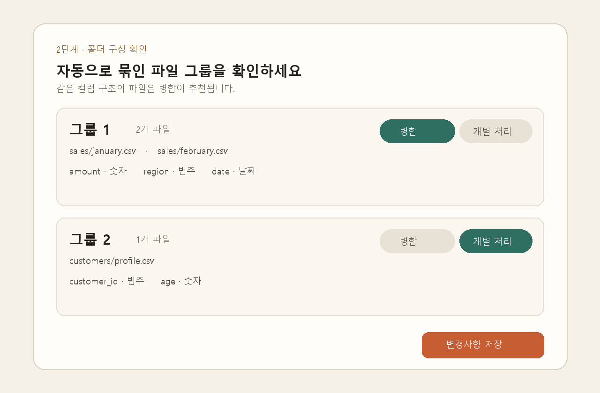

# T074 — 폴더 구성 판별 결과 UI

## 문서 성격과 현재 상태

구현 전 Task Analysis 문서다. 완료나 검증 PASS를 의미하지 않는다.

- 기준: 2026-10-02 `dev`
- 백로그 상태: `todo` / 에픽: `E7` / 예상: 30분
- 의존 작업: T061 `done`, T073 `done`
- 후행 작업: T075, T076

## 쉽게 이해하기

업로드가 끝나면 서버가 같은 컬럼 구조끼리 묶은 파일 그룹을 보여준다. 사용자는 각 그룹을 하나로 합쳐 분석할지, 파일별로 따로 처리할지 선택하고 변경 내용을 저장할 수 있다.

## 범위

- 업로드 성공 후 해당 작업의 그룹 판별 결과를 조회한다.
- 그룹별 파일 목록과 컬럼 구조 요약을 표시한다.
- 각 그룹의 `병합` / `개별 처리` 결정을 명시적인 단일 선택 컨트롤로 제공한다.
- 변경된 전체 그룹 결정을 PUT으로 저장하고 서버 응답으로 화면 상태를 동기화한다.
- 조회·저장 중 상태, 오류와 재시도, 저장 완료 상태를 제공한다.
- 작은 화면에서도 파일명과 선택 컨트롤이 잘리지 않도록 반응형으로 구성한다.

## 비범위

- 그룹별 분석 컬럼 선택(T076)
- 파이프라인 실행과 진행률(T075, T113)
- 그룹 판별 알고리즘이나 API 스키마 변경
- 업로드 작업을 브라우저 새로고침 뒤 복원하는 라우팅/영속 상태
- 자동 저장

## 완료 기준

1. 업로드 성공 뒤 `GET /jobs/{job_id}/groups` 결과의 모든 그룹이 표시된다.
2. 각 그룹에 파일 경로, 파일 수, 컬럼명과 종류가 표시된다.
3. 서버의 `merge` 값이 병합/개별 처리 선택의 초기값으로 반영된다.
4. 선택을 바꾸면 저장 가능 상태가 되고, 저장 시 현재 모든 그룹을 각각 한 번 포함한 PUT 요청을 보낸다.
5. 저장 중 중복 요청과 추가 조작을 막고, 성공 응답으로 기준 상태를 갱신해 저장 완료를 알린다.
6. 조회 실패는 재조회할 수 있고, 저장 실패 때는 사용자의 변경값을 유지한 채 다시 저장할 수 있다.
7. 작업 변경·컴포넌트 해제 뒤 늦게 도착한 응답이 현재 화면을 덮어쓰지 않는다.
8. 프론트 lint/build와 관련 백엔드 그룹 API 테스트가 통과한다.

## 관련 요구사항

- `problem.md` §3: 같은 컬럼 구조는 병합하고 다른 구조는 그룹별 처리하며, 자동 판별 결과와 사용자 재정의를 화면에 제공한다.
- `problem.md` §7: 폴더 업로드 다음 단계에서 구성 자동 판별 결과를 확인한다.
- 백로그 원문 완료 조건: 변경 사항이 PUT으로 저장됨.

## 기존 코드와 예상 변경 파일

- `frontend/src/UploadPage.tsx`: 업로드 성공 뒤 그룹 UI를 연결한다.
- `frontend/src/api/client.ts`: `getGroups`, `updateGroups`가 이미 존재한다.
- `frontend/src/api/types.ts`: `GroupView`, `GroupUpdate`, `GroupsView`가 이미 존재한다.
- `frontend/src/GroupReview.tsx`: 조회·표시·선택·저장 상태를 담당하는 새 컴포넌트 후보다.
- `frontend/src/styles.css`: 그룹 카드와 반응형 상태 스타일을 추가한다.
- `backend/tests/test_job_groups.py`: 기존 GET/PUT 계약 회귀 테스트다.

## 상태·오류 설계

- 조회: loading → ready 또는 error. error에서 재시도하면 새 요청을 만든다.
- 편집: 서버 응답을 기준값으로 보관하고 현재 선택과 비교해 변경 여부를 계산한다.
- 저장: idle/saving/saved/error. 오류가 나도 현재 선택은 그대로 둔다.
- AbortController로 조회와 저장을 해제 시 취소한다. 활성 요청과 일치할 때만 결과를 반영한다.
- 빈 그룹 응답은 정상적인 빈 상태로 안내하고 저장 버튼을 노출하지 않는다.

## 테스트 계획

- `npm run lint --silent`, `npm run build --silent`
- `pytest -q tests/test_job_groups.py tests/test_jobs.py`
- 브라우저에서 합성 CSV를 업로드해 여러 그룹 표시, 토글 변경, PUT 저장 완료와 새로 조회한 값 유지 확인
- 좁은 화면에서 파일 목록과 선택 컨트롤 배치 확인

## 대표 화면 예시

아래 이미지는 합성 데이터로 만든 설계·검증용 예시이며 실제 완료 증거가 아니다.

## 경계 사례와 위험

- 그룹이 없거나 컬럼 목록이 비어도 렌더링 오류 없이 안내해야 한다.
- 긴 상대 경로와 많은 컬럼은 카드 폭을 넘지 않아야 한다.
- 저장 직전의 모든 그룹을 빠짐없이 보내야 백엔드의 정확 집합 검증을 통과한다.
- 빠른 재시도·작업 변경 때 이전 요청의 늦은 응답을 무시해야 한다.
- API가 정규화한 값을 반환할 수 있으므로 성공 시 로컬 추정값이 아닌 응답을 기준으로 삼는다.

## 줄 수 제한

TSX 파일 250줄/함수 80줄, TS 파일 200줄/함수 50줄(공백 제외). 정확한 규칙은 `hooks/config.json`을 따른다.

## 확인되지 않은 내용

- 전용 프론트 테스트 러너는 현재 확인되지 않아 lint/build와 실제 브라우저 검증을 우선한다.
