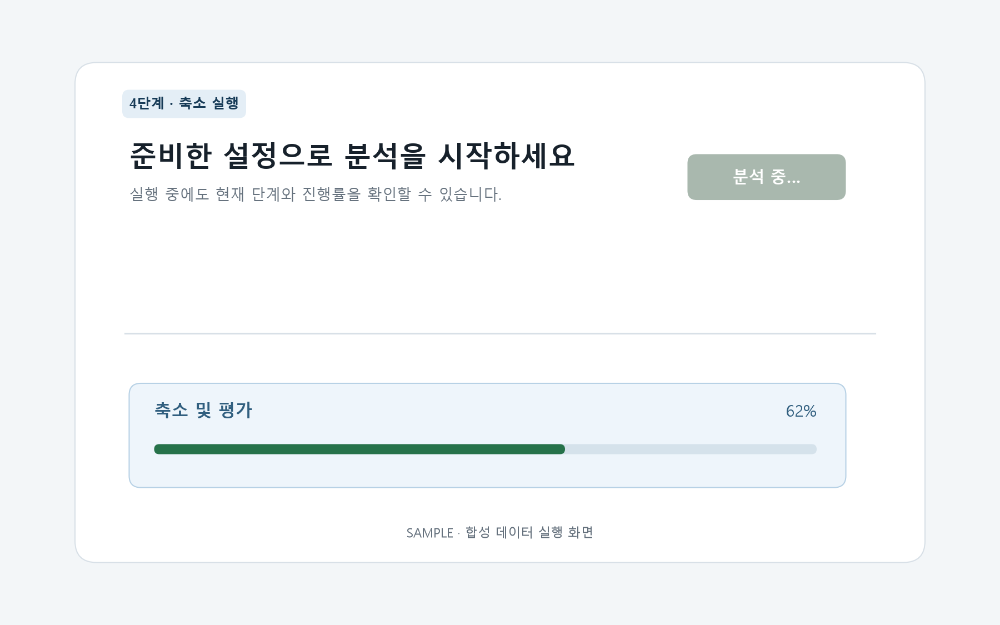

# T075 — 실행 및 진행 상태 UI

## 문서 성격과 현재 상태

구현 전 확인한 범위와 검증 계획을 기록한다. 최종 판정은 리뷰 문서에 남긴다.

- 기준: 2026-10-02 dev
- 백로그 상태: `in_progress` / 에픽: `E7` / 예상: 25분
- 후행 작업: [T122](T122.md)

## 쉽게 이해하기

실행 버튼으로 계산을 시작하고 단계와 진행률을 표시하다 완료되면 결과 화면으로 이동한다.

## 의존 작업

- [T063](T063.md): `done` — 진행 상태 API
- [T074](T074.md): `done` — 폴더 구성 판별 결과 UI
- [T077](T077.md): `done` — 컬럼 선택 검증과 안내

## 범위와 완료 기준

실행 버튼, 진행률 바와 단계명 폴링 표시, 완료 시 결과 화면 이동

1. 진행률이 갱신되고 완료 후 자동 이동
2. 그룹 결정과 컬럼 선택이 모두 저장된 경우에만 실행 가능
3. 네트워크/작업 실패 안내와 상태 재확인 제공

## 구현 계획

1. `RunPanel.tsx`에서 실행 요청, 상태 폴링, 진행률·단계·오류 표시를 담당한다.
2. `GroupReview`와 `ColumnReview`의 저장 준비 상태를 합쳐 실행 버튼을 제어한다.
3. 완료 시 작업 ID를 보존한 `/results?job=<id>`로 이동한다.
4. lint/build, API 회귀, 실제 브라우저 흐름과 반응형 화면을 검증한다.

## 관련 요구사항

[problem.md](../../problem.md)의 §7 사용자 흐름을 참고한다. 제목과 절 구성은 작업 시작 때 다시 확인한다.

## 현재 코드 근거와 관련 파일

- [frontend/src/App.tsx](../../frontend/src/App.tsx) — 현재 존재하는 참고 파일.
- [frontend/package.json](../../frontend/package.json) — 현재 존재하는 참고 파일.

### 구현 시 검토할 위치

파일명과 구성은 확정 설계가 아니라 후보다. 기존 파일을 확장할지 새 파일로 나눌지는 착수 시 판단한다.

- `frontend/src/components/T075.tsx` — 현재 없음; 생성 후보

## 검증 근거와 다음 확인

- `npm run lint --silent`, `npm run build --silent`
- `pytest tests/test_job_runs.py tests/test_job_status.py`
- 합성 CSV를 사용한 브라우저 실행·진행률·완료 이동 확인

## 경계 사례와 위험

빈 선택, 다중 그룹, 네트워크 실패, 중복 실행, 오래된 폴링 응답을 확인한다.

## 줄 수 제한

core 파일 300/함수50, API 파일200/함수40, backend 테스트400/함수60, TSX250/함수80, TS200/함수50, scripts200/함수50 (공백 제외). 정확한 적용 규칙은 [hooks/config.json](../../hooks/config.json) 참고.

## 대표 화면 예시

아래 이미지는 구현 화면의 문구·색상·진행 상태를 사용한 합성 데이터 실행 예시이며 실제 사용자
데이터 결과는 아니다.

