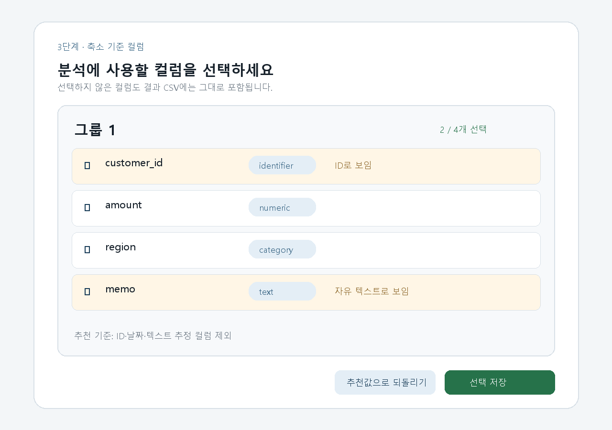

# T076 — 축소 기준 컬럼 선택 UI

## 문서 성격과 현재 상태

구현 전 Task Analysis 문서다. 완료나 검증 PASS를 의미하지 않는다.

- 기준: 2026-10-02 `dev`
- 백로그 상태: `todo` / 에픽: `E7` / 예상: 30분
- 의존 작업: T067 `done`, T074 `done`
- 후행 작업: T077

## 쉽게 이해하기

폴더 구성을 확인한 다음 각 그룹에서 축소 계산에 사용할 컬럼을 고른다. 서버가 추천한 선택값과 자동 제외 사유를 보여주고, 사용자가 바꾼 값은 그룹별로 저장하거나 추천값으로 되돌릴 수 있다.

## 범위

- 판별된 모든 그룹의 컬럼 선택 정보를 조회한다.
- 그룹별 체크박스 목록에 컬럼명, 타입, 결측률, 자동 제외 사유를 표시한다.
- 현재 선택 개수와 최소 1개 선택 규칙을 즉시 안내한다.
- 그룹별 변경값을 PUT으로 저장한다.
- `추천값으로 되돌리기`가 `default_selected` 기준으로 로컬 선택을 복원한다.
- 조회·저장 상태, 오류·재시도, 저장 완료 상태를 그룹별로 제공한다.
- 좁은 화면에서도 컬럼 행과 그룹별 동작 버튼이 읽기 쉽게 배치된다.

## 비범위

- 컬럼 추천 규칙이나 API 스키마 변경
- 그룹 병합 판정 기능 변경(T074)
- 파이프라인 실행, 진행률, 결과 화면(T075, T077)
- 컬럼 선택 자동 저장
- 선택하지 않은 컬럼을 결과 CSV에서 제거하는 기능

## 완료 기준

1. 폴더 구성 조회 성공 뒤 각 그룹의 `GET .../columns` 결과가 표시된다.
2. 체크박스 초기값은 서버의 `selected`, 추천 복원 기준은 `default_selected`를 사용한다.
3. 컬럼명·종류·dtype·결측률과 자동 제외 사유가 표시된다.
4. 선택 개수를 항상 표시하고 0개일 때 저장을 막으며 최소 1개 안내를 제공한다.
5. 저장 시 해당 그룹의 선택된 컬럼명만 PUT으로 보내고 성공 응답으로 기준 상태를 갱신한다.
6. 추천값 복원은 아직 저장하지 않은 로컬 선택만 기본값으로 되돌리고, 변경된 경우 저장 가능 상태가 된다.
7. 조회 실패는 그룹별 재시도가 가능하고 저장 실패 때 편집값을 유지한다.
8. 작업 변경·컴포넌트 해제 뒤 늦은 응답이 현재 화면을 덮어쓰지 않는다.
9. 프론트 lint/build와 컬럼 API 회귀 테스트가 통과한다.

## 관련 요구사항

- `problem.md` §3: 결측률 50% 초과 컬럼은 기본 선택에서 자동 제외한다.
- `problem.md` §4: 그룹별 축소 기준 컬럼을 선택하며 ID·날짜·자유 텍스트 추정 컬럼은 기본 해제, 최소 1개 이상 필요하다.
- `problem.md` §7: 폴더 구성 확인 다음에 축소 기준 컬럼을 확인·수정한다.
- 백로그 원문 완료 조건: 체크 변경 PUT 저장, 추천값 복원 동작.

## 기존 코드와 예상 변경 파일

- `frontend/src/GroupReview.tsx`: 판별된 그룹 ID를 컬럼 선택 UI에 연결한다.
- `frontend/src/api/client.ts`: `getColumns`, `updateColumns`가 이미 존재한다.
- `frontend/src/api/types.ts`: `ColumnChoice`, `ColumnChoices`가 이미 존재한다.
- `frontend/src/ColumnReview.tsx`: 그룹별 조회·편집·복원·저장 상태를 담당하는 새 컴포넌트 후보다.
- `frontend/src/styles.css`: 컬럼 선택 카드와 반응형 스타일을 추가한다.
- `backend/tests/test_job_columns.py`: 기존 GET/PUT 계약 회귀 테스트다.

## 상태·오류 설계

- 각 그룹은 독립적인 loading/ready/error 상태와 AbortController를 가진다.
- 서버 응답의 선택 목록을 기준값으로 저장해 현재 선택과 비교한다.
- 저장 중 해당 그룹의 조작과 중복 저장만 막고 다른 그룹은 계속 편집할 수 있다.
- PUT 오류 시 현재 체크 상태를 보존하며 재시도할 수 있다.
- 추천 복원 후 선택값이 0개인 비정상 응답도 저장은 막고 안내한다.

## 테스트 계획

- `npm run lint --silent`, `npm run build --silent`
- `pytest -q tests/test_job_columns.py tests/test_job_groups.py tests/test_jobs.py`
- 브라우저에서 자동 제외 사유 표시, 선택 개수 갱신, 0개 방지, 추천 복원, PUT 저장과 재조회 유지 확인
- 키보드 체크박스 조작과 좁은 화면 배치 확인

## 대표 화면 예시

아래 이미지는 합성 데이터로 만든 설계·검증용 예시이며 실제 완료 증거가 아니다.

## 경계 사례와 위험

- 그룹 또는 컬럼이 비어 있어도 렌더링 오류 없이 안내해야 한다.
- 모든 추천값이 해제된 비정상 데이터에서는 최소 1개 선택 안내가 유지되어야 한다.
- 같은 이름의 컬럼이 그룹마다 존재하므로 checkbox id/name은 그룹 ID를 포함해야 한다.
- 저장 요청 중 다른 그룹 응답이나 오래된 재시도 응답이 상태를 섞지 않아야 한다.
- 긴 컬럼명·dtype·제외 사유는 카드 폭을 넘지 않아야 한다.

## 줄 수 제한

TSX 파일 250줄/함수 80줄, TS 파일 200줄/함수 50줄(공백 제외). 정확한 규칙은 `hooks/config.json`을 따른다.

## 확인되지 않은 내용

- 전용 프론트 테스트 러너는 현재 확인되지 않아 lint/build와 실제 브라우저 검증을 우선한다.
