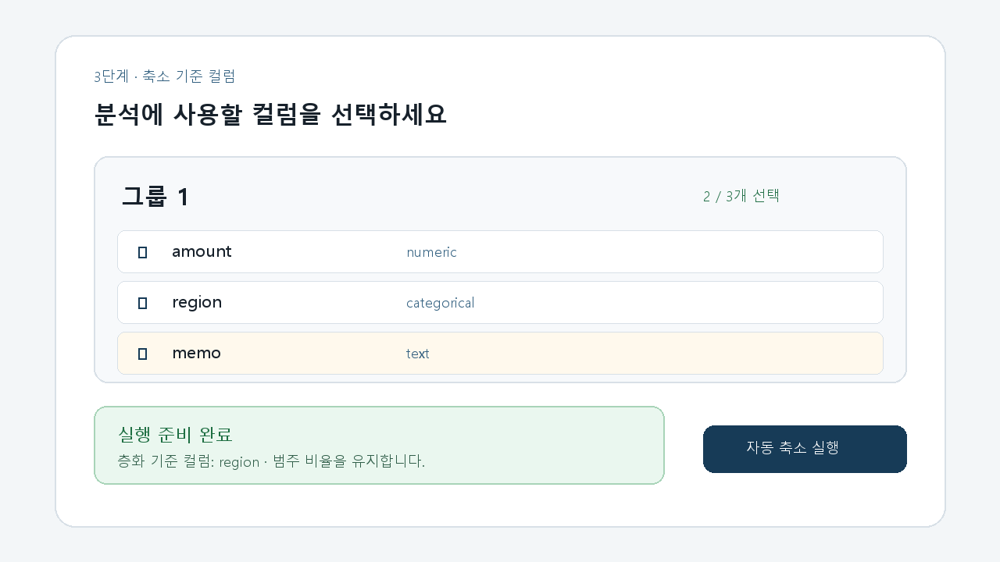

# T077 — 컬럼 선택 검증과 안내

## 문서 성격과 현재 상태

구현 전 Task Analysis 문서다. 완료나 검증 PASS를 의미하지 않는다.

- 기준: 2026-10-02 `dev`
- 백로그 상태: `todo` / 에픽: `E7` / 예상: 15분
- 의존 작업: T076 `done`, T029 `done`
- 후행 작업: T075

## 쉽게 이해하기

각 그룹에서 컬럼을 하나도 고르지 않은 상태는 실행 불가로 명확히 표시한다. 선택된 범주형 컬럼 중 실제 층화 규칙이 고른 컬럼 이름도 보여줘, 어떤 비율을 보존하려는지 실행 전에 알 수 있게 한다.

## 범위

- 그룹별 컬럼 선택 상태가 0개인지 검증하고 실행 준비 여부를 화면과 컴포넌트 상태로 제공한다.
- 0개 선택 상태에 경고를 표시하고 후행 실행 UI가 사용할 수 있는 `ready` 상태를 만든다.
- 백엔드 컬럼 응답에 T029의 실제 자동 선택 결과(`stratify_column` 또는 없음)를 포함한다.
- 저장 성공 때 층화 기준 안내를 갱신하고, 저장 전 편집 중에는 재계산이 필요함을 알린다.
- 층화 기준이 없으면 오류가 아니라 층화 샘플링을 건너뛴다는 안내를 표시한다.

## 비범위

- 실행 버튼의 API 연결, 진행률 폴링, 결과 화면 이동(T075)
- 층화 기준 자동 선택 알고리즘 변경(T029)
- 사용자가 층화 기준을 직접 지정하는 기능
- 축소 실행 API나 파이프라인 변경

## 완료 기준

1. 그룹에서 선택 컬럼이 0개면 경고와 `ready=false`가 되고, 후행 실행 UI가 실행을 허용할 수 없다.
2. 조회·편집·추천 복원·저장 후 현재 선택에 맞는 층화 기준 컬럼 이름 또는 `없음` 안내가 표시된다.
3. 백엔드가 T029의 `choose_stratify_column`을 사용해 현재 저장 선택에 대한 결과를 반환한다.
4. 저장 전 로컬 편집 상태에서는 부정확한 후보를 예측하지 않고 저장 후 재계산됨을 안내한다.
5. 다중 그룹은 각자의 검증·층화 안내를 독립적으로 유지한다.
6. 프론트 lint/build와 컬럼·층화 관련 회귀 테스트가 통과한다.

## 관련 요구사항

- `problem.md` §4: 축소 기준 컬럼은 최소 1개 이상 선택해야 실행 가능하다.
- `problem.md` §4: 층화 기준 컬럼은 선택된 범주형 컬럼 중 자동 선택한다.
- `problem.md` §7: 컬럼 확인·수정 뒤 자동 축소 실행으로 진행한다.
- 백로그 원문 완료 조건: 0개 선택 시 실행 불가, 층화 기준 컬럼 이름 표시.

## 설계 결정

- T075가 실행 버튼과 진행률을 소유하므로 이번 작업은 실행 가능 여부를 콜백으로 노출하고 화면에는 준비 상태를 표시한다.
- 정확한 층화 선택은 데이터의 범주 수·분포가 필요하므로 프론트가 `kind`만 보고 임의로 고르지 않는다.
- 백엔드는 그룹 데이터를 읽어 T029 함수를 호출하고 `stratify_column`을 응답한다.
- 실제 파이프라인처럼 현재 선택 컬럼의 결측 행을 제거한 뒤 T029 함수를 호출한다.
- 저장 전 편집은 서버 계산 전이므로 기존 저장 기준과 재계산 예정 상태를 구분해 보여준다.

## 기존 코드와 예상 변경 파일

- `backend/app/api/columns.py`: 현재 선택에 대한 층화 기준과 후보 목록을 응답한다.
- `backend/app/core/sampling.py`: 기존 T029 선택 함수를 그대로 사용하고 후보 순서 계산을 공유할 수 있다.
- `backend/tests/test_job_columns.py`: 층화 기준/후보와 선택 변경 응답을 검증한다.
- `frontend/src/api/types.ts`: 컬럼 응답 타입에 층화 정보를 추가한다.
- `frontend/src/ColumnReview.tsx`: 안내와 그룹별 실행 준비 상태를 제공한다.
- `frontend/src/GroupReview.tsx`: 후행 실행 UI가 사용할 전체 준비 상태를 받는다.
- `frontend/src/styles.css`: 층화 안내·실행 준비 상태 스타일을 추가한다.

## 테스트 계획

- `npm run lint --silent`, `npm run build --silent`
- `pytest -q tests/test_job_columns.py tests/test_sampling.py tests/test_job_groups.py`
- 브라우저에서 범주형 선택 시 층화 기준 이름 표시, 해제 시 `없음`, 0개 선택 시 실행 불가 상태 확인
- 추천 복원 및 PUT 저장 후 층화 안내와 준비 상태 재동기화 확인

## 대표 화면 예시

아래 이미지는 합성 데이터로 만든 설계·검증용 예시이며 실제 완료 증거가 아니다.

## 경계 사례와 위험

- 선택된 범주형이 없거나 범주 수가 2~50 밖이면 `없음`을 정상 상태로 안내해야 한다.
- 로딩·조회 오류·0개 선택·저장되지 않은 변경은 실행 준비 완료로 오인하면 안 된다.
- 다중 그룹 중 하나라도 준비되지 않으면 전체 `ready`는 false여야 한다.
- 큰 파일을 매 요청마다 불필요하게 여러 번 읽지 않도록 후보와 선택 결과를 한 번의 데이터 로드에서 계산한다.
- 컬럼 이름은 React 텍스트로 렌더링하고 API 경로 식별자는 기존 인코딩을 유지한다.

## 줄 수 제한

백엔드 API 200줄/함수 40줄, TSX 250줄/함수 80줄, TS 200줄/함수 50줄, 백엔드 테스트 400줄/함수 60줄. 정확한 규칙은 `hooks/config.json`을 따른다.

## 확인되지 않은 내용

- 실제 실행 버튼은 T075 범위이므로 이번 작업 완료 시점에는 준비 상태만 제공된다.
