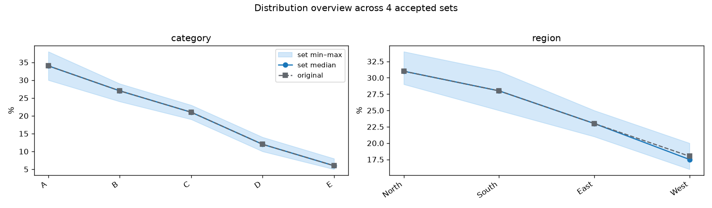

# T079 --sets 전체 분포 집계 그래프

| 항목 | 값 |
|---|---|
| 에픽 | E5 축소 크기 자동 추천 및 불확실성 |
| 상태 | todo |
| 선행 | T078(done) |
| 예상 | 30분 |

## 목표

`run_reduce_units.py --sets N`이 만든 accepted set들의 분포를 개별 PNG뿐 아니라 하나의 집계 그래프에서도 비교한다. 원본 분포를 기준선으로 두고 세트 전체의 중앙 경향과 변동 범위를 보여준다.

## Sample output

아래 이미지는 실제 데이터 결과가 아니라 기대 레이아웃을 확인하기 위한 합성 데이터 샘플이다.

## 범위

- `SetReports`가 보유한 전체 범주 비율을 사용해 `distribution_overview.png`를 생성한다.
- `--show-dist`로 지정된 컬럼을 우선하고, 없으면 현재 자동 선택 규칙을 유지한다.
- 범주별 원본 비율, 세트 중앙값, 세트 최소~최대 범위를 표시한다.
- 기존 `distribution_set_###.png`, CSV, `comparison.png`는 유지한다.
- 세트가 1개여도 집계 그래프를 만들고, 0개 또는 `--no-plot`이면 만들지 않는다.

## 비범위

- accepted set 생성 알고리즘이나 점수 계산 변경
- 개별 분포 CSV 형식 변경
- 20종을 넘는 고카디널리티 컬럼의 전체 범주 시각화

## 완료 기준

- [ ] 모든 accepted set의 선택 분포 컬럼을 한 그래프에서 원본과 함께 비교할 수 있다.
- [ ] 세트 수가 많아도 전체 범위와 중앙 경향을 읽을 수 있고 개별 세트 파일은 유지된다.
- [ ] 0개/1개 세트와 `--no-plot` 동작을 회귀 테스트한다.

## 관련 파일

- `scripts/units_set_reports.py`: 세트별 전체 범주 비율 보관 및 집계 그래프 생성
- `scripts/plot_distribution.py`: 기존 개별 세트 그래프 스타일 참고
- `backend/tests/test_set_reports.py`: 생성 여부와 집계 값 테스트
- `problem.md` 91, 101행: 컬럼별 분포 비교 및 분포 그래프 요구사항

## 경계 조건

- accepted set 0개, 1개, 다수
- 원본에만 있거나 일부 세트에 없는 범주
- 결측값과 문자열 `nan` 구분
- `--show-dist` 미지정 또는 존재하지 않는 컬럼
- 세트 수가 커도 세트별 선을 전부 그려 그래프를 읽기 어렵게 만들지 않기

## 줄 수 한도

- `scripts/**/*.py`: 파일 200줄, 함수 50줄
- `backend/tests/**/*.py`: 파일 400줄, 함수 60줄
