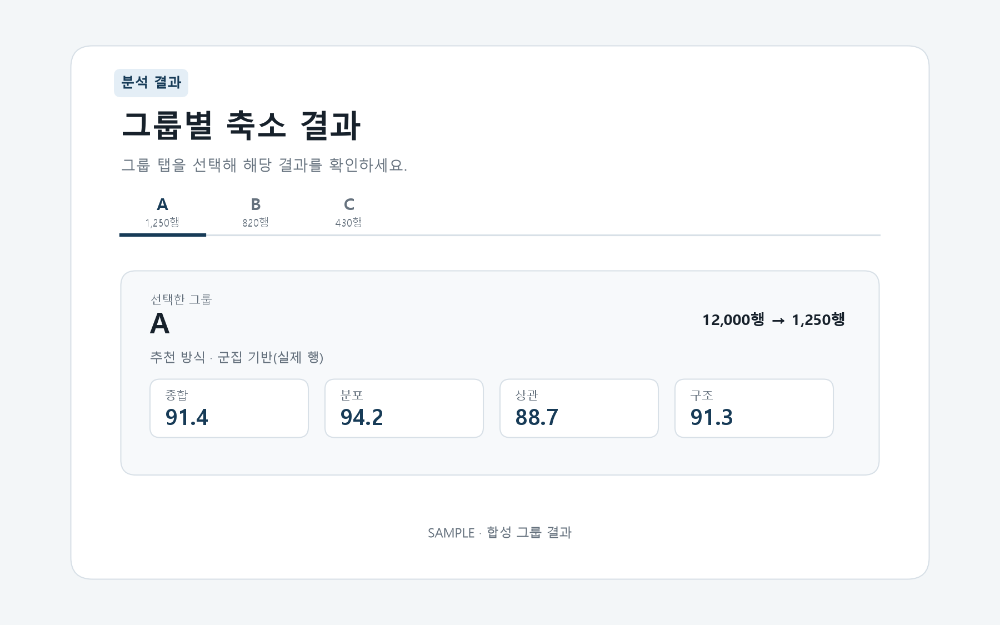

# T080 — 그룹 선택 탭

## 문서 성격과 현재 상태

구현 전 확인한 범위와 검증 계획을 기록한다. 최종 판정은 리뷰 문서에 남긴다.

- 기준: 2026-10-02 dev
- 백로그 상태: `in_progress` / 에픽: `E8` / 예상: 15분
- 후행 작업: [T081](T081.md), [T082](T082.md), [T083](T083.md), [T084](T084.md), [T085](T085.md), [T090](T090.md), [T134](T134.md)

## 쉽게 이해하기

여러 데이터 그룹의 결과를 탭으로 나눠 한 번에 한 그룹씩 보여준다.

## 의존 작업

- [T070](T070.md): `done` — 앱 레이아웃과 라우팅
- [T071](T071.md): `done` — API 클라이언트 모듈

## 범위와 완료 기준

여러 그룹 결과를 탭으로 전환

1. 탭 전환 시 해당 그룹 결과 표시
2. URL의 작업 ID로 결과를 조회하고 로딩·오류·빈 결과를 처리
3. 키보드 접근 가능한 탭 의미와 선택 상태 제공

## 구현 계획

1. `ResultsPage.tsx`에 결과 조회 상태와 선택 그룹 상태를 둔다.
2. 그룹별 탭을 렌더링하고 선택한 그룹의 행 수·축소 방식·점수 요약을 표시한다.
3. 결과 작업 ID 누락, 조회 실패 재시도, 그룹 0개, skipped 그룹을 안내한다.
4. lint/build와 결과 API 회귀, 합성 결과 샘플 이미지를 검증한다.

## 관련 요구사항

[problem.md](../../problem.md)의 §5 지표, §7 결과 확인을 참고한다. 제목과 절 구성은 작업 시작 때 다시 확인한다.

## 현재 코드 근거와 관련 파일

- [frontend/src/App.tsx](../../frontend/src/App.tsx) — 현재 존재하는 참고 파일.
- [frontend/package.json](../../frontend/package.json) — 현재 존재하는 참고 파일.

### 구현 시 검토할 위치

파일명과 구성은 확정 설계가 아니라 후보다. 기존 파일을 확장할지 새 파일로 나눌지는 착수 시 판단한다.

- `frontend/src/components/T080.tsx` — 현재 없음; 생성 후보

## 검증 근거와 다음 확인

- `npm run lint --silent`, `npm run build --silent`
- `pytest tests/test_job_results.py`
- 다중 그룹 합성 결과의 탭 선택과 요약 교체 검증

## 경계 사례와 위험

그룹 전환 시 이전 그룹의 값이 남지 않는지, 비어 있는 결과와 다운로드 행 수를 확인한다.

## 줄 수 제한

core 파일 300/함수50, API 파일200/함수40, backend 테스트400/함수60, TSX250/함수80, TS200/함수50, scripts200/함수50 (공백 제외). 정확한 적용 규칙은 [hooks/config.json](../../hooks/config.json) 참고.

## 대표 화면 예시

아래 이미지는 합성 그룹 결과를 사용한 설계·검증용 예시이며 실제 사용자 데이터 결과는 아니다.

