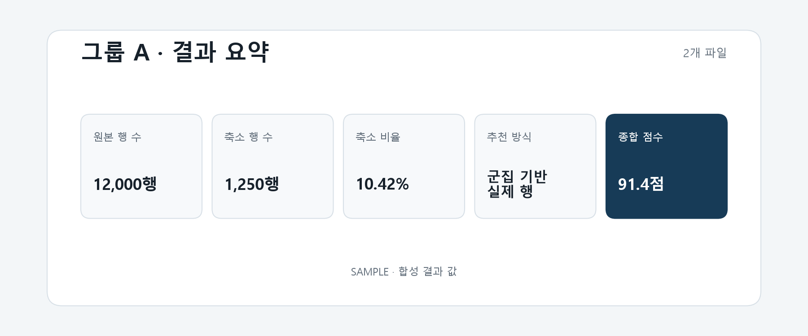

# T081 — 요약 카드

## 문서 성격과 현재 상태

구현 전 확인한 범위와 검증 계획을 기록한다. 최종 판정은 리뷰 문서에 남긴다.

- 기준: 2026-10-02 dev
- 백로그 상태: `in_progress` / 에픽: `E8` / 예상: 20분
- 후행 작업: 없음

## 쉽게 이해하기

원본과 축소본의 크기, 축소 방식, 점수를 짧게 요약해 보여준다.

## 의존 작업

- [T080](T080.md): `done` — 그룹 선택 탭

## 범위와 완료 기준

원본 행 수, 축소 행 수, 축소 비율, 추천 방식, 종합 점수 카드

1. 요약 값이 결과와 일치
2. 축소 비율은 행 수에서 안전하게 계산하고 내부 방식 코드는 사용자 이름으로 표시
3. 그룹 전환 시 카드 전체가 선택 그룹 값으로 교체

## 구현 계획

1. `SummaryCards.tsx`에 5개 요약 카드와 표시값 변환을 분리한다.
2. 원본/축소 행 수는 로케일 구분, 비율은 백분율, 점수는 100점 기준으로 표시한다.
3. T080 선택 그룹 패널에 연결하고 좁은 화면 카드 배치를 검증한다.

## 관련 요구사항

[problem.md](../../problem.md)의 §5 지표, §7 결과 확인을 참고한다. 제목과 절 구성은 작업 시작 때 다시 확인한다.

## 현재 코드 근거와 관련 파일

- [frontend/src/SummaryCards.tsx](../../frontend/src/SummaryCards.tsx) — 표시값 변환과 카드 구성.
- [frontend/src/ResultsPage.tsx](../../frontend/src/ResultsPage.tsx) — 선택 그룹 결과와 카드 연결.
- [frontend/src/styles.css](../../frontend/src/styles.css) — 데스크톱·좁은 화면 카드 배치.

## 검증 근거와 다음 확인

- `npm run lint --silent`, `npm run build --silent`
- `pytest tests/test_job_results.py`
- 합성 그룹 값으로 카드 산식과 표시 예시 검증

## 경계 사례와 위험

그룹 전환 시 이전 그룹의 값이 남지 않는지, 비어 있는 결과와 다운로드 행 수를 확인한다.

## 줄 수 제한

core 파일 300/함수50, API 파일200/함수40, backend 테스트400/함수60, TSX250/함수80, TS200/함수50, scripts200/함수50 (공백 제외). 정확한 적용 규칙은 [hooks/config.json](../../hooks/config.json) 참고.

## 대표 화면 예시

화면 구조를 확인하기 위한 합성 결과 값이며 실제 사용자 데이터 결과는 아니다.
