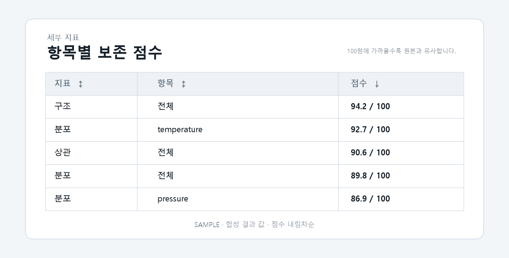

# T082 — 세부 지표 표

## 문서 성격과 현재 상태

구현 전 확인한 범위와 검증 계획을 기록한다. 최종 판정은 리뷰 문서에 남긴다.

- 기준: 2026-10-02 dev
- 백로그 상태: `in_progress` / 에픽: `E8` / 예상: 30분
- 후행 작업: 없음

## 쉽게 이해하기

종합 점수만으로 알 수 없는 세부 차이를 표로 보고 정렬한다.

## 의존 작업

- [T080](T080.md): `done` — 그룹 선택 탭

## 범위와 완료 기준

분포·상관·구조 지표를 컬럼별/항목별 표로 표시, 정렬 가능

1. 지표 항목별 정렬 동작

## 구현 계획

1. 총괄 분포·상관·구조 점수와 `detail.columns`의 컬럼별 분포 점수를 한 표로 구성한다.
2. 지표·항목·점수 머리글을 눌러 오름차순과 내림차순을 전환한다.
3. 상세 컬럼이 없는 결과도 총괄 3행을 표시하고 좁은 화면에서는 표를 가로 스크롤한다.

## 관련 요구사항

[problem.md](../../problem.md)의 §5 지표, §7 결과 확인을 참고한다. 제목과 절 구성은 작업 시작 때 다시 확인한다.

## 현재 코드 근거와 관련 파일

- [frontend/src/MetricTable.tsx](../../frontend/src/MetricTable.tsx) — 표 행 구성과 정렬 상태.
- [frontend/src/ResultsPage.tsx](../../frontend/src/ResultsPage.tsx) — 선택 그룹 결과와 표 연결.
- [frontend/src/styles.css](../../frontend/src/styles.css) — 표와 지표 배지의 반응형 표현.

## 검증 근거와 다음 확인

- `npm.cmd run lint`, `npm.cmd run build`
- `pytest tests/test_job_results.py`
- 합성 점수로 기본 내림차순 및 머리글 정렬 전환 검토

## 경계 사례와 위험

그룹 전환 시 이전 그룹의 값이 남지 않는지, 비어 있는 결과와 다운로드 행 수를 확인한다.

## 줄 수 제한

core 파일 300/함수50, API 파일200/함수40, backend 테스트400/함수60, TSX250/함수80, TS200/함수50, scripts200/함수50 (공백 제외). 정확한 적용 규칙은 [hooks/config.json](../../hooks/config.json) 참고.

## 대표 화면 예시

점수 내림차순 상태를 보여 주는 합성 결과 값이며 실제 사용자 데이터 결과는 아니다.
