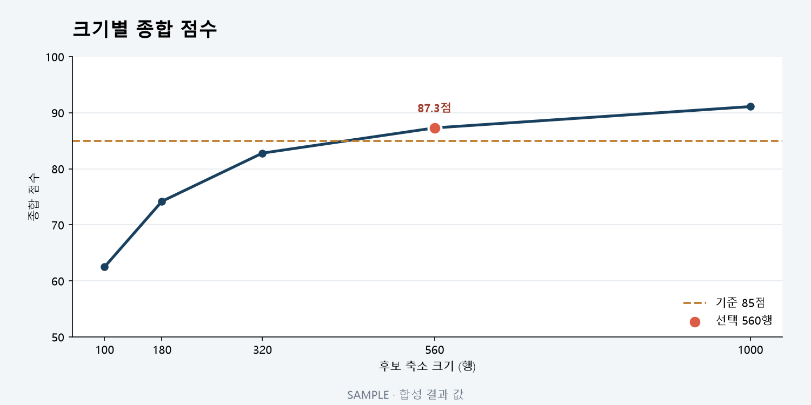

# T083 — 크기별 점수 곡선 차트

## 문서 성격과 현재 상태

구현 전 확인한 범위와 검증 계획을 기록한다. 최종 판정은 리뷰 문서에 남긴다.

- 기준: 2026-10-02 dev
- 백로그 상태: `in_progress` / 에픽: `E8` / 예상: 25분
- 후행 작업: 없음

## 쉽게 이해하기

행을 얼마나 남겼을 때 어떤 점수가 나왔는지 곡선으로 보여준다.

## 의존 작업

- [T080](T080.md): `done` — 그룹 선택 탭

## 범위와 완료 기준

후보 크기 vs 종합 점수 곡선과 기준선, 선택 지점 표시

1. 기준선과 선택 크기 강조 표시

## 구현 계획

1. `size_curve`를 크기순으로 정렬해 후보 크기와 종합 점수 곡선을 SVG로 그린다.
2. 결과 응답에 실제 실행 기준을 포함해 해당 점수 수평선과 실제 축소 행 수에 가장 가까운 후보를 강조한다.
3. 후보가 없을 때의 빈 상태와 후보가 하나뿐인 경우도 안전하게 표시한다.

## 관련 요구사항

[problem.md](../../problem.md)의 §5 지표, §7 결과 확인을 참고한다. 제목과 절 구성은 작업 시작 때 다시 확인한다.

## 현재 코드 근거와 관련 파일

- [frontend/src/SizeScoreChart.tsx](../../frontend/src/SizeScoreChart.tsx) — 곡선 좌표, 기준선, 선택 지점.
- [frontend/src/ResultsPage.tsx](../../frontend/src/ResultsPage.tsx) — 선택 그룹 결과와 차트 연결.
- [frontend/src/styles.css](../../frontend/src/styles.css) — 차트 범례와 반응형 표현.

## 검증 근거와 다음 확인

- `npm.cmd run lint`, `npm.cmd run build`
- `pytest tests/test_job_results.py`
- 빈 곡선, 단일 후보, 복수 후보 좌표와 선택 지점 검토

## 경계 사례와 위험

그룹 전환 시 이전 그룹의 값이 남지 않는지, 비어 있는 결과와 다운로드 행 수를 확인한다.

## 줄 수 제한

core 파일 300/함수50, API 파일200/함수40, backend 테스트400/함수60, TSX250/함수80, TS200/함수50, scripts200/함수50 (공백 제외). 정확한 적용 규칙은 [hooks/config.json](../../hooks/config.json) 참고.

## 대표 화면 예시

85점 기준과 선택 지점을 보여 주는 합성 결과 값이며 실제 사용자 데이터 결과는 아니다.
