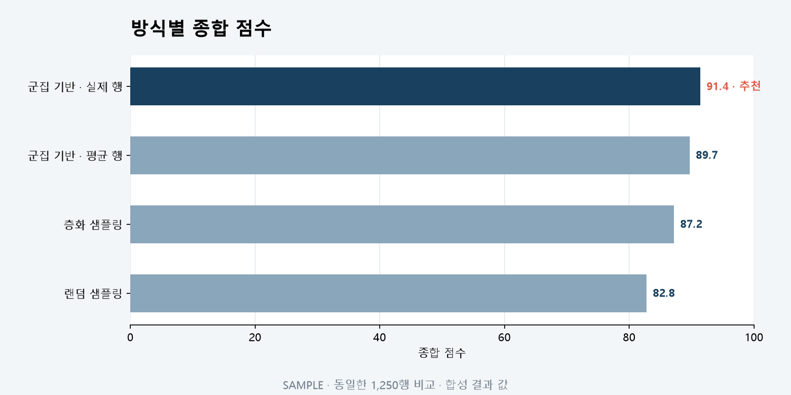

# T084 — 방식별 점수 비교

## 문서 성격과 현재 상태

구현 전 확인한 범위와 검증 계획을 기록한다. 최종 판정은 리뷰 문서에 남긴다.

- 기준: 2026-10-02 dev
- 백로그 상태: `in_progress` / 에픽: `E8` / 예상: 15분
- 후행 작업: 없음

## 쉽게 이해하기

같은 크기에서 방식별 점수를 비교하고 추천한 방식을 강조한다.

## 의존 작업

- [T080](T080.md): `done` — 그룹 선택 탭

## 범위와 완료 기준

랜덤/층화/군집 방식 점수 비교 막대

1. 추천 방식이 강조됨

## 구현 계획

1. `method_scores`를 종합 점수 내림차순의 가로 막대로 표시한다.
2. 실제 `reduction_method`와 일치하는 막대에 추천 배지와 강조색을 적용한다.
3. 내부 방식 코드는 T081과 같은 사용자용 이름을 공유하고 빈 비교 결과도 안내한다.

## 관련 요구사항

[problem.md](../../problem.md)의 §5 지표, §7 결과 확인을 참고한다. 제목과 절 구성은 작업 시작 때 다시 확인한다.

## 현재 코드 근거와 관련 파일

- [frontend/src/MethodScoreBars.tsx](../../frontend/src/MethodScoreBars.tsx) — 방식별 막대와 추천 강조.
- [frontend/src/SummaryCards.tsx](../../frontend/src/SummaryCards.tsx) — 공통 방식 이름 변환.
- [frontend/src/ResultsPage.tsx](../../frontend/src/ResultsPage.tsx) — 선택 그룹 결과와 비교 연결.

## 검증 근거와 다음 확인

- `npm.cmd run lint`, `npm.cmd run build`
- `pytest tests/test_job_results.py`
- 추천 방식, 점수 순서, 빈 배열 표시 검토

## 경계 사례와 위험

그룹 전환 시 이전 그룹의 값이 남지 않는지, 비어 있는 결과와 다운로드 행 수를 확인한다.

## 줄 수 제한

core 파일 300/함수50, API 파일200/함수40, backend 테스트400/함수60, TSX250/함수80, TS200/함수50, scripts200/함수50 (공백 제외). 정확한 적용 규칙은 [hooks/config.json](../../hooks/config.json) 참고.

## 대표 화면 예시

추천 방식 강조를 보여 주는 합성 결과 값이며 실제 사용자 데이터 결과는 아니다.
