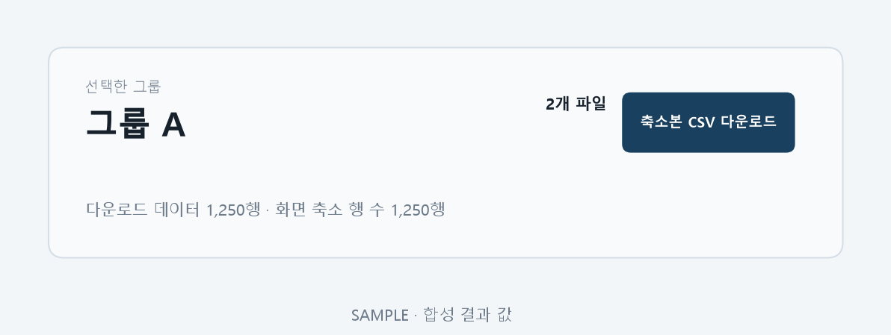

# T085 — 축소본 CSV 다운로드

## 문서 성격과 현재 상태

구현 전 확인한 범위와 검증 계획을 기록한다. 최종 판정은 리뷰 문서에 남긴다.

- 기준: 2026-10-02 dev
- 백로그 상태: `in_progress` / 에픽: `E8` / 예상: 20분
- 후행 작업: 없음

## 쉽게 이해하기

선택된 축소본을 CSV로 내려받는다. 화면의 행 수와 파일의 행 수가 같아야 한다.

## 의존 작업

- [T064](T064.md): `done` — 결과 조회 API
- [T080](T080.md): `done` — 그룹 선택 탭

## 범위와 완료 기준

선택된 축소본 행을 CSV로 다운로드

1. 다운로드 파일 행 수 = 축소 행 수

## 구현 계획

1. 실행 완료 시 각 성공 그룹의 선택된 축소 프레임을 UTF-8 BOM CSV로 저장한다.
2. 완료 결과에 존재하는 그룹만 다운로드할 수 있는 API를 추가한다.
3. 선택 그룹 헤더에 다운로드 링크를 두고 API 테스트에서 데이터 행 수를 대조한다.

## 관련 요구사항

[problem.md](../../problem.md)의 §5 지표, §7 결과 확인을 참고한다. 제목과 절 구성은 작업 시작 때 다시 확인한다.

## 현재 코드 근거와 관련 파일

- [backend/app/api/runs.py](../../backend/app/api/runs.py) — 축소본 CSV 저장.
- [backend/app/api/results.py](../../backend/app/api/results.py) — 그룹별 다운로드 API.
- [frontend/src/ResultsPage.tsx](../../frontend/src/ResultsPage.tsx) — 선택 그룹 다운로드 링크.

## 검증 근거와 다음 확인

- `pytest tests/test_job_results.py`
- `npm.cmd run lint`, `npm.cmd run build`
- 알 수 없는 그룹 거부와 다운로드 CSV 행 수 대조

## 경계 사례와 위험

그룹 전환 시 이전 그룹의 값이 남지 않는지, 비어 있는 결과와 다운로드 행 수를 확인한다.

## 줄 수 제한

core 파일 300/함수50, API 파일200/함수40, backend 테스트400/함수60, TSX250/함수80, TS200/함수50, scripts200/함수50 (공백 제외). 정확한 적용 규칙은 [hooks/config.json](../../hooks/config.json) 참고.

## 대표 화면 예시

다운로드 파일과 화면의 축소 행 수 대조를 보여 주는 합성 결과 값이다.
