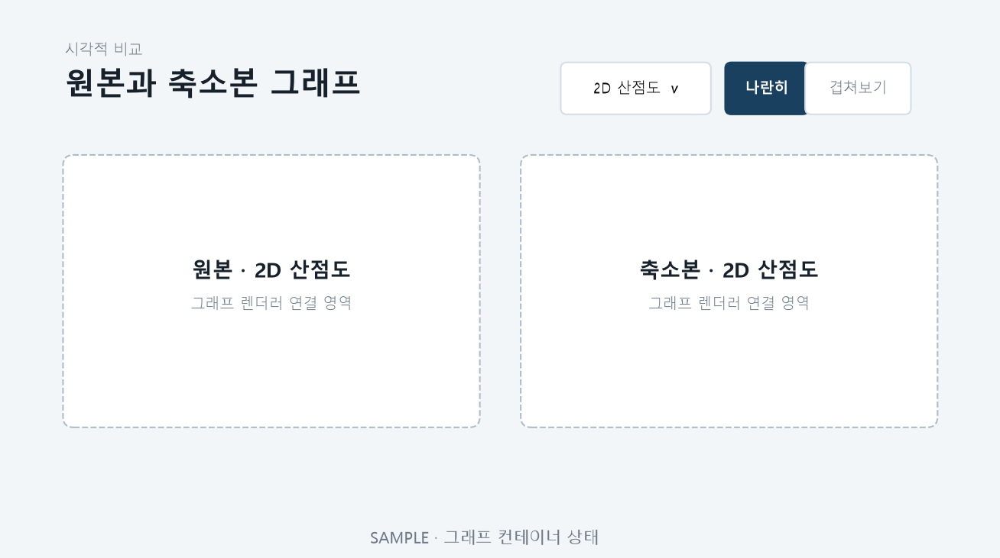

# T090 — 그래프 컨테이너와 종류 선택

## 문서 성격과 현재 상태

구현 전 확인한 범위와 검증 계획을 기록한다. 최종 판정은 리뷰 문서에 남긴다.

- 기준: 2026-10-02 dev
- 백로그 상태: `in_progress` / 에픽: `E9` / 예상: 25분
- 후행 작업: [T091](T091.md), [T093](T093.md), [T094](T094.md), [T095](T095.md), [T096](T096.md), [T098](T098.md), [T100](T100.md)

## 쉽게 이해하기

어떤 그래프를 볼지, 원본과 축소본을 나란히 볼지 겹쳐 볼지 선택하는 틀이다.

## 의존 작업

- [T080](T080.md): `done` — 그룹 선택 탭

## 범위와 완료 기준

그래프 종류 선택 드롭다운과 원본/축소본 나란히·겹쳐보기 전환

1. 종류·보기 모드 전환 동작

## 구현 계획

1. 후속 그래프가 공유할 종류 선택과 보기 모드 상태를 `GraphExplorer`에 둔다.
2. 2D/3D 산점도, 히스토그램, 박스플롯, 상관 네트워크를 선택할 수 있게 한다.
3. 나란히는 두 패널, 겹쳐보기는 한 패널로 즉시 전환하고 좁은 화면은 세로 배치한다.

## 관련 요구사항

[problem.md](../../problem.md)의 §6 시각화을 참고한다. 제목과 절 구성은 작업 시작 때 다시 확인한다.

## 현재 코드 근거와 관련 파일

- [frontend/src/GraphExplorer.tsx](../../frontend/src/GraphExplorer.tsx) — 종류·보기 모드와 공통 그래프 영역.
- [frontend/src/ResultsPage.tsx](../../frontend/src/ResultsPage.tsx) — 선택 그룹 패널에 그래프 영역 연결.
- [frontend/src/styles.css](../../frontend/src/styles.css) — 컨트롤과 반응형 패널 배치.

## 검증 근거와 다음 확인

- `npm.cmd run lint`, `npm.cmd run build`
- 종류 선택 시 패널 제목 변경, 보기 모드별 패널 수 변경 검토

## 경계 사례와 위험

빈 그래프, 상수·undefined 상관, 같은 축·노드 위치, 대용량 표시 한계를 확인한다.

## 줄 수 제한

core 파일 300/함수50, API 파일200/함수40, backend 테스트400/함수60, TSX250/함수80, TS200/함수50, scripts200/함수50 (공백 제외). 정확한 적용 규칙은 [hooks/config.json](../../hooks/config.json) 참고.

## 대표 화면 예시

후속 그래프 렌더러가 연결될 공통 컨테이너의 합성 동작 예시다.
