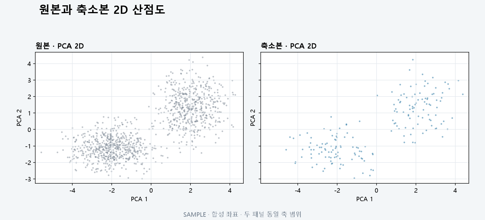

# T091 — 2D 산점도 비교

## 문서 성격과 현재 상태

구현 전 확인한 범위와 검증 계획을 기록한다. 최종 판정은 리뷰 문서에 남긴다.

- 기준: 2026-10-02 dev
- 백로그 상태: `in_progress` / 에픽: `E9` / 예상: 30분
- 후행 작업: [T092](T092.md), [T104](T104.md), [T114](T114.md), [T144](T144.md)

## 쉽게 이해하기

같은 투영 축에서 원본과 축소본의 점 분포를 2차원으로 비교한다.

## 의존 작업

- [T065](T065.md): `done` — 원본 대용량 시각화용 데이터 API
- [T090](T090.md): `done` — 그래프 컨테이너와 종류 선택

## 범위와 완료 기준

PCA/UMAP 투영 결과를 원본(밀도/서브샘플)과 축소본으로 표시

1. 투영 방법 전환 가능
2. 축 범위 동기화

## 구현 계획

1. 실행 시 투영 원본/축소 특징을 로컬 캐시에 저장하고 API 요청 방식으로 실제 PCA/UMAP 2D 좌표를 만든다.
2. 원본과 축소본 전체 좌표에서 공통 범위를 계산해 나란히·겹쳐보기 SVG에 동일 적용한다.
3. 로딩·오류 상태와 점 수를 표시하고 API 표본 상한으로 DOM 크기를 제한한다.

## 관련 요구사항

[problem.md](../../problem.md)의 §6 시각화을 참고한다. 제목과 절 구성은 작업 시작 때 다시 확인한다.

## 현재 코드 근거와 관련 파일

- [backend/app/api/visualizations.py](../../backend/app/api/visualizations.py) — 방식별 실제 재투영.
- [frontend/src/ScatterPlot.tsx](../../frontend/src/ScatterPlot.tsx) — 공통 축 범위 SVG 산점도.
- [frontend/src/GraphExplorer.tsx](../../frontend/src/GraphExplorer.tsx) — 투영 선택과 API 상태.

## 검증 근거와 다음 확인

- frontend lint/build, visualization API와 pipeline 회귀 테스트
- PCA/UMAP 방식 응답, 공통 축 범위, 빈/상수 좌표 검토

## 경계 사례와 위험

빈 그래프, 상수·undefined 상관, 같은 축·노드 위치, 대용량 표시 한계를 확인한다.

## 줄 수 제한

core 파일 300/함수50, API 파일200/함수40, backend 테스트400/함수60, TSX250/함수80, TS200/함수50, scripts200/함수50 (공백 제외). 정확한 적용 규칙은 [hooks/config.json](../../hooks/config.json) 참고.

## 대표 화면 예시

동일한 좌표 범위를 적용한 합성 좌표이며 실제 사용자 데이터 결과는 아니다.
