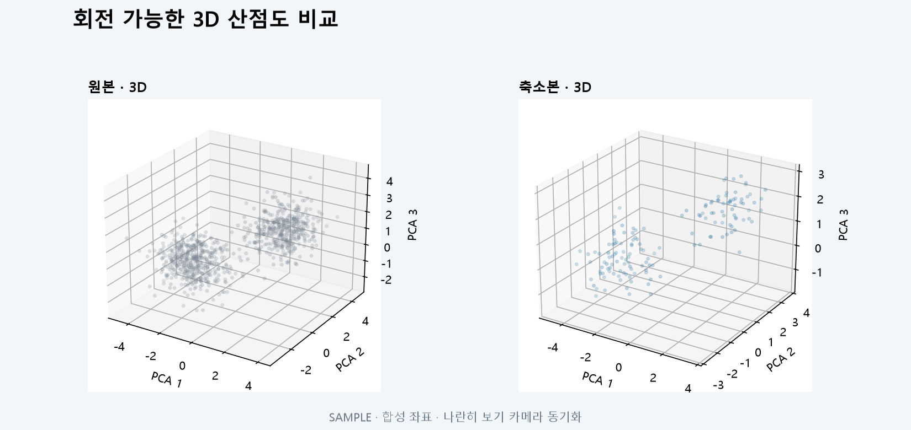

# T092 — 3D 산점도 비교

## 문서 성격과 현재 상태

구현 전 확인한 범위와 검증 계획을 기록한다. 최종 판정은 리뷰 문서에 남긴다.

- 기준: 2026-10-02 dev
- 백로그 상태: `in_progress` / 에픽: `E9` / 예상: 25분
- 후행 작업: 없음

## 쉽게 이해하기

3차원 점 구름을 회전해 살펴본다. 두 그래프의 카메라 방향을 맞춰 비교한다.

## 의존 작업

- [T091](T091.md): `done` — 2D 산점도 비교

## 범위와 완료 기준

3D 투영 좌표 표시, 회전 가능

1. 원본·축소본 카메라 동기화

## 구현 계획

1. 시각화 API가 3차원 PCA/UMAP 좌표를 요청에 따라 생성한다.
2. Plotly 3D 산점도를 지연 로드해 초기 결과 화면 번들 부담을 줄인다.
3. 나란히 보기의 한쪽 카메라 변경을 다른 쪽에 전달하고 겹쳐보기는 두 trace를 한 장면에 표시한다.

## 관련 요구사항

[problem.md](../../problem.md)의 §6 시각화을 참고한다. 제목과 절 구성은 작업 시작 때 다시 확인한다.

## 현재 코드 근거와 관련 파일

- [frontend/src/ThreeDScatter.tsx](../../frontend/src/ThreeDScatter.tsx) — 회전 가능한 3D 렌더링과 카메라 동기화.
- [frontend/src/GraphExplorer.tsx](../../frontend/src/GraphExplorer.tsx) — 3D 데이터 요청과 보기 모드 연결.
- [backend/app/api/visualizations.py](../../backend/app/api/visualizations.py) — 요청 차원의 재투영.

## 검증 근거와 다음 확인

- frontend lint/build, visualization API 3D 응답 테스트
- 나란히 카메라 이벤트 전달과 겹쳐보기 trace 구성 검토

## 경계 사례와 위험

빈 그래프, 상수·undefined 상관, 같은 축·노드 위치, 대용량 표시 한계를 확인한다.

## 줄 수 제한

core 파일 300/함수50, API 파일200/함수40, backend 테스트400/함수60, TSX250/함수80, TS200/함수50, scripts200/함수50 (공백 제외). 정확한 적용 규칙은 [hooks/config.json](../../hooks/config.json) 참고.

## 대표 화면 예시

동일한 카메라 방향의 합성 좌표이며 실제 사용자 데이터 결과는 아니다.
