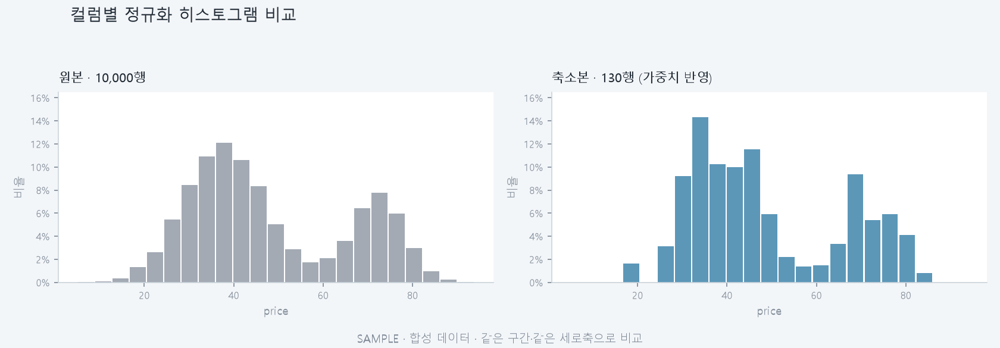

# T093 — 히스토그램 비교

| 항목 | 값 |
|---|---|
| 에픽 | E9 비교 그래프 |
| 예상 | 25분 |
| 선행 | T090(done) |
| 후행 | T099(히스토그램 다듬기), T116(원본 읽기 캐시) |

## 쉽게 말하면

선택한 컬럼의 값들이 어느 구간에 몇 개씩 몰렸는지를 원본과 축소본으로 비교한다. 히스토그램을 겹쳐서 보거나 나란히 보면서 분포가 얼마나 보존됐는지 눈으로 확인할 수 있다.

## 해야 할 일

- [x] Histogram 컴포넌트 만들기 (정규화 히스토그램, 원본/축소본 데이터 표시)
- [x] 히스토그램 데이터 API 엔드포인트 구현 (backend)
- [x] GraphExplorer에 히스토그램 렌더러 연결하기
- [x] 나란히·겹쳐보기 모드 모두 지원하기
- [x] 컬럼 선택 변경 시 즉시 갱신하기
- [x] API 로딩/오류 상태 처리하기

## 완료 기준

- [x] 컬럼 선택 시 히스토그램이 즉시 갱신된다 (`column`이 useEffect 의존성이라 선택 즉시 재요청)
- [x] 나란히 모드에서 원본과 축소본 히스토그램을 두 패널로 표시한다
- [x] 겹쳐보기 모드에서 원본과 축소본을 다른 색으로 겹쳐 표시한다
- [x] 로딩·오류 상태를 명확히 표시한다 (`graph-message`, `graph-message--error`)

## 관련 문서

- problem.md §6 그래프 (L96-L111): 시각화 종류(히스토그램 포함)와 원본/축소본 비교 방식
- problem.md §5 완료 기준 (L80-L91): 컬럼별 분포 비교 지표 및 시각적 비교 요구사항

## 관련 파일

| 파일 | 상태 | 이유 |
|---|---|---|
실제로 만들거나 고친 파일이다 (`visualizations.py`는 건드리지 않았다).

| 파일 | 상태 | 이유 |
|---|---|---|
| backend/app/api/distributions.py | 새로 만듦 | 히스토그램 엔드포인트. 투영 좌표를 다루는 `visualizations.py`와 입력이 달라 모듈을 나눴다 |
| backend/tests/test_distributions.py | 새로 만듦 | 단위 9개 + 실제 파이프라인 통합 1개 |
| backend/app/api/runs.py | 고침 | 대표 행 가중치를 projection-source npz에 함께 저장 |
| backend/app/main.py | 고침 | 라우터 등록 |
| frontend/src/Histogram.tsx | 새로 만듦 | T091(ScatterPlot.tsx) 패턴의 인라인 SVG 막대 그래프 |
| frontend/src/GraphExplorer.tsx | 고침 | histogram 렌더러·컬럼 선택기 연결 (placeholder 교체) |
| frontend/src/api/client.ts, types.ts | 고침 | `getHistogram`과 응답 타입 |
| frontend/src/styles.css | 고침 | 막대·안내문 스타일 |

## 줄 수 한도

- frontend/src/Histogram.tsx, GraphExplorer.tsx: 파일 250줄, 함수 80줄 (규칙 '프론트 컴포넌트')
- frontend/src/api/client.ts, types.ts: 파일 200줄, 함수 50줄 (규칙 '프론트 로직')
- backend/app/api/distributions.py: 파일 200줄, 함수 40줄 (규칙 '백엔드 API 라우터')
- backend/tests/test_distributions.py: 파일 400줄, 함수 60줄 (규칙 '백엔드 테스트')

## 구현 메모

- 엔드포인트는 `visualizations.py`(투영 좌표 전용) 대신 새 모듈 `backend/app/api/distributions.py`에 두었다. 컬럼 단위 분포 비교는 투영과 입력이 다르고, T094·T095도 같은 모듈을 쓸 수 있다.
- **축소본은 가중치를 반영한다.** 대표 행 하나가 원본 여러 행을 대표하므로(`Reduction.weights`), 가중치를 빼면 지표 표(`numeric_metrics`)와 그래프가 서로 다른 분포를 말하게 된다. 가중치가 저장되지 않고 있어서 `_save_projection_sources`가 npz에 `weights`를 함께 쓰도록 고쳤다. 예전 작업에는 키가 없으므로 그때는 모두 1로 본다.
- 원본 값은 `GroupResult.files`(파일 **이름**)를 업로드 폴더 경로로 풀어 다시 읽는다. `merge_group`은 `CsvFile` 객체를 받으므로 결과 모델만으로는 쓸 수 없다.
- 원본과 축소본은 **같은 구간 경계**(합친 최솟값~최댓값)를 쓰고 각자 합이 1이 되도록 정규화한다. 그래야 크기가 달라도 모양을 비교할 수 있다. 세로축 배율도 양쪽 분포를 함께 보고 정한다 — 나란히 볼 때 패널마다 배율이 다르면 10% 막대와 90% 막대가 같은 높이로 보인다.
- 원본은 업로드 CSV 그대로가 아니라 **축소 때와 같은 기준으로 결측 행을 뺀 뒤** 쓴다(`drop_missing_rows`). 그러지 않으면 축소 대상이 아니었던 행의 이상값이 구간 범위를 늘려 실제 분포가 첫 구간에 뭉개진다.
- 결측과 **무한대**를 양쪽에서 뺀다. `inf`가 하나라도 남으면 `np.linspace`가 NaN 경계를 만들고 응답의 `edges`가 `null`이 되어 화면이 깨진다. 뺀 건수는 `dropped_values`로 알린다.
- 가중치가 없는 예전 작업은 모두 1로 세되 `weighted: false`로 밝히고 화면에 "지표 표와 다를 수 있다"는 안내를 띄운다. 조용히 다른 분포를 보여 주지 않는다.
- 값이 모두 유한해도 `-1e308`~`1e308`처럼 폭이 너무 크면 `np.linspace`가 넘쳐 경계가 무너진다. 경계가 유한하고 단조 증가하는지 확인하고 아니면 422로 막는다 (그러지 않으면 `np.histogram`이 올리는 `ValueError`가 500으로 새어 나간다).
- **선택할 수 있는 컬럼은 실제 비교 대상(`detail["columns"]`)뿐이다.** 축소 기준에서 빠진 컬럼은 분포를 비교할 의미가 없다 — 실제 파이프라인에서 `value` 같은 일련번호성 컬럼이 제외되는 것을 통합 테스트로 확인했다.

## 대표 화면 예시

합성 데이터로 만든 설계 예시이며 실제 실행 결과가 아니다. 의도(같은 구간, 같은 세로축, 가중치 반영)를 보여 주려고 matplotlib으로 그린 것이라 실제 화면의 SVG와 축 눈금 표기가 똑같지는 않다.

## 주의할 점

- **컬럼 타입 구분**: 수치형 컬럼만 히스토그램 대상 (범주형은 나중 태스크에서 처리할 수 있음)
- **정규화**: 히스토그램을 확률 밀도로 표시하면 원본과 축소본 비교가 용이함 (축소본이 작으므로)
- **빈(bin) 개수 결정**: 데이터 특성에 따라 Sturges 규칙 또는 고정값 사용 (T091, T092 차원축소 구현 패턴 참고)
- **T090 이후**: T090의 그래프 컨테이너(GraphExplorer) 상태 관리와 API 로딩 방식을 따르면, GraphPlaceholder 코드 교체만으로 통합 가능함
- **API 캐싱**: T091의 "실행 시 특징 행렬을 로컬 캐시에 저장" 패턴처럼, 히스토그램도 선택 컬럼별로 한 번만 계산하도록 설계
