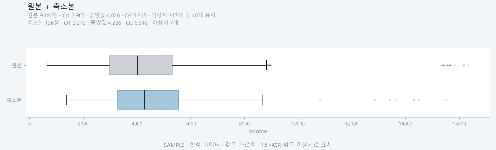

# T094 박스플롯 비교

| 항목 | 값 |
|---|---|
| 에픽 | E9 비교 그래프 |
| 예상 | 20분 |
| 선행 | T093(done), T099(done) |
| 후행 | 없음 |

## 쉽게 말하면

선택한 컬럼의 중앙값, 사분위수, 이상치를 원본과 축소본으로 비교한다. 박스플롯을 겹쳐서 보거나 나란히 보면서 데이터의 퍼짐 정도가 얼마나 보존됐는지 눈으로 확인할 수 있다.

## 해야 할 일

- [x] 공용 자료 읽기를 `backend/app/api/column_data.py`로 분리 (히스토그램과 함께 쓴다)
- [x] BoxplotData 응답 모델과 가중 분위수 계산 (`backend/app/api/boxplots.py`)
- [x] GET /jobs/{job_id}/boxplot 엔드포인트 추가
- [x] 백엔드 테스트 작성 (`backend/tests/test_boxplots.py`)
- [x] Boxplot 컴포넌트 만들기 (frontend/src/Boxplot.tsx)
- [x] GraphExplorer에 박스플롯 렌더러 연결
- [x] 컬럼 선택 시 즉시 갱신 및 로딩/오류 상태 처리

## 완료 기준

- [x] 컬럼 선택 시 박스플롯이 즉시 갱신된다 (`useColumnGraph`를 히스토그램과 공유)
- [x] 나란히 모드에서 원본과 축소본 박스플롯을 두 패널로 표시한다
- [x] 겹쳐보기 모드에서 두 상자를 한 그림에 위아래로 둔다 (같은 가로축)
- [x] 로딩·오류 상태를 명확히 표시한다 (`ColumnGraphNotes`로 제외 건수 안내)
- [x] 대표 행 가중치를 반영해 축소본 박스플롯을 계산한다 (`weighted_quantiles`)

## 관련 문서

- problem.md §6 그래프 (L96-L111): 시각화 종류(박스플롯 포함)와 원본/축소본 비교 방식
- problem.md §5 시각적 비교 (L89-L91): 컬럼별 분포 비교 지표 및 시각적 비교 요구사항
- docs/tasks/T093.md 구현 메모 (L59-L83): 가중치 반영, 결측·무한대 처리, 컬럼 선택 로직

## 관련 파일

| 파일 | 상태 | 이유 |
|---|---|---|
| backend/app/api/column_data.py | 새로 만듦 | 히스토그램·박스플롯이 함께 쓰는 자료 읽기(`load_sides`) |
| backend/app/api/boxplots.py | 새로 만듦 | 가중 분위수와 `/boxplot` 엔드포인트 |
| backend/app/api/distributions.py | 고침 | 공용 모듈을 쓰도록 정리 (161줄 → 62줄) |
| backend/app/main.py | 고침 | 라우터 등록 |
| backend/tests/test_boxplots.py | 새로 만듦 | 가중 분위수·이상치·오류 코드·실제 파이프라인 통합 |
| frontend/src/Boxplot.tsx | 새로 만듦 | T091(ScatterPlot.tsx)·T093(Histogram.tsx) 패턴의 인라인 SVG 상자 그래프 |
| frontend/src/useColumnGraph.ts | 새로 만듦 | `useHistogram`을 일반화 (로더만 바꿔 두 그래프가 공유) |
| frontend/src/GraphExplorer.tsx | 고침 | boxplot 렌더러·컬럼 선택기 연결 (placeholder 교체) |
| frontend/src/api/client.ts, types.ts | 고침 | `getBoxplot` 함수와 응답 타입 (`BoxplotData`) |
| frontend/src/styles.css | 고침 | 상자·수염·이상치·중앙값선 스타일 |

## 줄 수 한도

- backend/app/api/distributions.py: 파일 200줄, 함수 40줄 (규칙 '백엔드 API 라우터')
- backend/tests/test_distributions.py: 파일 400줄, 함수 60줄 (규칙 '백엔드 테스트')
- frontend/src/Boxplot.tsx: 파일 250줄, 함수 80줄 (규칙 '프론트 컴포넌트')
- frontend/src/GraphExplorer.tsx: 파일 250줄, 함수 80줄 (규칙 '프론트 컴포넌트')
- frontend/src/api/client.ts, types.ts: 파일 200줄, 함수 50줄 (규칙 '프론트 로직')

## 구현 메모

- **공용 모듈 분리**: `distributions.py`가 161/200줄이라 박스플롯을 넣으면 한도를 넘겼다. 자료 읽기(그룹 찾기, 컬럼 고르기, 원본·축소본 값, 가중치)를 `app/api/column_data.py`의 `load_sides`로 옮기고, 히스토그램·박스플롯은 각자 계산만 한다. T095·T096도 같은 입구를 쓰면 된다.
- **가중 분위수는 직접 계산한다**: `np.percentile`은 가중치를 받지 못한다. 누적 비율이 p 이상이 되는 첫 값을 고른다 — numpy의 `inverted_cdf`와 같은 정의다. 정수 가중치면 그만큼 행을 늘려 놓고 `np.percentile(..., method="inverted_cdf")`를 쓴 것과 1e-9 이내로 같다.
  - **척도 무관성이 핵심이다.** 원본은 가중치가 모두 1이지만 축소본은 `원본 행 수 / 남긴 행 수`(stratified) 같은 소수·큰 값이다. 가중치 크기에 따라 결과가 달라지는 정의를 쓰면 같은 분포인데도 두 상자가 다르게 그려진다. 가중치를 0.25배·18.2배·1000배 해도 같은 값이 나오는지 테스트한다.
  - 두 번 틀렸던 지점이다. (1) "각 값이 차지하는 구간의 가운데"를 위치로 보는 방식은 가중치가 쏠릴 때 틀렸다 — 값 `[10, 90]`에 가중치 `[99, 1]`이면 실제 100행의 Q3는 `10`인데 `50.8`을 내놓았다. (2) 그 다음 "자리의 처음과 끝을 꺾은점으로 보간"하는 방식은 정수 가중치에서는 정확했지만 **가중치 크기에 따라 결과가 달라져** 원본·축소본 비교가 공정하지 않았다.
- **왜 가중치가 필요한가**: 대표 행 하나가 원본 수십 행을 대표하므로, 가중치를 빼면 상자가 실제보다 좁거나 넓게 그려진다. 실제 데이터(income, 원본 2,824행 / 축소본 155행)에서 중앙값이 3,939 vs 3,984로 맞는다.
- **수염과 이상치**: 수염은 1.5×IQR 안에 **실제로 있는 값**의 최솟값·최댓값이다(한계선 자체가 아니다). 이상치는 많아도 40개만 보내되(`OUTLIER_LIMIT`) 전체 개수는 `outlier_count`로 알리고, **화면 캡션에 "이상치 212개 중 40개 표시"처럼 반드시 함께 띄운다**. 점 개수만 보면 양쪽이 똑같이 40개라 "이상치가 보존됐다"고 잘못 읽게 된다.
- **사분위수는 글자로 적는다**: 축에 눈금으로 찍어 봤지만, 값이 한쪽에 몰린 컬럼에서는 세 눈금이 2~3px 안에 겹쳐 아무것도 읽을 수 없었다. 패널 캡션에 `Q1 … · 중앙값 … · Q3 …`로 적으면 축 범위와 무관하게 항상 읽힌다.
- **부동소수 경계**: 누적 비율을 그대로 비교하면 `1000/12`처럼 나누어떨어지지 않는 가중치에서 `0.5` 대신 `0.4999…`가 나와 중앙값이 한 칸 밀린다. 비교에 `1e-9` 여유를 둔다 — 대표 12행 기준 24%의 경우에서 값이 틀어지던 문제다.
- **같은 가로축**: 한쪽만 볼 때도 축을 바꾸지 않는다. 나란히 본 두 패널의 축이 다르면 퍼짐 정도를 비교할 수 없다.
- **훅 공유**: `useHistogram`을 `useColumnGraph`로 일반화해 로더만 바꿔 쓴다. 그래프 종류를 바꾸면 컬럼 선택은 초기화된다(히스토그램·박스플롯이 각자 상태를 갖는다).

## 대표 화면 예시

합성 데이터로 만든 설계 예시이며 실제 실행 결과가 아니다. 의도(같은 축 범위, 가중치 반영, 이상치 표시)를 보여 주려고 matplotlib으로 그린 것이라 실제 화면의 SVG와 축 눈금 표기가 똑같지는 않다.

## 주의할 점

- **컬럼 타입 구분**: 수치형 컬럼만 박스플롯 대상 (히스토그램과 동일)
- **가중치와 사분위수**: 일반 `np.percentile`은 가중치를 지원하지 않으므로 수동으로 구현하거나 `numpy.average` 조합, 또는 `statsmodels` 활용 검토. 히스토그램의 정규화 패턴과 일관성 유지.
- **이상치 표시**: 박스 범위 밖의 점을 개별 표시할 때, 데이터가 많으면 화면이 복잡해질 수 있다. 원본은 샘플링, 축소본은 모두 표시하는 방안 검토.
- **T093 재사용**: `_weights`, `_pick_column`, `_present_columns`, 결측·무한대 처리 로직을 그대로 쓸 수 있다. 새로 추가하는 건 `build_boxplot` 함수와 사분위수 계산 함수뿐이다.
- **그래프 범위**: 나란히 볼 때 패널마다 축 범위가 달라지면 비교가 어렵다. 히스토그램처럼 원본·축소본 양쪽 데이터를 보고 `[min(original, reduced), max(original, reduced)]` 범위를 공유한다.
- **docs/tasks/T094.sample.png**: PNG 이미지 파일을 같은 디렉터리에 두고 마크다운에서 링크한다. 화면 표시 없이 코드만 완성했으면 빌드 후 screenshot으로 대체 가능.

