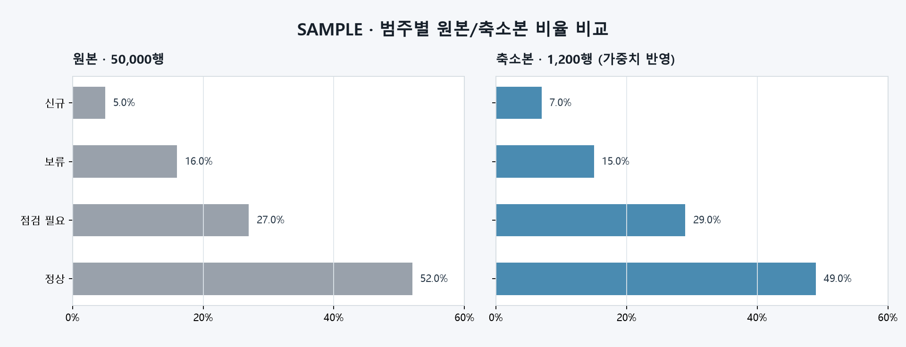

# T095 범주 비율 비교

| 항목 | 값 |
|---|---|
| 에픽 | E9 비교 그래프 |
| 상태 | in_progress |
| 예상 | 20분 |
| 선행 | T090(done) |
| 후행 | 없음 |

## 쉽게 말하면

축소 전후에 각 범주가 차지하는 비율을 같은 축의 막대로 나란히 보여 줍니다. 대표 행 가중치를 반영해, 축소본 CSV의 단순 행 개수가 아니라 실제로 대표하는 원본 행 비율과 비교합니다.

## 범위

- 축소 기준으로 사용된 범주형 컬럼을 선택하는 API를 추가한다.
- 원본과 축소본의 범주 합집합을 만들고, 각 범주의 비율을 같은 순서로 반환한다.
- 축소본 비율에는 저장된 대표 행 가중치를 적용한다.
- GraphExplorer에 `범주 비율` 종류를 추가하고, 나란히/겹쳐보기에서 동일 척도의 가로 막대로 렌더한다.
- 원본·축소본에서 제외된 행과 가중치 미사용 상태는 기존 컬럼 그래프 안내문으로 알린다.
- API·렌더 데이터 계약과 주요 경계 조건을 자동 테스트한다.

## 비범위

- 범주를 합치거나 종류 수를 줄이는 기능
- 범주 검색·필터·페이지네이션과 상위 N개/기타 묶기
- JS divergence나 분포 점수 계산 변경(기존 `categorical_metrics` 유지)
- 색상·정렬 방식 등 디자인 설정 스키마(T100)

## 완료 기준

- [x] 원본과 축소본에서 한쪽에만 존재하는 범주까지 같은 목록으로 반환하고 비율 합이 각각 1이다.
- [x] 축소본 범주 비율은 대표 행 가중치를 반영하며, 가중치가 없으면 동일 비중 fallback을 응답과 화면에 알린다.
- [x] 없는 컬럼은 404, 데이터에는 있지만 비교 대상이 아닌 컬럼은 422, 범주형 비교 컬럼이 없으면 422다.
- [x] 범주 선택 시 그래프가 즉시 갱신되고, 나란히/겹쳐보기 모두 원본·축소본을 동일한 0~100% 척도로 비교한다.
- [x] 축소 전 결측 제거 건수와 축소본 결측 건수를 구분한다.
- [x] 백엔드 대상 테스트, Ruff, 프런트 lint/build가 통과한다.

## 관련 요구사항

- `problem.md` §3: 수치형·범주형 컬럼 혼재, 결측 행 제외
- `problem.md` §4: 분포 비교 컬럼은 축소 기준 컬럼과 동일, 대표 행 가중치 의미
- `problem.md` §5: 범주 비율 차이와 원본·축소본 시각 비교
- `problem.md` §6: 여러 그래프 종류와 축 변수 선택

## 설계 메모

- API는 `GET /jobs/{job_id}/category-ratios?group=...&column=...` 형태로 둔다.
- 응답은 `categories`, `original_ratios`, `reduced_ratios`, 양쪽 행 수, `weighted`, 제외 건수를 포함한다. 세 배열은 같은 인덱스가 같은 범주를 뜻한다.
- 범주 순서는 원본 비율 내림차순, 동률은 표시 문자열 오름차순으로 고정한다. 원본에 없는 범주는 뒤에 축소본 비율 내림차순으로 둔다.
- 범주 값은 문자열로 직렬화한다. 타입이 다른 `1`과 `"1"`이 같은 CSV 컬럼에 섞이면 CSV 왕복 과정에서 이미 같은 표시값이 되므로 별도 타입 구분은 하지 않는다.
- 결측 행은 축소 파이프라인과 같은 기준으로 원본에서 먼저 제외한다. 축소본 컬럼에만 남은 결측은 별도로 세고 비율 분모에서 제외한다.
- 모든 유효 축소 가중치 합이 0 이하면 422로 거절한다. 음수·비유한 가중치는 저장 가중치로 인정하지 않고 기존 fallback 규칙을 따른다.
- 범주 수 제한이나 `기타` 묶기는 요구사항에 없으므로 이번에는 전체 범주를 전달한다.

## 예상 파일

| 파일 | 상태 | 역할 |
|---|---|---|
| `backend/app/api/category_ratios.py` | 새 파일 | 범주 비율 응답 모델·계산·라우터 |
| `backend/app/api/column_data.py` | 수정 | 범주형 컬럼 선택과 원본/축소본 로딩 공통화 |
| `backend/app/main.py` | 수정 | 새 라우터 등록 |
| `backend/tests/test_category_ratios.py` | 새 파일 | 가중치·합집합·오류·실제 파이프라인 테스트 |
| `frontend/src/CategoryRatio.tsx` | 새 파일 | 동일 척도의 범주 비율 막대 렌더러 |
| `frontend/src/GraphExplorer.tsx` | 수정 | 그래프 종류·컬럼 선택·패널 연결 |
| `frontend/src/api/types.ts` | 수정 | 응답 타입 추가 |
| `frontend/src/api/client.ts` | 수정 | API 호출 추가 |
| `frontend/src/styles.css` | 수정 | 범주 막대 스타일 |

## 테스트와 경계 사례

- 원본 전용 범주와 축소본 전용 범주가 합집합에 포함되는지 확인
- `[90, 10]` 가중치가 단순 50:50이 아니라 90:10을 만드는지 확인
- 가중치가 없는 과거 작업의 fallback과 `weighted=false` 확인
- 범주형 컬럼 없음, 없는 그룹/컬럼, 수치형 컬럼 요청의 HTTP 상태 확인
- 축소본 결측과 축소 전 결측의 제외 건수를 각각 확인
- 실제 파이프라인 결과에서 선택 가능 컬럼과 행 수·가중치가 맞물리는지 확인
- 특수문자·한글·빈 문자열 범주가 JSON/SVG 텍스트로 안전하게 표시되는지 확인

## 구현 결과

- `CategoryRatioData`의 세 배열은 같은 인덱스로 맞물리며, 원본 전용·축소본 전용 범주도 0 비율과 함께 남긴다.
- 범주 순서는 원본 빈도 우선으로 고정했다. 원본에 없는 범주는 축소본 가중 빈도 순서로 뒤에 붙는다.
- 범주 라벨은 SVG 텍스트로 렌더하고 18자를 넘으면 화면에서 줄인다. 전체 값은 `<title>`로 남긴다.
- 나란히 보기는 양쪽 SVG가 모두 0~100% 축을 사용하고, 겹쳐보기는 같은 행 안에 회색 원본·파란 축소본 막대와 텍스트 범례를 배치한다.
- 저장 가중치가 음수·비유한·합계 0이면 유효한 대표 가중치로 보지 않고 기존과 같이 동일 비중 fallback을 쓴다.
- 회귀 검증: 범주 비율·히스토그램·박스플롯 테스트 합계 35개 통과, Ruff·프런트 lint/build 통과.

## 줄 수 한도

- `backend/app/api/**/*.py`: 파일 200줄, 함수 40줄
- `backend/tests/**/*.py`: 파일 400줄, 함수 60줄
- `frontend/src/**/*.tsx`: 파일 250줄, 함수 80줄
- `frontend/src/**/*.ts`: 파일 200줄, 함수 50줄

## 시각 샘플

대표 합성 데이터로 만든 SAMPLE 이미지다.
