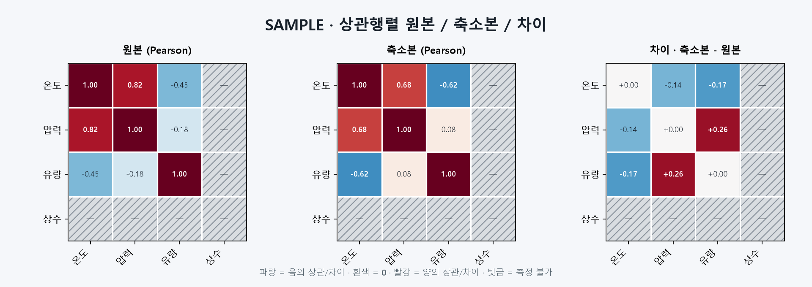

# T096 상관행렬 히트맵 비교

| 항목 | 값 |
|---|---|
| 에픽 | E9 비교 그래프 |
| 상태 | in_progress |
| 예상 | 25분 |
| 선행 | T090(done) |
| 후행 | T143 |

## 쉽게 말하면

수치형 컬럼끼리 얼마나 함께 움직이는지 원본·축소본·차이 세 행렬로 한 화면에 보여 줍니다. 실제 상관 0과 계산할 수 없는 값을 다른 모양으로 표시하고, 차이 행렬은 0을 중심으로 같은 강도의 증가·감소가 같은 진하기가 되도록 합니다.

## 범위

- 결과 JSON의 `detail.correlation`을 안전하게 검증해 프런트 표시 모델로 변환한다.
- GraphExplorer에 `상관 히트맵` 종류를 추가한다.
- 원본, 축소본, `축소본 - 원본` 히트맵을 같은 컬럼 순서로 동시에 표시한다.
- 원본·축소본은 -1~1 고정 발산 색상, 차이는 관측된 최대 절댓값을 양끝으로 하는 대칭 색상 범위를 쓴다.
- `undefined_original`·`undefined_reduced` 마스크를 사용해 측정 불가 셀을 회색 빗금으로 표시한다.
- 셀 tooltip과 범례에 값·부호·측정 불가 의미를 제공한다.

## 비범위

- Pearson/Spearman을 화면에서 다시 계산하거나 전환하는 API
- 셀 선택 후 산점도로 이동하는 상호작용
- 상관 네트워크 렌더링(T098)
- 반영 리포트의 단계 설명(T143)

## 완료 기준

- [x] 원본·축소본·차이 히트맵 3개가 같은 컬럼 순서와 셀 배치로 표시된다.
- [x] 원본·축소본 색상 범위는 -1~1이고, 차이 범위는 `[-maxAbs, +maxAbs]`로 대칭이다.
- [x] 실제 상관 0은 중립색, 측정 불가는 별도 빗금/문구로 구분된다.
- [x] 차이는 `축소본 - 원본`이며 셀 tooltip에서 부호와 수치를 확인할 수 있다.
- [x] 수치형 컬럼이 0~1개이거나 상관 데이터가 누락·손상된 결과는 오류 없이 안내문을 표시한다.
- [x] 프런트 lint/build와 관련 백엔드 상관 테스트가 통과한다.

## 관련 요구사항

- `problem.md` §5 상관관계 보존: 원본/축소본/차이 상관행렬 히트맵
- `problem.md` §5 시각적 비교: 원본과 축소본 그래프 비교
- `problem.md` §7 결과 화면: 상관관계 보존을 핵심 관점으로 제공

## 현재 코드 근거

- `backend/app/core/metrics.py::correlation_metrics`가 `columns`, `method`, 두 행렬과 두 undefined 마스크를 결과에 저장한다.
- 행렬 값은 JSON 안전성을 위해 NaN을 0으로 바꾸지만, undefined 마스크가 실제 0과 계산 불가를 구분한다.
- `frontend/src/GraphExplorer.tsx`는 아직 상관 네트워크만 placeholder로 두며 히트맵 종류가 없다.
- `GroupResult.detail`이 `Record<string, unknown>`이므로 런타임 검증 없이 행렬을 단언하면 오래되거나 손상된 결과에서 렌더가 깨질 수 있다.

## 설계 메모

- 프런트 전용 `correlationHeatmap.ts`에서 unknown 값을 읽고 정사각 행렬·마스크 크기·유한 수치를 검증한다.
- 두 마스크 중 하나라도 undefined인 셀은 차이 행렬에서도 undefined로 표시한다.
- 차이가 모두 0이면 색상 분모를 1로 두되 범례에는 `±0.00`을 표시해 NaN 색 계산을 막는다.
- 컬럼이 많아지면 셀 크기를 고정하고 패널 내부를 가로 스크롤한다. 전체 그래프 축소로 라벨을 읽을 수 없게 만들지 않는다.
- 대각선도 저장 마스크를 존중한다. 상수 컬럼의 자기 상관이 undefined일 수 있기 때문이다.

## 예상 파일

| 파일 | 상태 | 역할 |
|---|---|---|
| `frontend/src/correlationHeatmap.ts` | 새 파일 | 상관 detail 런타임 검증·차이/범위 계산 |
| `frontend/src/CorrelationHeatmap.tsx` | 새 파일 | 한 행렬 SVG 렌더링 |
| `frontend/src/CorrelationHeatmaps.tsx` | 새 파일 | 세 패널·범례·빈 상태 구성 |
| `frontend/src/GraphExplorer.tsx` | 수정 | 그래프 종류와 렌더러 연결 |
| `frontend/src/styles.css` | 수정 | 3열 배치·스크롤·빗금·범례 스타일 |

## 테스트와 경계 사례

- 완전 양/음/0 상관과 양·음 차이의 색상 방향
- 차이 최댓값이 0인 동일 행렬
- 원본만 또는 축소본만 undefined인 셀
- 빈 컬럼, 1개 컬럼, 비정사각·길이 불일치·비유한 행렬
- 긴 컬럼명과 많은 컬럼에서 스크롤 및 tooltip 유지
- 기존 `test_metrics.py`, `test_undefined_relationships.py`, `test_spearman.py` 회귀

## 구현 결과

- `detail.correlation`의 컬럼 중복, 행렬·마스크 크기, 유한성, 상관 범위(-1~1)를 런타임에 검증한다.
- 원본·축소본은 고정 `limit=1`, 차이는 정의된 셀의 최대 절댓값을 양끝으로 사용한다. 모두 같은 색 함수로 0을 중립색에 둔다.
- 한쪽이라도 undefined인 셀은 차이에서도 빗금으로 표시하고 tooltip에 `측정 불가`를 적는다.
- 셀은 42px 고정이라 컬럼이 많으면 각 패널 내부에서 가로 스크롤한다. 긴 라벨은 줄이되 전체 이름은 `<title>`에 남긴다.
- 색상 범위의 55% 이상인 진한 셀은 숫자를 흰색으로 바꿔 양·음의 강한 상관에서도 값을 읽을 수 있게 한다.
- 관련 백엔드 상관 테스트 46개, Ruff, 프런트 lint/build가 통과했다.

## 줄 수 한도

- `frontend/src/**/*.tsx`: 파일 250줄, 함수 80줄
- `frontend/src/**/*.ts`: 파일 200줄, 함수 50줄

## 시각 샘플

대표 합성 데이터로 만든 SAMPLE 이미지다.
