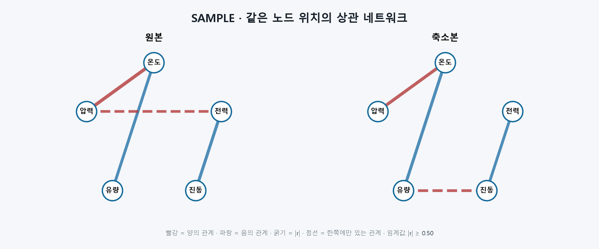

# T098 상관 네트워크 그래프 렌더링

| 항목 | 값 |
|---|---|
| 에픽 | E9 비교 그래프 |
| 상태 | in_progress |
| 예상 | 30분 |
| 선행 | T097(done), T090(done) |
| 후행 | T105, T135 |

## 쉽게 말하면

수치형 컬럼을 노드로, 임계값 이상의 상관관계를 선으로 그립니다. 원본과 축소본의 노드를 정확히 같은 위치에 놓고, 한쪽에만 있는 관계는 점선으로 표시해 무엇이 사라지고 생겼는지 바로 비교합니다.

## 범위

- T097의 `correlation_network`를 사용하는 원본·축소본 네트워크 API를 추가한다.
- 임계값 `0~1`을 쿼리로 받아 두 네트워크에 동일하게 적용한다.
- undefined 마스크를 NaN으로 복원해 계산 불가 관계가 임계값 0에서도 엣지가 되지 않게 한다.
- GraphExplorer의 기존 `상관 네트워크` placeholder를 실제 SVG 렌더러로 교체한다.
- 컬럼 순서로 결정한 원형 좌표를 원본·축소본 양쪽에서 공유한다.
- 선 굵기는 |r|, 색은 부호, 점선은 해당 화면에만 존재하는 관계로 표시한다.
- 임계값 슬라이더와 범례, 빈 상태·오류 상태를 제공한다.

## 비범위

- force-directed 등 레이아웃 알고리즘 선택(T100 이후 디자인 설정)
- 네트워크 노드 드래그·고정
- 관계 클릭 후 산점도 이동(T105)
- 관계 원인 설명(T135)
- Pearson/Spearman 재계산 전환

## 완료 기준

- [x] 원본·축소본이 같은 노드 ID와 좌표를 사용한다.
- [x] 임계값을 바꾸면 양쪽 엣지가 inclusive `|r| >= threshold` 규칙으로 갱신된다.
- [x] 양의 관계와 음의 관계를 다른 색으로, |r|을 선 굵기로 표현한다.
- [x] 원본에만 있거나 축소본에만 있는 관계가 점선과 범례로 식별된다.
- [x] undefined 관계는 임계값 0에서도 표시하지 않으며 고립 노드는 유지한다.
- [x] 빈/단일 노드, 손상된 상관 결과, 네트워크 API 오류를 화면에서 안전하게 안내한다.
- [x] API·회귀 테스트, Ruff, 프런트 lint/build가 통과한다.

## 관련 요구사항

- `problem.md` §5: 원본·축소본 상관 네트워크를 같은 노드 배치로 나란히 표시
- `problem.md` §5: 엣지 임계값 `|r|` 슬라이더, 사라진·새로 생긴 관계 구분
- `problem.md` §6-1: 노드=컬럼, 굵기=|r|, 색=부호

## 설계 메모

- API는 `GET /jobs/{job_id}/correlation-network?group=...&threshold=0.5`로 둔다.
- 결과는 T097 그래프 두 개와 method를 포함한다. 두 그래프는 동일한 `columns`에서 만들어 노드 배열이 같다.
- 저장 행렬의 undefined 셀은 0으로 직렬화되어 있으므로 반드시 마스크 위치를 NaN으로 바꾼 뒤 T097 변환기에 전달한다.
- 프런트는 노드 순서 `i`를 각도 `-π/2 + 2πi/n`에 매핑한다. 데이터나 임계값이 바뀌어도 같은 그룹의 좌표는 변하지 않는다.
- 원본/축소본 edge key는 정렬된 `source\0target`으로 비교한다. 현재 그래프에만 있는 edge에 `network-edge--unique` 점선을 붙인다.
- 노드가 많아도 고정 viewBox 안에 라벨을 배치한다. 긴 이름은 줄이고 `<title>`로 전체 이름을 제공한다.

## 예상 파일

| 파일 | 상태 | 역할 |
|---|---|---|
| `backend/app/api/correlation_networks.py` | 새 파일 | 결과 행렬 검증·마스크 복원·두 그래프 응답 |
| `backend/app/main.py` | 수정 | 라우터 등록 |
| `backend/tests/test_correlation_networks.py` | 새 파일 | 임계값·undefined·오류·실제 결과 테스트 |
| `frontend/src/api/types.ts` | 수정 | 네트워크 응답 타입 |
| `frontend/src/api/client.ts` | 수정 | 네트워크 API 호출 |
| `frontend/src/CorrelationNetwork.tsx` | 새 파일 | 안정 좌표 SVG 렌더링 |
| `frontend/src/CorrelationNetworks.tsx` | 새 파일 | 로딩·슬라이더·양쪽 비교·범례 |
| `frontend/src/GraphExplorer.tsx` | 수정 | placeholder 교체·고정 나란히 보기 |
| `frontend/src/styles.css` | 수정 | 노드·엣지·범례·반응형 스타일 |

## 테스트와 경계 사례

- threshold 0, 0.5, 1의 inclusive 경계와 양쪽 동일 적용
- 원본 전용·축소본 전용·공통 edge 비교
- undefined 마스크가 0 상관과 구분되어 edge에서 빠지는지 확인
- 0개·1개 노드에서도 동일 노드 목록과 빈 edge 반환
- 누락·비정사각·마스크 크기 불일치·비유한·비대칭 행렬의 422
- 없는 작업·그룹 404와 미완료 작업 상태
- 긴 노드명, 고립 노드, 완전 상관, 관계 0개 렌더링

## 구현 결과

- API가 현재 결과의 두 행렬에 undefined 마스크를 복원하고 T097 변환기를 호출하므로 백엔드와 화면의 임계값 규칙이 하나로 유지된다.
- undefined 마스크는 JSON boolean 정사각 행렬만 허용해 문자열·숫자가 묵시 변환되어 관계를 숨기지 못하게 한다.
- 프런트는 두 응답의 동일한 노드 순서를 원형 좌표로 변환한다. 엣지 수나 임계값이 바뀌어도 좌표는 움직이지 않는다.
- 양의 관계는 적색, 음의 관계는 청색이며 굵기는 `1.5 + |r| × 5`다. 반대편에 같은 pair가 없으면 점선이 된다.
- 임계값은 0.05 단위 슬라이더로 조절하고 요청을 취소 가능한 fetch로 갱신한다.
- 새 API와 T097 회귀 테스트 33개, Ruff, 프런트 lint/build가 통과했다.

## 줄 수 한도

- `backend/app/api/**/*.py`: 파일 200줄, 함수 40줄
- `backend/tests/**/*.py`: 파일 400줄, 함수 60줄
- `frontend/src/**/*.tsx`: 파일 250줄, 함수 80줄
- `frontend/src/**/*.ts`: 파일 200줄, 함수 50줄

## 시각 샘플

대표 합성 데이터로 만든 SAMPLE 이미지다.
