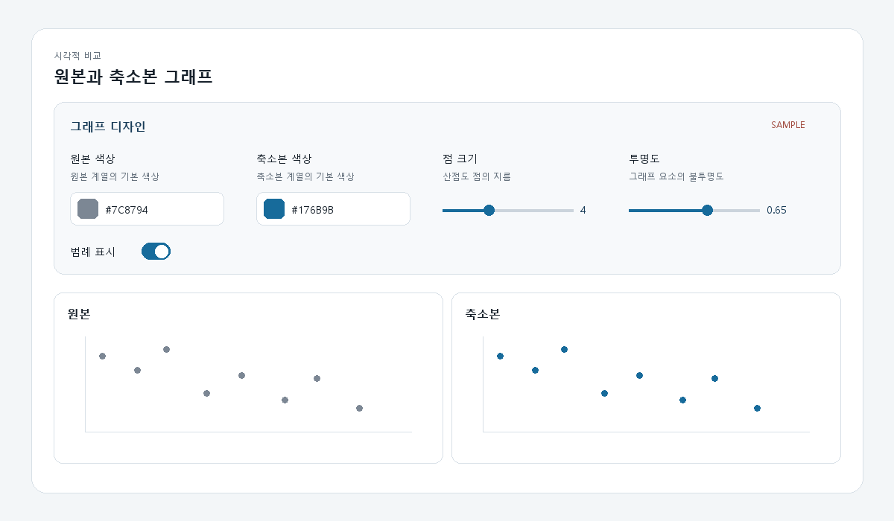

# T101 설정 패널 자동 생성 UI

## 상태와 의존성

- 백로그 상태: `todo` (Task Analysis 시점)
- 에픽: E10 그래프 디자인 설정
- 선행 작업: T100 `done` — `frontend/src/graphSettings.ts`에 설정 스키마와 기본값/정규화 도우미가 있음
- 후속 작업: T102~T106 — 각 그래프 렌더러에 설정값을 실제 반영

## 목표

현재 그래프 종류에 적용되는 T100 스키마 항목을 읽어 범위·색상·선택·불리언 컨트롤을 자동으로 만들고, 변경값을 상위 그래프 화면 상태에 전달한다.

## 범위

- 스키마 기반 `GraphSettingsPanel` 컴포넌트 추가
- `range`, `color`, `select`, `boolean` 타입별 접근 가능한 입력 UI 생성
- 설정 라벨·설명·현재값 표시
- `GraphExplorer`에서 전체 설정 상태를 보존하고 현재 그래프 종류의 항목만 노출
- 데스크톱과 좁은 화면에서 설정 패널이 깨지지 않도록 스타일 추가

## 비범위

- 설정값을 그래프 렌더링에 적용하는 일(T102~T106)
- 프리셋 저장/불러오기 및 영속화
- 스키마 항목 추가나 의미 변경
- 백엔드 API 및 축소 결과 재계산

## 완료 기준

1. 현재 그래프에 해당하는 모든 스키마 항목이 타입에 맞는 컨트롤로 자동 생성된다.
2. 그래프 종류를 바꾸면 관련 없는 항목은 숨고 관련 항목만 표시된다.
3. 입력 변경은 `GraphExplorer` 설정 상태에 반영되며 그래프 종류를 왕복해도 값이 유지된다.
4. 각 입력은 라벨 및 설명과 연결되고 키보드로 조작할 수 있다.
5. 프론트엔드 lint와 build가 통과한다.

## 관련 요구사항

- `problem.md` §6: 색상, 점 크기, 투명도, 네트워크 레이아웃 등 확장 가능한 디자인 설정 구조
- 디자인 설정 변경은 축소 결과를 재계산하지 않고 표시만 바꿔야 함
- 결과 화면에서 설정 조정이 즉시 상태에 반영되어야 함

## 파일 계획

- `frontend/src/GraphSettingsPanel.tsx` — 신규 스키마 기반 컨트롤 렌더러
- `frontend/src/GraphExplorer.tsx` — 설정 상태와 패널 연결
- `frontend/src/styles.css` — 패널 및 반응형 스타일
- `frontend/src/graphSettings.ts` — 읽기 전용 의존성, 변경 예정 없음

## 검증 계획

- `npm run lint --silent`
- `npm run build --silent`
- 브라우저에서 2D 산점도와 네트워크를 전환해 노출 항목 및 상태 유지 확인
- 320px 수준의 좁은 화면에서 가로 넘침 여부 확인

## 경계 조건과 위험

- 그래프 전환 시 패널 DOM은 바뀌어도 전체 설정 상태는 초기화되지 않아야 한다.
- 범위 입력의 숫자 변환은 유한값만 전달해야 한다.
- 스키마에 새 항목이 추가돼도 타입별 렌더러 외 별도 화면 코드를 요구하지 않아야 한다.
- 동일 라벨이 생겨도 각 입력/설명 ID는 충돌하지 않아야 한다.
- 이번 작업에서는 설정값이 그래프 모양을 바꾸지 않는다. 실제 렌더러 연결은 후속 작업 범위다.

## 라인 제한

- TSX: 파일 250 비공백 줄, 함수 80 비공백 줄
- TS: 파일 200 비공백 줄, 함수 50 비공백 줄

## 시각 샘플

대표 합성 데이터로 만든 설계 참고 이미지이며 화면 안에 `SAMPLE` 표기를 포함한다.
