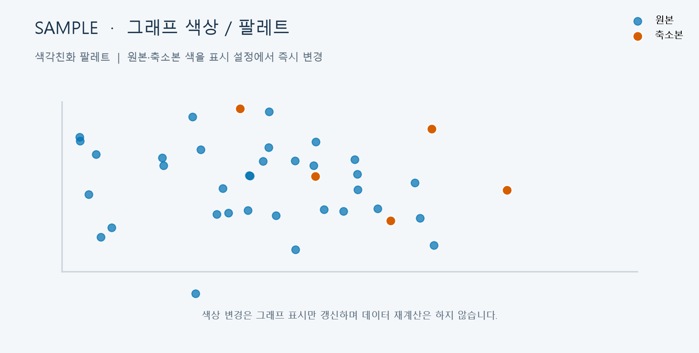

# T102 — 색상/팔레트 설정

## 분석 기준과 상태

- 작업: E10 그래프 디자인 설정 / 백로그 `todo` / 예상 25분
- 의존성: T101 `done` (스키마 기반 그래프 설정 패널)
- 후행: T114 (프론트 렌더링 성능 점검)
- 분석 시점: 2026-10-06, `dev`; 구현 전 분석 산출물이며 완료나 검증 PASS를 뜻하지 않는다.

## 목표와 요구사항

사용자가 그래프 표시 색을 바꾸고 선택한 팔레트를 적용할 수 있게 한다. 색상 설정은 렌더링에만 영향을 주며 축소 결과나 API 계산을 다시 실행하지 않는다. `problem.md` §6은 색상/팔레트의 사용자 조정과 재계산 없는 표시 변경을 요구한다.

백로그 설명은 팔레트 선택, 원본·축소본 색 지정, 컬럼 기준 색상 매핑을 포함한다. 현재 그래프 데이터에는 투영 점과 컬럼별 분포가 있으나 산점도 점별 원본 컬럼 범주 매핑 입력이 정의되어 있지 않다. 따라서 이번 구현은 원본·축소본 시리즈 팔레트와 직접 색 지정, 그리고 컬럼별 그래프의 시리즈 색 적용까지 다룬다. 특정 원본 컬럼 값을 산점도 점 색으로 매핑하는 기능은 필요한 범주/결측/범례 UX와 데이터 계약이 정의되지 않아 범위 밖으로 명시하며 별도 후속 설계 대상으로 남긴다.

## 범위

- 기존 `GraphSettingsPanel`/`graphSettings` 설정 체계를 활용해 기본·색각친화·고대비 팔레트를 고르고, 원본/축소본 색을 직접 지정한다.
- 설정을 2D/3D 산점도, 히스토그램, 박스플롯, 범주 비율 그래프의 원본/축소 시리즈에 즉시 반영한다. 현재 상관 heatmap/network는 관계 부호 등 의미 색이 있으므로 변경하지 않는다.
- 설정 변경은 React 표시 상태만 바꾸고 데이터 API를 다시 요청하거나 축소를 실행하지 않는다.

## 비범위

- 백엔드/API/축소 로직과 결과 파일, 저장·복원 설정, 색상 설정 초기화.
- 군집 리포트(RepresentationCloud) 팔레트 변경.
- 산점도에서 원본 데이터 컬럼 값을 기준으로 개별 점 색상을 매핑하는 기능.
- heatmap의 부호별 의미 색 및 network의 양/음 관계 색.

## 완료 기준

1. 팔레트 선택과 원본/축소본 사용자 색 설정이 해당 비교 그래프에 일관되게 보인다.
2. 팔레트 변경 및 색상 입력은 데이터 조회/재계산 없이 화면에 반영된다.
3. 지원 그래프 종류를 전환해도 설정 상태가 유지되고, 색각친화·고대비 팔레트는 구별 가능한 두 시리즈 색을 제공한다.
4. 지원 범위의 빈 데이터, 잘못된 저장 설정 값, 기본값에서 UI/렌더 오류가 없다.
5. `npm run lint --silent` 및 `npm run build --silent` 통과.

## 현재 구현 근거와 예상 파일

- `frontend/src/graphSettings.ts`: 모든 그래프에 `originalColor`, `reducedColor` 색 설정은 있으나 현재는 고정값. 팔레트 선택 정의를 추가할 후보.
- `frontend/src/GraphSettingsPanel.tsx`: schema 기반 컨트롤 렌더러; 선택 설정을 재사용.
- `frontend/src/GraphExplorer.tsx`: 설정 상태는 있으나 비교 렌더러에 전달되지 않음. 지원 그래프에 색 props/CSS 변수를 연결할 후보.
- `frontend/src/ScatterPlot.tsx`, `ThreeDScatter.tsx`, `Histogram.tsx`, `Boxplot.tsx`, `CategoryRatio.tsx`, `frontend/src/styles.css`: 각 그래프의 색상 렌더 위치.
- 데이터 요청은 `GraphExplorer` effect 및 column graph hook에 있음. 색상 변경으로 effect 의존성/API 호출이 생기지 않아야 한다.

## 검증 계획 및 경계 사례

- 기존 lint/build를 실행한다.
- 지원 시각화에서 각 팔레트와 사용자 지정 색을 바꾼 뒤 표시가 갱신되고, 네트워크 요청/축소 재실행은 발생하지 않는지 브라우저에서 확인한다.
- 그래프 종류 전환, 원본/축소본 보기, 빈 분포, 기존 색 설정 누락/잘못된 형식에서 기본 색 fallback을 확인한다.
- heatmap/network와 리포트 색상이 바뀌지 않는 것을 확인한다.
- T101의 기존 스키마/설정 패널 기능을 회귀 확인한다.

## 제한과 미확정 사항

- 파일/함수 제한은 `hooks/config.json` 기준: TSX 250/함수 80, TS 200/함수 50 (공백 제외).
- 산점도 점별 컬럼 범주 매핑 UX와 API 데이터 연결은 별도 작업으로 분리한다.
- 시각 샘플은 합성 데이터로 만든 디자인 참고 자료이며 실제 앱 실행 증거가 아니다.

## 시각 샘플

합성 데이터로 만든 디자인/검증 참고 이미지이며 실제 실행 결과가 아니다. 이미지 안에 `SAMPLE` 표시가 있다.
