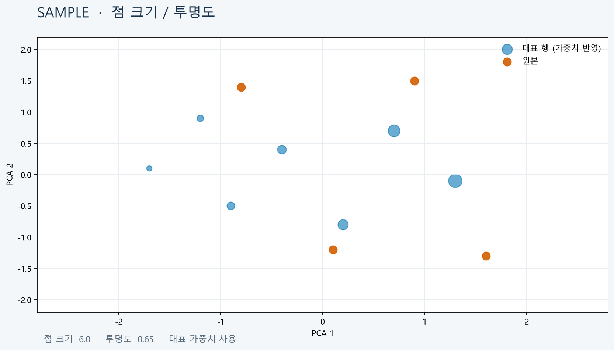

# T103 — 점 크기·투명도 설정

## 분석 기준과 상태

- 작업: E10 그래프 디자인 설정 / 백로그 `todo` / 예상 20분
- 의존성: T101 `done` (설정 패널), T034 `done` (대표 가중치 저장)
- 분석 시점: 2026-10-06, `dev`; 구현 전 준비 문서이며 완료나 검증 PASS를 뜻하지 않는다.

## 목표와 요구사항

2D/3D 산점도에서 점 크기와 투명도를 조정하고, 선택적으로 대표 가중치를 점 크기에 반영한다. 사용자 설정은 결과를 재계산하지 않고 표시만 바꾼다. 근거는 `problem.md` §6과 백로그 T103 설명이다.

현재 스키마에 `pointSize`(1–12)와 `opacity`(0.1–1) 설정은 있으나 2D/3D renderer가 이를 사용하지 않는다. 축소 대표 가중치는 `projection-source/group-*.npz`에 기록되지만 visualization API 응답에는 포함되지 않는다. API가 표본 추출한 축소 좌표와 같은 인덱스의 가중치를 반환해야 크기 대응을 보존할 수 있다.

## 범위

- 기존 점 크기/투명도 슬라이더를 2D SVG와 3D Plotly 점 표시로 연결한다.
- 대표 가중치 기반 크기 옵션을 2D/3D 산점도에 제공한다. 크기는 가중치에 선형 비례시키지 않고 대표값 주변으로 정규화/클램프해 소수의 큰 가중치가 나머지를 안 보이게 하지 않도록 한다.
- visualization 응답의 축소 점 표본과 인덱스 정렬된 가중치를 반환한다. 기존 결과/투영 계약과 이전 저장 결과(가중치 자료 없음)에서도 기본 크기로 안전하게 동작한다.
- 설정 변경은 표시 렌더링만 갱신하며 projection API 호출이나 축소 계산을 유발하지 않는다.

## 비범위

- 히스토그램/박스플롯/범주 그래프의 요소 크기 조정.
- 서버 측 projection 산출, 축소 알고리즘, 가중치 산출 방식 변경.
- 가중치 수치 자체를 데이터로 재계산하거나 사용자가 편집하는 기능.

## 완료 기준

1. 점 크기/투명도 슬라이더 변경이 2D 및 3D 점에 즉시 반영된다.
2. 가중치 기반 크기 옵션은 유효한 대응 가중치가 있을 때 크기 차이를 보이고, 없거나 길이/값이 잘못된 경우 기본 크기로 fallback한다.
3. 최소/최대 점 크기, 가중치가 모두 같은 경우, 빈 점 표본, outlier 가중치에서 렌더 오류나 점 소실이 없다.
4. 설정 변경은 API 재요청이나 축소 계산을 유발하지 않는다.
5. 백엔드 API 테스트와 프론트엔드 lint/build가 통과한다.

## 현재 코드 근거와 예상 파일

- `frontend/src/graphSettings.ts`: 점 크기/투명도 정의 및 허용 범위 존재.
- `frontend/src/GraphExplorer.tsx`: `settings` state는 있으나 산점도 renderer로 크기·투명도를 전달하지 않음.
- `frontend/src/ScatterPlot.tsx`: circle 반경이 고정(`2.2`), opacity는 CSS 고정.
- `frontend/src/ThreeDScatter.tsx`: Plotly marker size/opacity가 고정, settings prop 없음.
- `frontend/src/api/types.ts`, `backend/app/api/visualizations.py`: `VisualizationData`에는 현재 축소 point weights 없음.
- `backend/app/api/runs.py`: projection-source NPZ에 reduction weights 저장.
- `backend/app/api/column_data.py`: 이전/누락 weights 파일을 처리하는 읽기 로직 참고 후보.
- 검토할 테스트: `backend/tests`의 visualization API 테스트와 프론트엔드 build/lint. 별도 TS 테스트 러너는 현재 확인되지 않음.

## 검증 계획 및 경계 사례

- backend visualization API 테스트: 표본 제한/seed에 맞춰 축소 점과 weights의 인덱스 정렬, 3D 좌표, 빈/이전 결과의 fallback을 검사한다.
- 프론트엔드 lint/build 후 `pointSize` 최소·최대, `opacity` 양끝, weight 0/음수/NaN/큰 값/길이 불일치를 검사한다.
- settings는 visualization effect의 요청 의존성에 들어가지 않음을 확인한다.
- `hooks/config.json` 라인 제한을 적용한다 (API 200/함수 40, TSX 250/함수 80, TS 200/함수 50).

## 미확정/위험

- 이전 작업 산출물 형식에 따라 weight NPZ 부재 시 API 처리 경로를 확인해야 한다. 기존 점 크기 기능은 이 경우에도 작동해야 한다.
- 실제 브라우저 상호작용과 시각 샘플은 검토 시 별도로 확인한다.

## 시각 샘플

합성 데이터로 만든 디자인/검증 참고 이미지이며 실제 실행 결과가 아니다. 이미지 안에 `SAMPLE` 표시가 있다.
