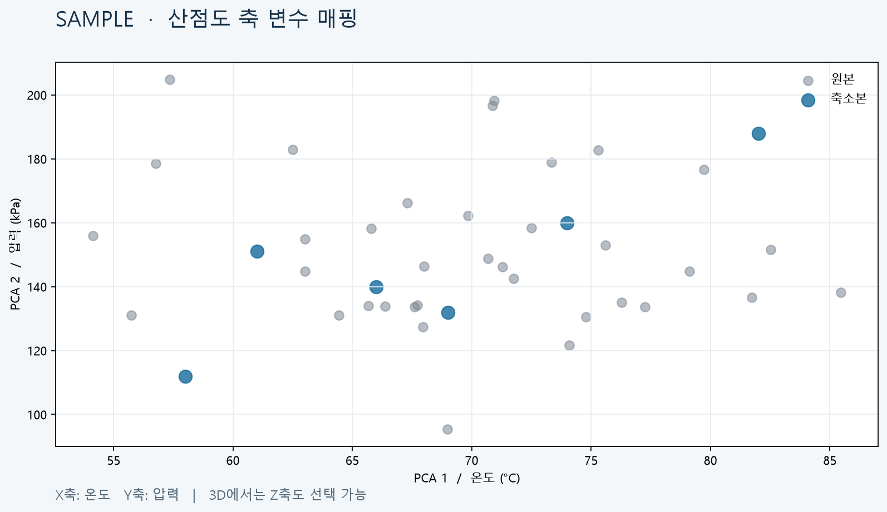

# T104 — 축 변수 매핑 설정

## 분석 기준과 상태

- 작업: E10 그래프 디자인 설정 / 백로그 `todo` / 예상 25분
- 의존성: T101 `done` (설정 패널), T091 `done` (2D 산점도 비교)
- 분석 시점: 2026-10-06, `dev`; 구현 전 문서이며 완료나 검증 PASS를 뜻하지 않는다.

## 목표와 요구사항

2D/3D 산점도 각 축에 PCA/UMAP 투영 좌표 또는 원본의 수치형 컬럼을 고르고, 선택 즉시 다른 표시 좌표를 제공한다. `problem.md` §6과 백로그 T104 설명(“x/y/z 축에 원본 컬럼 또는 투영 축 선택”)을 따른다.

현재 `ScatterPlot`은 점 배열의 앞 2/3개 차원을 고정 사용하고 `ThreeDScatter`도 같은 점 좌표를 고정 축에 연결한다. `VisualizationData`는 원본 투영 점의 원본 인덱스를 포함하지만 raw 컬럼 값은 제공하지 않는다. 원본 인덱스와 저장된 축소 CSV 행 순서를 이용해 raw numeric column 좌표를 투영 표본과 같은 행 순서로 맞춰야 한다. 축 선택은 투영/축소 계산이 아니라 표시 좌표 선택이어야 한다.

## 범위

- 산점도에서 X/Y와 3D Z 축 각각에 투영축 또는 사용할 수 있는 numeric column을 선택한다.
- 백엔드 visualization API가 해당 산점도 표본 인덱스에 맞는 원본/축소 축 값 및 사용 가능한 numeric column 목록을 반환한다. 잘못된 컬럼·비수치 컬럼은 안전한 4xx로 거부한다.
- 축 선택은 화면에 즉시 적용하고 선택된 축 이름을 축 레이블에 보여준다. 축 변경은 좌표 조회만 다시 할 수 있고 축소 알고리즘을 호출하지 않는다.
- 기존 기본 선택은 PCA/UMAP의 첫 2축(3D에서 첫 3축)이며 기존 호출/결과의 호환을 유지한다.

## 비범위

- 히스토그램/박스플롯/범주 그래프의 축 변경.
- 범주형 텍스트 컬럼을 연속 숫자 축으로 인코딩하거나 수동 범주 순서를 제공하는 기능.
- 원본 데이터 자체의 전처리/축소 기준을 바꾸거나 결과를 재계산하는 기능.
- 상관 히트맵/네트워크 그래프 축 구성.

## 완료 기준

1. 2D X/Y 및 3D X/Y/Z 축 각각에서 투영 차원과 numeric column을 선택할 수 있다.
2. 선택한 축 조합이 원본·축소본 점과 축 레이블 모두에 반영되고 빈/결측 데이터에서도 무한 좌표/화면 오류가 없다.
3. 원본 점 표본 인덱스, 축소점 행, 가중치 배열(기존 T103)이 축 값과 일관되게 정렬된다.
4. 존재하지 않는 컬럼, 비수치 컬럼, 3D에서 없는 투영축 및 밀도 모드 등 경계 입력을 명시적으로 처리한다.
5. 변경은 축소/투영 특징 재계산을 유발하지 않는다 (데이터 조회는 허용).
6. backend visualization API 테스트, Ruff/compileall, frontend lint/build가 통과한다.

## 현재 코드 근거와 예상 파일

- `frontend/src/GraphExplorer.tsx`: 현재 투영 방법만 선택; X/Y/Z 선택 상태와 API 옵션 연결 후보.
- `frontend/src/GraphAxisControls.tsx`, `frontend/src/useVisualization.ts`, `frontend/src/useAxisCompatibility.ts`: 축 선택 UI, 취소 가능한 표시자료 조회, 그룹별 선택값 정리.
- `frontend/src/ScatterPlot.tsx`, `frontend/src/ThreeDScatter.tsx`: 축 좌표/이름이 고정.
- `frontend/src/api/types.ts`, `frontend/src/api/client.ts`: visualization 옵션/응답 타입 변경 후보.
- `backend/app/api/visualizations.py`, `backend/app/api/visualization_axes.py`: 점 표본/가중치와 축 정렬, 유효 축 값 및 레이블 반환.
- `backend/app/api/column_data.py`: numeric 컬럼, 원본 프레임 정리와 저장된 축소 CSV를 읽는 참고 코드.
- 테스트: `backend/tests/test_visualizations.py`에서 API, 표본 정렬, 잘못된 축 지정 검사.

## 구현 및 검증 결과

- numeric column 값은 `column:<name>` API 옵션으로 요청하며 original/reduced 인덱스로 점 표본과 같은 순서로 정렬한다. 투영축이 기본값이고 density 모드의 raw column 축은 422로 거부한다.
- backend 전체 테스트: 332 passed (Windows subprocess 테스트는 `PYTHONIOENCODING=utf-8` 설정 필요), Ruff/compileall 통과.
- frontend lint/build 통과. Vite의 기존 Plotly 번들 크기 경고가 있었지만 빌드는 성공했다.
- 브라우저 직접 상호작용은 미실행; 합성 샘플은 디자인 참고용이다.

## 검증 계획 및 경계 사례

- 2D/3D 모든 축 선택 조합, 같은 컬럼을 두 축에 선택, 비수치·누락 컬럼, 없는 3차원 투영축, 비어 있는 표본과 결측값을 검사한다.
- 표본화된 원본 인덱스와 원본 CSV 값의 정렬, 축소 CSV 값·T103 weight 배열의 길이/순서를 비교한다.
- 산점도 축을 변경해 API 표시자료 요청만 바뀌고 축소 job을 재실행하지 않는지 확인한다.
- 라인 제한: backend API 200/함수40, backend test 400/함수60, TSX250/함수80, TS200/함수50.

## 미확정/위험

- numeric column의 유효값이 일부 결측인 이전 job에서 투영 데이터와 행 정렬을 보존하는 방법을 구현 시 확정해야 한다. 현재 pipeline 입력은 선택 변수 결측 제거를 수행하지만 이전 산출물 호환은 테스트가 필요하다.
- 축 변경 때 전체 표본 좌표를 API에서 재전송할지 기존 원본 데이터에서 프론트가 계산할지 비용을 비교한다. 기본은 API에서 동기화된 값 반환.

## 시각 샘플

합성 데이터로 만든 디자인/검증 참고 이미지이며 실제 실행 결과가 아니다. 이미지 안에 `SAMPLE` 표시가 있다.
