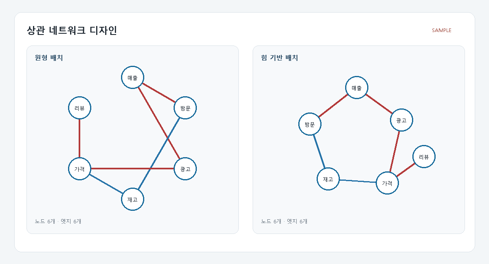

# T105 네트워크 레이아웃 알고리즘 설정

## 상태와 의존성

- 백로그 상태: `todo` (Task Analysis 시점), 에픽 E10
- 선행 작업: T098 `done`(노드·엣지 렌더링), T101 `done`(스키마 기반 설정 패널)
- 후속 작업: T122

## 목표

상관 네트워크의 원형 및 force-directed 배치를 사용자가 전환하고, 동일한 설정을 원본·축소본 양쪽에 즉시 적용한다. 상관 임계값도 디자인 설정 패널에서 함께 조절한다.

## 범위

- 네트워크 전용 상관 임계값 설정을 그래프 설정 스키마에 추가
- 원형/force-directed 노드 좌표 계산
- 레이아웃과 임계값을 GraphExplorer 상태에서 두 네트워크로 전달
- 기존 네트워크 내부 임계값 컨트롤을 통합 설정 패널로 이동
- 빈 그래프, 단일 노드, 연결 없는 노드의 안정적인 배치

## 비범위

- 노드 드래그, 줌/팬, 애니메이션
- 네트워크 색상·투명도 설정 반영(T102)
- 백엔드 상관 계산 방식 변경

## 완료 기준

1. 원형과 force-directed 레이아웃 전환 시 원본·축소본이 함께 갱신된다.
2. 임계값 변경 시 네트워크 API가 새 값으로 갱신되고 두 그래프에 함께 적용된다.
3. 배치는 입력이 같으면 재현 가능하고 노드가 SVG 영역 밖으로 나가지 않는다.
4. 설정 변경은 축소 파이프라인을 재실행하지 않는다.
5. frontend lint/build가 통과한다.

## 관련 요구사항

- `problem.md` §6: 컬럼=노드, 상관=엣지인 네트워크와 force-directed 등 레이아웃 알고리즘
- 디자인 설정은 축소 결과 재계산 없이 표시만 변경

## 파일 계획

- `frontend/src/networkLayout.ts` — 결정론적 원형/force 좌표 계산
- `frontend/src/CorrelationNetwork.tsx` — 선택 레이아웃으로 렌더링
- `frontend/src/CorrelationNetworks.tsx` — 상위 설정값 사용
- `frontend/src/GraphExplorer.tsx` — 설정 전달
- `frontend/src/graphSettings.ts` — 네트워크 임계값 정의 추가
- `frontend/src/styles.css` — 통합 후 불필요한 기존 컨트롤 스타일 정리

## 검증 계획

- 좌표 계산을 Node에서 빈/단일/다중 노드 합성 데이터로 점검
- `npm.cmd run lint --silent`
- `npm.cmd run build --silent`

## 경계 조건과 위험

- force 반복 계산은 렌더마다 흔들리지 않도록 결정론적으로 수행한다.
- 원본·축소본의 노드 수와 엣지 구성이 달라도 각각 유효 좌표를 만든다.
- 겹친 노드는 0으로 나누지 않도록 작은 결정론적 방향을 사용한다.
- threshold는 0~1, 0.05 간격을 유지한다.

## 라인 제한

- TSX: 파일 250 비공백 줄, 함수 80 비공백 줄
- TS: 파일 200 비공백 줄, 함수 50 비공백 줄

## 시각 샘플

대표 합성 네트워크로 만든 설계 참고 이미지이며 화면 안에 `SAMPLE` 표기를 포함한다.
