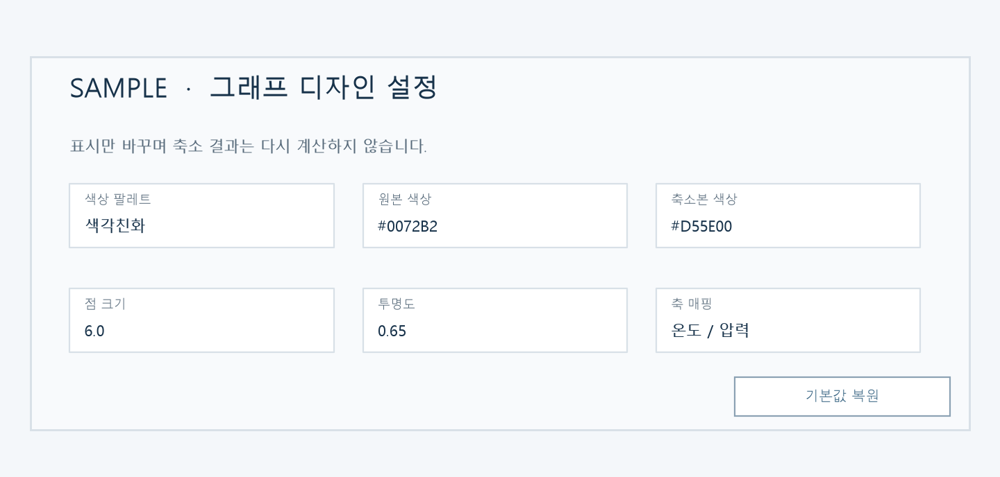

# T106 — 그래프 설정 초기화

## 분석 기준과 상태

- 작업: E10 그래프 디자인 설정 / 백로그 `todo` / 예상 10분
- 의존성: T101 `done` (schema 기반 설정 UI)
- 분석 시점: 2026-10-06, `dev`; 구현 전 분석 문서이며 완료나 검증 PASS를 뜻하지 않는다.

## 목표와 요구사항

기본값 복원 버튼으로 그래프 디자인 설정을 한 번에 기본 상태로 되돌린다. 근거는 백로그 T106 “기본값 복원 버튼”, 완료 기준 “모든 설정이 기본값으로 돌아감”, `problem.md` §6이다.

현재 `GraphSettingsPanel`은 schema 컨트롤만 렌더링하고 초기화 기능이 없다. 설정값은 `GraphExplorer` 로컬 상태이며, T104의 축 선택(X/Y/Z)과 투영 방식도 schema 밖의 별도 상태다.

## 범위

- 설정 패널에 접근 가능한 “기본값 복원” 버튼을 추가한다.
- 클릭 시 `defaultGraphSettings()` 전체 값(현재 선택된 graph에서 숨겨진 설정 포함), 축 매핑(X=투영1, Y=투영2, Z=투영3), 투영 방법(그룹 결과의 기본 method)을 동시 복원한다.
- 화면 표시만 갱신한다. 축/투영 좌표 요청은 값 변경에 따라 다시 가져올 수 있지만 축소 실행은 하지 않는다.
- 현재 그래프 종류와 나란히/겹쳐보기 모드는 유지해 탐색 위치를 보존한다.

## 비범위

- 사용자 설정 영속 저장/브라우저 새로고침 복원.
- graph kind 또는 side/overlay 보기 방식 변경.
- 특정 단일 설정만 되돌리는 기능이나 초기화 확인 모달.

## 완료 기준

1. 버튼 한 번으로 색상 팔레트/직접 색상, 점 크기/투명도/가중치, 네트워크 옵션, 축 매핑, 투영 방법이 기본값으로 돌아간다.
2. 버튼은 마우스와 키보드로 사용할 수 있고, 설정 패널 열기/닫기 동작과 충돌하지 않는다.
3. 초기화 이후 현재 그래프 종류와 비교 보기 모드는 유지되며 컨트롤 및 그래프 표시 값은 일치한다.
4. API 데이터 조회만 필요에 따라 발생하고 축소 job은 다시 실행하지 않는다.
5. 프론트엔드 lint/build 통과.

## 현재 코드 근거와 예상 파일

- `frontend/src/GraphSettingsPanel.tsx`: summary/settings grid 렌더. 초기화 버튼 후보.
- `frontend/src/GraphExplorer.tsx`: graph settings, 축, 투영, 보기 상태의 소유자; 하나의 reset handler로 묶을 위치.
- `frontend/src/graphSettings.ts`: schema의 모든 기본값을 생성하는 `defaultGraphSettings()`.
- `frontend/src/styles.css`: 패널 안 버튼의 포커스/레이아웃 스타일.

## 구현 및 검증 결과

- 패널 버튼은 GraphExplorer의 reset handler를 호출해 스키마 기본값, 투영축 X/Y/Z, 그룹 기본 투영법을 함께 초기화한다. 그래프 종류/보기 방식은 유지한다.
- `npm run lint --silent`, `npm run build --silent`, `git diff --check` 통과. 기존 Plotly chunk 크기 경고는 있으나 build 성공.
- 실제 브라우저 직접 상호작용은 실행하지 않았다. 키보드 접근은 native button과 `:focus-visible` 스타일로 제공된다.

## 검증 계획 및 경계 사례

- 모든 상태를 기본값과 다르게 바꾼 후 reset하여 각 schema/axis/projection 기본값 및 현재 graph kind/mode 보존을 대조한다.
- reset을 반복해도 값이 동일하며 에러가 없는지 확인한다.
- 키보드 포커스/Enter/Space로 작동하며 summary 토글과 reset action이 서로 간섭하지 않는지 확인한다.
- lint/build, TSX 줄 제한 250/함수80 (공백 제외)을 확인한다.

## 미확정/위험

- graph kind/view mode는 제품 맥락상 탐색 상태로 유지한다는 분석 결정을 적용한다. 초기화는 디자인 값과 축 변수 선택만 대상으로 한다.
- 시각 샘플은 합성 참고 자료이며 실제 앱 실행 증거가 아니다.

## 시각 샘플

합성 UI 데이터로 만든 디자인/검증 참고 이미지이며 실제 실행 결과가 아니다. 이미지 안에 `SAMPLE` 표시가 있다.
