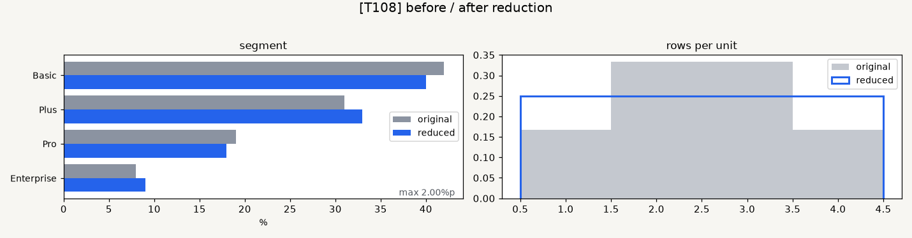

# T108 Task Analysis — 결과 그림 한글 글꼴 선택 보정

## Task and dependency status

- Task: T108, 결과 그림 한글 글꼴 선택 보정
- Status: `todo` at analysis time; move to `in_progress` before implementation.
- Estimate: 15 minutes
- Dependencies: none
- Downstream tasks: none
- Active branch: `dev`

## Scope

- Make `scripts/plot_compare.py::_pick_font` verify actual Hangul glyphs in a font file instead of trusting its family name.
- Select Korean labels only when a preferred installed font contains distinct glyphs for representative Hangul characters.
- Fall back to the existing English label set when no verified Hangul font exists.
- Verify that `plot_distribution` creates an image without missing-glyph warnings in the no-Hangul-font fallback.
- Add focused automated tests and a representative fallback sample image.

## Non-goals

- Bundling or downloading fonts, changing system font installation, or altering Matplotlib's global font cache.
- Translating user-provided column/category values or guaranteeing glyph coverage for every possible Unicode character.
- Changing graph colors, layout, metrics, data selection, DPI, filenames, or export formats.
- Changing `make_metric_figures.py` policy, which intentionally requires a Hangul-capable font and already has its own glyph validation.

## Technical approach

- Use `matplotlib.ft2font.FT2Font` to inspect each preferred font file from `fontManager.ttflist`.
- Require nonzero, distinct glyph indices for representative characters `"원본가"`; this rejects absent glyphs and LastResort-style shared replacement glyphs.
- Iterate preferred family names in current priority order, but only activate a matching font entry after glyph validation.
- Leave Matplotlib defaults unchanged and return `LABELS_EN` if every candidate fails validation.
- Test font-file validation with the installed DejaVu Sans path and test candidate selection with controlled fake font entries.

## Acceptance criteria

1. A preferred-name font without real Hangul glyphs is skipped rather than returning Korean labels.
2. A verified Hangul-capable candidate sets the font family and returns Korean labels.
3. If no verified candidate exists, `_pick_font` returns English labels.
4. In the fallback path, a representative distribution chart is saved without Matplotlib missing-glyph warnings.
5. Focused tests, full backend tests in default/UTF-8 modes, Ruff/compile checks, frontend gates, visual inspection, and diff checks pass.

## Relevant requirements

- `problem.md` §6: comparison graphs are user-facing and their labels must remain readable.
- T108 backlog acceptance: use Korean labels only with actual Hangul glyph support; otherwise use English labels and emit no missing-glyph warnings.
- T126 review evidence: family-name matching incorrectly selected IPAGothic and produced square/missing glyph output.

## Existing and expected files

- `scripts/plot_compare.py`: add glyph validation and use it during font selection.
- New: `backend/tests/test_plot_fonts.py`: focused validation, selection, fallback rendering, and warning assertions.
- `scripts/plot_distribution.py`: integration consumer used by the test; no change expected.
- `scripts/make_metric_figures.py`: reference implementation of glyph validation; no change expected.
- `docs/tasks/T108.sample.png`: representative English fallback chart from real project rendering code.

## Representative sample

This is a design/verification sample for an environment without a verified Hangul font. Labels fall back to English while the graph data and layout remain unchanged.

## Test plan

- Assert a normal Latin font lacks the representative Hangul glyph set.
- Provide a preferred-name candidate with failed glyph validation followed by a validated candidate; assert only the latter is selected.
- Provide no validated candidates and assert English labels.
- Render a small distribution chart through `save_distribution_chart`, capture warnings, and assert no missing-glyph warning plus a nonempty PNG.
- Run full backend suites in default and UTF-8 modes, Ruff including changed scripts, compileall, frontend lint/build, and `git diff --check`.

## Edge cases and risks

- Multiple files can share a family name; selection must inspect each matching file rather than treating the name as proof.
- Font files can be missing, corrupt, or unreadable; validation should return false rather than fail plotting.
- A font can map many characters to one replacement glyph; distinct-glyph validation rejects that case.
- Matplotlib global `rcParams` can leak between tests; tests must restore the original font family.
- User data containing Korean text can still require Hangul glyphs even with English application labels; translating arbitrary data is outside T108.

## Line limits

From `hooks/config.json`:

- Scripts: at most 200 non-blank lines per file and 50 per function.
- Backend tests: at most 400 non-blank lines per file and 60 per function.

## Unknowns

- Exact font inventories vary by OS and installed applications, so tests control candidate metadata rather than depending on a specific Korean font being present.
