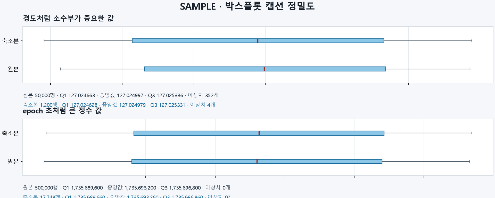

# T118 박스플롯 비교 — 사소 지적 정리

| 항목 | 값 |
|---|---|
| 에픽 | E9 마무리 |
| 예상 | 20분 |
| 선행 | T094(done) |
| 후행 | 없음 |

## 쉽게 말하면
T094의 마지막 리뷰(리뷰 5)에서 지적된 사소 항목 2건을 정리합니다. 캡션의 수치 표기가 큰 값을 정확하지 않게 보여 주는 문제와 테스트의 경계 조건 커버리지를 각각 고칩니다.

## 해야 할 일
- [x] GraphExplorer.tsx의 `number()`를 크기별 규칙으로 수정 (1 이상: 소수점 2자리, 1 미만: 유효숫자 4자리, 0.0001 미만: 지수)
- [x] `test_weighted_quantiles_match_unweighted_for_uniform_weights`의 범위를 대표 수 2~1000 × 원본 행 수 3종으로 확대
- [x] 수정 후 pytest와 npm 빌드 실행 확인

## 완료 기준
- [x] 캡션의 큰 값이 정확하게 표시됨 — `1735689600`과 `1735693200`이 서로 다른 값으로 찍히고, `99999999`가 `100,000,000`으로 바뀌지 않는다
- [x] 균일 가중치 비교가 넓은 범위를 덮는다 — 여유를 `1e-14`로 줄이는 돌연변이를 이제 잡는다 (이전 범위에서는 통과했다)

## 구현 메모

- **표기는 "정수부는 다 남기고 그 위로 유효숫자 6자리"** 한 규칙으로 정리했다. 고정된 소수점 자리나 고정된 유효숫자 하나로는 둘 다 안 된다:
  - 소수점 2자리로 자르면 위도처럼 1 이상이면서 소수부가 중요한 값이 뭉개진다 — 원본 `37.56481414/37.56648464/37.56817833`과 축소본 `37.56464211/…`이 전부 `37.56 / 37.57 / 37.57`이 되어 여섯 칸이 두 칸으로 줄어든다.
  - 유효숫자 6자리로 고정하면 `1,735,693,200`이 `1,735,690,000`으로, `99999999`가 데이터에 없는 `100,000,000`으로 바뀐다.
  - `max(6, 정수부 자릿수)`도 부족했다. 정수부가 커질수록 소수부가 깎여, 경도(`127.02466283` 등) 여섯 칸이 전부 `127.025`가 됐다.
  - 그래서 **소수부 6자리를 항상 남긴다**: 유효숫자를 `min(21, 정수부 자릿수 + 6)`으로 준다. 0.0001 미만만 지수로 적는다.
- **테스트 범위가 좁으면 경계 버그를 못 잡는다.** 대표 수 2~200·원본 1000행만 보던 테스트는 여유를 `1e-14`까지 줄여도 통과했다(첫 어긋남이 대표 610행 근처). 대표 수를 2~1000에 실제 축소 크기(1500·2236·6300·17748·50000)를 더하고 원본 행 수도 1000·4096·99991·500000으로 늘렸다. 이제 `1e-13`·`1e-14`·`1e-4` 돌연변이를 모두 잡는다.
- **여유 `1e-9`는 위아래로 묶여 있다.** 너무 작으면(`1e-13`) 균일 가중치 비교가, 너무 크면(`1e-5`) 경계 비교가 깨진다. 경계 테스트는 10만 행과 100만 행 두 가지로 돌려 상한을 좁혔다 — 행이 많을수록 경계가 25%에 더 가까워진다.
- `number()`는 프런트에 테스트 도구가 없어 자동 검증이 없다. node로 직접 돌려 25개 사례가 모두 서로 다르게 찍히는 것을 확인했다. 테스트 러너 도입은 T149로 분리했다.

## 관련 문서
- T094.review.md 리뷰 5 (L196-230): 마지막 리뷰 보고서, 지적 1·2가 이번 태스크의 근거

## 관련 파일
| 파일 | 상태 | 이유 |
|---|---|---|
| frontend/src/GraphExplorer.tsx | 있음 | L30-31 number() 함수의 서식 규칙 수정 필요 |
| backend/tests/test_boxplots.py | 있음 | L113-127 test_weighted_quantiles_match_unweighted_for_uniform_weights 테스트 파라미터 확장 필요 |
| backend/app/api/boxplots.py | 있음 | L65 cumulative + 1e-9의 여유 폭이 관련 있음 (파일 수정은 아님, 참고용) |

## 줄 수 한도
- backend/tests/**/*.py: 파일 400줄, 함수 60줄 (규칙 '백엔드 테스트')
- frontend/src/**/*.tsx: 파일 250줄, 함수 80줄 (규칙 '프론트 컴포넌트')

## 주의할 점
- **좌표축 범위의 정밀도**: T094 리뷰 5 지적 1에서 epoch 초(타임스탬프) 같은 큰 정수 값에서 문제가 드러남. 유효숫자 6자리는 7자리 이상에서 정보 손실 가능
- **1e-9 여유의 민감도**: 리뷰 4-2에서 `1e-15`로 조이면 1 failed, `1e-4`로 늘리면 1 failed로 나타남. 테스트 파라미터가 작은 범위만 커버하면 중간값의 버그를 놓쳐서 후속 수정에서 무검출로 통과 가능
- **test_weighted_quantiles 시리즈**: 기존 테스트들이 균일 가중치의 특정 값만 테스트 (배수 0.25, 1.0, 18.2, 1000)하므로, 실제로는 둘 다 다른 확률에서도 깨질 수 있음. 새로운 큰 `kept` 파라미터 추가 시 `range(2, 201)` 전체를 포함하도록 유지

## 시각 샘플

대표 합성 데이터로 만든 SAMPLE 이미지다.
