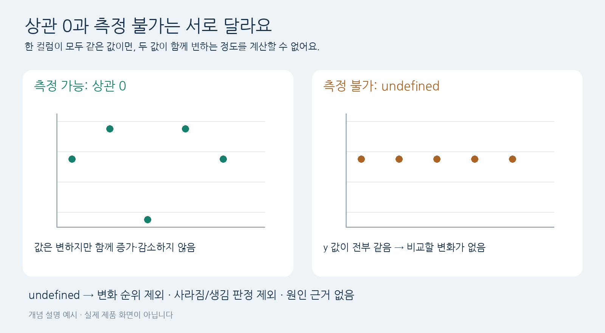

# T139 — 측정 불가 상관 쌍 표시

## 작업 분석
2026-10-01 최신 dev 3ae12a8 기준. T139 todo → in_progress; 의존 T130/T131/T132 done.
범위: correlation_metrics의 undefined 마스크, 순위/관계 분류, 원인 분석 안전 처리 및 회귀 테스트.
T141 소스는 dev에 없으므로 기존 로컬 구현을 새 파일로 복원해 T139 완료 기준을 검증한다.
T141은 T139 완료 후 별도로 재리뷰한다. API/제품 화면 연결과 성능 개선은 범위 밖이다.
관련 요구: 측정되지 않은 값을 근거로 꾸며내지 않는다. 기존 지표 키와 파이프라인 호출을 유지한다.
파일: metrics.py, relationships.py, relationship_causes.py 및 해당 테스트.
제한: core 300줄/함수50줄, tests400줄/함수60줄(공백 제외).

## 쉽게 이해하기
상관은 두 값이 함께 변하는 정도다. 한 컬럼의 값이 전부 같으면 변화를 비교할 수 없다.
이때 0은 “관계가 없다”는 측정값이고 undefined는 “측정할 수 없다”는 뜻이다.
예를 들어 대부분 0인 컬럼에서 몇 개의 큰 값을 제외하면 남은 값이 모두 0일 수 있다.
그것을 관계가 사라졌다고 설명하거나 이상치 제외 때문이라고 단정하면 잘못된 근거가 된다.

이 그림은 개념 설명이며 제품 화면 캡처가 아니다.

## 반환 규칙과 호환성
- 기존 matrix_original/matrix_reduced 및 집계 점수는 호환 목적으로 유지한다.
- undefined_original/undefined_reduced는 NaN을 0으로 채우기 전에 만든 대칭 boolean 마스크다.
- 쌍의 undefined 값은 null, difference/abs_difference도 null이다. 정상 쌍 뒤에 배치한다.
- classify_relationships는 undefined 상태와 집계 항목을 추가한다.
- 원본·축소본 중 측정 불가가 있으면 결과는 undefined이고 causes/evidence는 빈 배열이다. after_exclusion만 측정 불가라면 실제 결과를 유지하고 outlier_exclusion 근거만 제외한다.
- 마스크가 없는 기존 유한 행렬 입력은 계속 지원한다. 과거에 이미 0으로 치환된 NaN은 복구할 수 없으므로 새 correlation_metrics 결과를 사용해야 한다.
- after_exclusion의 측정 불가는 after_exclusion_undefined로 표시하며, 정상 관계 결과와 counts를 유지한다. 제외 행이 0이면 after_exclusion 입력을 무시한다.

## 완료 기준 검증
Pearson/Spearman 각각 원본만 상수, 축소본만 상수, 양쪽 상수, 이상치 제외 후 상수를 검증한다.
정상 쌍이 먼저 정렬되고 undefined 쌍에 lost/new나 outlier/cluster/boundary 근거가 붙지 않는지 확인한다.
잘못된 마스크 크기/자료형/비대칭은 ValueError. JSON allow_nan=False 직렬화도 검증한다.

## Claude 인계 후 재작업 분석 (2026-10-01)
현재 원격 dev 9cbb22b: T139 in_progress, T141 blocked. 코드 기준은 3ae12a8이다.
이전 done 서술은 이전 로컬 라운드의 상태이며 이번 인계에서는 유효하지 않다.
원본·축소본 마스크만 status/result undefined를 결정한다. after_exclusion의 undefined는 이상치 제외 근거만 차단한다.
제외 행이 0이면 after_exclusion은 사용하지 않는다. 정상 결과와 별도 boundary/cluster 근거를 보존한다.
T139 수정·검증 후 done 처리하고, T141의 기존 PASS는 무효로 보고 다시 검토한다.
