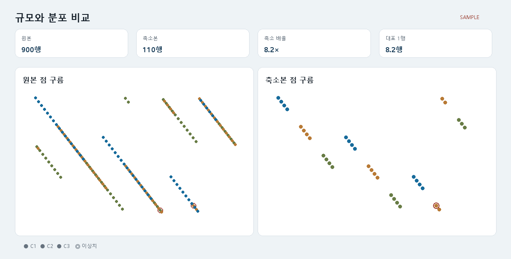

# T144 규모 비교 점 구름 UI

## 상태와 의존성

- 백로그: `todo` (Task Analysis 시점), E14
- 선행 T142 반영 리포트 API, T091 2D 산점도 모두 `done`

## 목표

결과 화면에서 원본과 축소본의 규모·배율을 설명하고, 동일한 투영 공간의 점을 실제 축소 군집 색과 이상치 표시로 비교한다.

## 범위

- 군집 축소 결과에 원본/대표 점의 군집 ID와 이상치 마스크를 저장
- T142 응답에 projection과 정렬된 점 메타데이터 추가
- 보고서 API 로딩·오류·빈 상태를 포함한 `RepresentationCloud` UI
- 원본/축소본 공통 좌표 범위, 동일 군집 팔레트, 이상치 링, 축소 배율 및 평균 대표 행 수 표시
- 비군집 방식은 단일 중립 계열로 표시하고 의미를 설명

## 비범위

- 군집별 반영 표(T145), 관계 변화 표(T146)
- 투영이나 군집 재계산, 점 선택/확대

## 완료 기준

1. 원본·축소 점이 같은 좌표계와 같은 군집 ID→색 매핑을 사용한다.
2. 이상치와 일반 점을 시각·텍스트로 구분한다.
3. 원본→축소 행 수, 축소 배율, 대표 1행당 원본 행 수를 표시한다.
4. API 오류가 기존 결과 화면 전체를 가리지 않는다.
5. frontend/backend lint·build와 관련 테스트가 통과한다.

## 파일 계획

- backend cluster metadata 저장 및 report 응답 보강
- `frontend/src/api/types.ts`, `client.ts`
- 신규 `frontend/src/RepresentationCloud.tsx`
- `frontend/src/ResultsPage.tsx`, `styles.css`
- backend report 테스트

## 경계 조건과 위험

- projection 원본은 서브샘플이므로 `original_indices`로 메타데이터를 정렬한다.
- 대표 군집 ID는 reduction members 순서와 reduced projection 순서가 같아야 한다.
- 비군집/과거 결과에는 군집 메타데이터가 없을 수 있다.
- 단일 좌표, 빈 점, 3D projection은 2D 앞 두 축으로 안전하게 표시한다.

## 검증

- 메타데이터 정렬·손상 응답 회귀 테스트
- frontend lint/build
- 좁은 화면 단일 열과 PNG 시각 샘플 비교

## 시각 샘플

대표 합성 데이터 기반 설계 참고 이미지이며 화면 안에 `SAMPLE` 표기를 포함한다.
