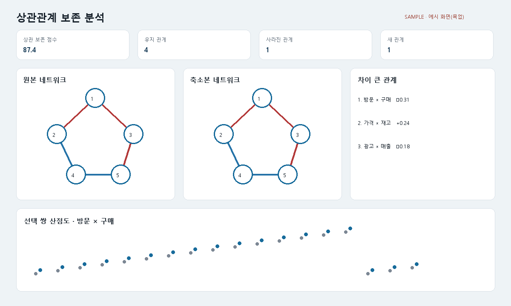

# T147 상관관계 분석 화면 예시(목업)

## 상태와 목표

- 백로그 상태: `todo` (Task Analysis 시점), 에픽 E13, 선행 작업 없음
- 실제 앱 구현 전에 상관관계 보존 화면의 정보 구조를 정적 HTML과 PNG로 검증한다.
- 업로드 없이 브라우저에서 볼 수 있도록 공개 샘플 HTML도 함께 생성한다.

## 범위

- 고정 seed 합성 데이터를 실제로 표본 축소
- `correlation_metrics`, `correlation_network`, `rank_correlation_pairs`, `classify_relationships`로 표시값 계산
- 요약 카드, Pearson/Spearman 전환 모양, 임계값, 동일 위치 네트워크 비교, 관계 변화 개수, 변화 순위, 선택 쌍 산점도를 한 화면에 배치
- `scripts/make_screen_mockups.py`로 HTML/PNG 재생성
- 문서 산출물은 `docs/images/screens/`, 웹 공개 사본은 `frontend/public/samples/`

## 비범위

- 실제 결과 화면 React 구현(T148 이후)
- 인터랙티브 전환, API 호출, 사용자 데이터
- 상관 계산 알고리즘 변경

## 완료 기준

1. 요구된 모든 정보 블록이 한 화면에 있고 원본·축소본 네트워크는 같은 노드 좌표를 쓴다.
2. 숫자는 실제 핵심 함수 출력이며 고정 seed로 재현된다.
3. 화면과 문서에 `예시 화면(목업)` 및 합성 데이터임을 명시한다.
4. 로컬 서버의 `/samples/correlation-analysis.html`에서 열린다.
5. 생성 스크립트 lint/실행과 산출물 확인이 통과한다.

## 관련 파일

- 신규: `scripts/make_screen_mockups.py`
- 신규: `docs/images/screens/correlation-analysis.html`, `correlation-analysis.png`
- 신규: `frontend/public/samples/correlation-analysis.html`
- 참조: `backend/app/core/metrics.py`, `network.py`, `relationships.py`

## 경계 조건과 위험

- 화면 숫자를 수기로 복제하지 않고 계산 결과에서 삽입한다.
- HTML과 PNG가 같은 계산 payload를 사용해야 한다.
- HTML은 외부 CDN 없이 동작하며 실제 앱으로 오해되지 않게 한다.
- 한국어 글리프가 있는 글꼴이 없으면 PNG 생성 전에 실패한다.

## 검증

- 스크립트 2회 실행 시 계산 payload 동일성
- 산출 HTML의 필수 문구·계산값 확인
- PNG 시각 검사와 한국어 글꼴 확인
- 서버 응답 200 확인
- scripts 파일 200/함수 50 비공백 줄 제한

## 시각 샘플

대표 합성 데이터로 만든 설계 참고 이미지이며 화면 안에 `SAMPLE · 예시 화면(목업)` 표기를 포함한다.
