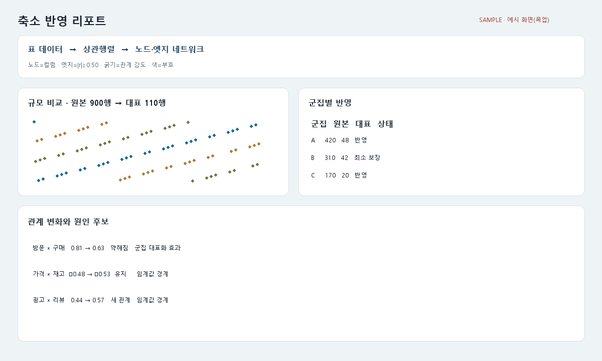

# T148 반영 리포트 화면 예시(목업)

## 상태·목표

- 백로그: `todo`, E14, 선행 T147 `done`
- 축소 결과가 무엇을 얼마나 대표하며 관계가 왜 달라졌는지를 설명하는 정적 HTML/PNG 목업을 만든다.

## 범위

- 고정 seed 합성 데이터와 실제 `cluster_representation_report`, `explain_relationship_changes` 결과 사용
- 표→상관행렬→네트워크 구성 설명, 원본 N→대표 M 규모/점 구름, 군집별 반영 표, 관계 변화·원인 표
- `scripts/make_report_mockup.py`로 문서 HTML·PNG와 웹 공개 HTML 생성
- 가이드에서 T147 상관 화면과 T148 반영 리포트 양쪽 링크 제공

## 비범위

- 실제 React 결과 화면, API 연결, 원인 알고리즘 변경

## 완료 기준

1. 네 정보 블록과 `예시 화면(목업)` 표시가 한 화면에 있다.
2. 숫자·상태·원인은 실제 핵심 함수 결과이고 고정 seed로 재현된다.
3. `/samples/representation-report.html`에서 HTTP 200으로 열린다.
4. 가이드에서 T147/T148 두 화면을 볼 수 있다.

## 파일 계획

- `scripts/make_report_mockup.py`
- `docs/images/screens/representation-report.{html,png,json}`
- `frontend/public/samples/representation-report.html`
- `docs/guide/screen_mockups.md`

## 검증·경계

- 생성 2회 JSON 해시 일치, 필수 문구 검사, PNG 글꼴/배치 시각 확인
- 군집 비율 분모와 원본/대표 합계 일치
- 원인 표는 함수가 반환하지 않은 인과를 만들어내지 않고 추정임을 명시
- scripts 200/함수 50 비공백 줄 제한

## 시각 샘플

대표 합성 데이터 기반 설계 참고 이미지이며 `SAMPLE · 예시 화면(목업)` 표기를 포함한다.
