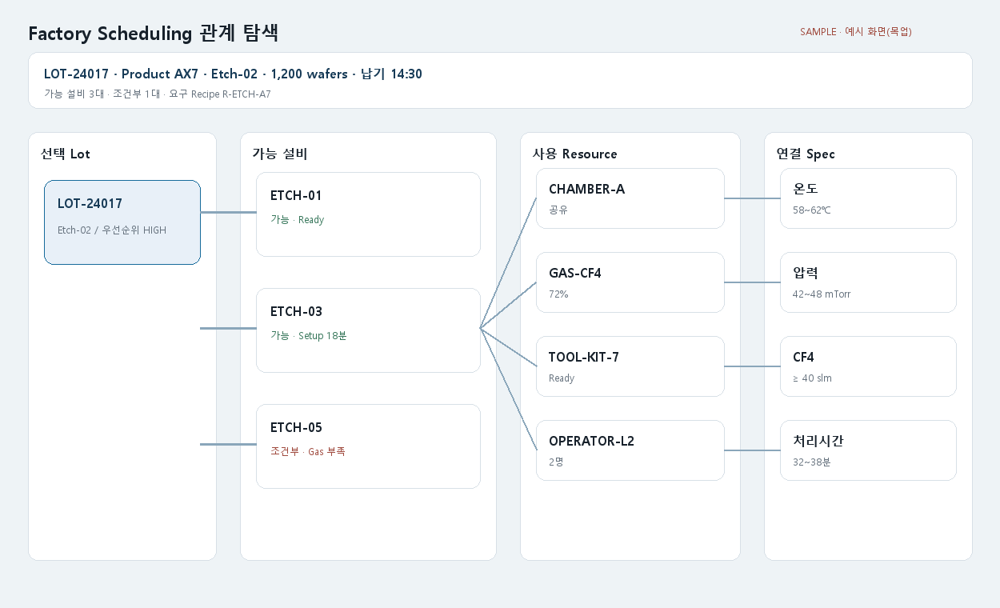

# T320 Lot-설비-Resource-Spec 관계 샘플

## 상태와 목표

- 백로그: `todo` (Task Analysis 시점), E15, 선행 작업 없음
- 업로드 없이 웹에서 공장 scheduling 관계를 탐색하는 합성 데이터 기반 정적 목업을 제공한다.
- 사용자가 Lot을 선택하면 가능한 설비가 여러 개 보이고, 설비별 Resource와 적용 Spec을 추적할 수 있어야 한다.

## 데이터 관계

- Lot → Operation/Recipe: Lot의 제품·공정 단계와 요구 Recipe
- Lot ↔ Equipment: 한 Lot에 복수 가능 설비, 한 설비에 복수 Lot
- Equipment ↔ Resource: 설비가 소비하거나 요구하는 복수 Resource
- Recipe/Resource → Spec: 온도·압력·가스·치공구·처리시간 등 허용 범위
- 설비 적합성: 가능, 조건부 가능, 불가와 근거

## 화면 범위

- Lot 선택 목록과 기본 scheduling 속성(제품, 공정, 수량, 납기, 우선순위)
- 선택 Lot을 중심으로 가능한 설비→Resource→Spec이 이어지는 관계 흐름
- 설비 카드별 준비 상태, 예상 처리시간, 전환시간, 적합성 사유
- Resource 가용량/상태와 Spec 요구값 대비 표시
- 설비 비교 표와 관계 범례
- 합성 데이터·예시 화면(목업) 명시

## 비범위

- 실제 스케줄 최적화, 시간축 Gantt, 생산계획 API
- 실시간 설비 상태 연동, 사용자 데이터 업로드
- 기존 축소 결과 화면에 통합

## 산출물

- `scripts/make_scheduling_mockup.py` — 고정 데이터로 HTML/PNG/JSON 재생성
- `docs/images/screens/factory-scheduling.{html,png,json}`
- `frontend/public/samples/factory-scheduling.html`
- 화면 목업 가이드 링크

## 완료 기준

1. Lot 하나가 2개 이상의 가능 설비로 연결된다.
2. 각 설비에서 사용하는 Resource와 관련 Spec을 확인할 수 있다.
3. 공유 Resource와 복수 Resource 관계가 표현된다.
4. 설비 적합성·상태·처리시간을 비교할 수 있다.
5. 웹 URL 200, 재현성, 스크립트 lint, PNG 시각 검사가 통과한다.

## 경계 조건

- Resource가 공유될 때 중복 카드가 아니라 동일 ID 관계로 표현한다.
- 조건부 설비의 충족되지 않은 Spec을 경고로 구분한다.
- 연결 없는 Lot/설비가 있는 경우 빈 상태를 명시한다.
- HTML은 외부 CDN 없이 반응형으로 동작한다.

## 라인 제한

- scripts 파일 200, 함수 50 비공백 줄

## 시각 샘플

고정 합성 데이터 기반 설계 참고 이미지이며 `SAMPLE · 예시 화면(목업)` 표기를 포함한다.
