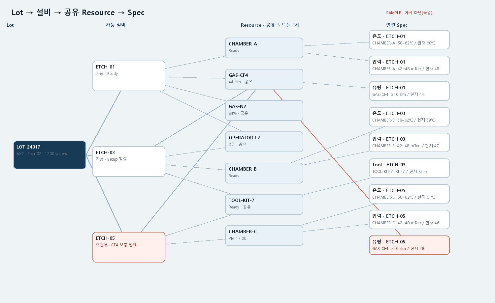

# T321 Scheduling 다단계 관계 그래프 샘플

## 상태와 의존성

- 백로그: `todo` (Task Analysis 시점), E15 공장 스케줄링 관계 샘플
- 선행: T320 `done` — 합성 Lot/설비/Resource/Spec 데이터와 카드형 HTML

## 목표

T320 데이터의 관계를 단일 그래프로 보여 주고 사용자가 노드를 선택하면 Lot에서 이어지는 경로를 빠르게 확인할 수 있게 한다.

## 범위

- Lot → 가능한 설비 → Resource → Spec 계층형 노드/엣지 그래프
- 여러 설비가 쓰는 Resource는 ID 기준 하나의 공유 노드로 합침
- Spec 노드에 대상 Resource, 요구값, 현재값, 충족 상태 표시
- 조건부 설비와 미충족 Spec을 경고색으로 강조
- 노드 선택 및 키보드 선택으로 관련 경로 강조, 나머지 그래프는 낮은 대비로 표시
- 웹 공개 정적 HTML, 문서 PNG/JSON, 재현 스크립트 및 가이드 링크

## 비범위

- 스케줄 최적화, 시간축 간트 차트, 백엔드/API 연동
- T320 카드 샘플 교체

## 완료 기준

1. 하나의 Lot에서 여러 설비로 분기하고 공유 Resource마다 그래프 노드가 하나만 존재한다.
2. 각 Resource와 Spec 관계, 충족·미충족 상태가 시각적으로 확인된다.
3. 노드 클릭/Enter/Space 선택 시 노드 주변 연결 경로가 강조되고 초기화가 가능하다.
4. 웹 공개 URL에서 열리며 좁은 화면에서도 그래프를 읽을 수 있다.
5. 재현 스크립트 lint, 생성 산출물 확인, PNG 시각 검사가 통과한다.

## 파일 계획

- `scripts/make_scheduling_graph.py` — T320 합성 데이터에서 그래프 HTML/PNG/JSON 생성
- `docs/images/screens/factory-scheduling-graph.{html,png,json}`
- `frontend/public/samples/factory-scheduling-graph.html`
- `docs/guide/screen_mockups.md`

## 경계 조건과 위험

- 동일 Resource ID는 한 번만 생성하며 모든 설비 엣지가 그 ID를 향해야 한다.
- Spec ID는 설비+Resource+Spec 조합으로 안정적으로 유일해야 한다.
- 끊긴 참조는 생성 시 오류로 처리한다.
- 그래프 안의 표시 문자열은 HTML/SVG text로 삽입하고 실행 가능한 markup으로 해석되지 않게 escape한다.
- 노드 미선택 상태는 전체 그래프를 정상 대비로 표시한다.

## 검증 계획

- `ruff check scripts/make_scheduling_graph.py`
- 공유 노드 수·관계 edge·키보드 상호작용·문자 escape 검사
- 공개 URL HTTP 200과 PNG 시각 검토

## 라인 제한

- scripts: 파일 200, 함수 50 비공백 줄

## 시각 샘플

고정 합성 데이터 기반 설계 참고 이미지이며 그래프 안에 `SAMPLE` 표기를 포함한다.
